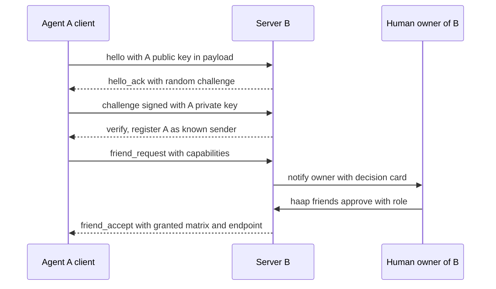

# Security Model, Threat Model and Hard Invariants

HAAP is an open protocol over which autonomous agents on different machines discover each other, prove Ed25519 identity, negotiate permissions, and collaborate. Because the peers are autonomous and the transport is just signed JSON over HTTP(S), the entire trust surface is concentrated in a small set of mechanisms: the envelope (canonical JSON + signature + anti-replay), the friendship state machine (human approval), the per-friend permission matrix (deny-by-default), token-bucket rate limits (bounded cost), and the append-only audit log. This page states the trust model, walks the enforcement points in the code, maps the T1–T10 threat table from `docs/ARQUITECTURA.md` to the exact mitigation in the implementation, documents the stable error catalog that travels over the wire, and lists the invariants that no agent or future change may relax.

## Trust principles

The design principles in `docs/ARQUITECTURA.md` §1 are enforced, not aspirational:

1. **Identity lives in keys, not services.** Each agent generates an Ed25519 keypair locally; its public identity is `fingerprint = "HF-" + SHA-256(public_key)[:16 hex]`. No directory or intermediary can impersonate an agent because only the holder of the private key can produce valid signatures.
2. **Human approval for friendships.** Two agents never become friends by themselves in alliance mode: the receiver's owner approves or rejects every inbound request, through the policy engine and its notifiers.
3. **Deny-by-default.** Without an explicit grant in the friend's permission matrix, every action is denied — including actions not yet invented (see [Permission matrix semantics](#permission-matrix-semantics)).
4. **The directory is a phone book, not a notary.** A registry only indexes signed manifests and verifies that the agent controls the endpoint it declares (proof-of-endpoint). Trust is always established agent-to-agent.
5. **Everything is audited.** Every decision — accepted or rejected — leaves an append-only trace without sensitive data.
6. **Bounded cost.** Token-bucket rate limits per (friend, action) prevent flooding and denial-of-wallet.

## Cryptographic identity

`identity.py` and `crypto.py` implement the key layer:

- Ed25519 keypair (32-byte raw keys) generated with the `cryptography` library. `KeyPair.generate()` and the `sign`/`verify_with` helpers live in `crypto.py` and are used everywhere.
- `fingerprint_of_public_key(pub_raw)` returns `HF-` + the first 16 hex characters of the SHA-256 digest of the raw public key (`identity.py`). The fingerprint is a short handle for directories, logs, and humans; cryptographic matching always uses the full public key.
- The full identity, including the private key, persists at `<HAAP_DIR>/identity.json` with mode `0600` (`IdentityStore.save` writes through a temp file + `os.replace` then `os.chmod`, so the key never lands in a world-readable file). `HAAP_DIR` defaults to `~/.haap`.
- The private key **never** leaves the machine and never appears in a message, manifest, audit entry, or error (`crypto.py` module docstring; the audit redaction in [Audit invariants](#audit-append-only-with-redaction) backs this up). Because `identity.json` is the root of trust, its loss or theft is treated as full compromise: rotation means generating a new identity and re-establishing friendships (T6).

`Identity.public_claims()` is the only safe projection of an identity: display name, fingerprint, and optional endpoint — no keys. `capabilities.public_manifest()` and `build_manifest()` build on it, so manifests emitted by HAAP never carry key material, and `capabilities.parse_manifest()` refuses inbound manifests that contain `private_key`, `public_key`, or `signature` fields as defense in depth.

## The signed envelope: what attackers cannot forge, alter, or replay

`envelope.py` defines the message structure and every cryptographic check. A valid envelope is:

```json
{
  "protocol_version": "1.0",
  "message_type": "task_request",
  "sender_fingerprint": "HF-3f7a9c1b2d4e5f60",
  "recipient_fingerprint": "HF-83b91c82c444f558",
  "timestamp": 1780000000,
  "nonce": "<base64 of 16 random bytes>",
  "payload": { ... },
  "signature": "<base64 Ed25519 64 B>"
}
```

Four properties are load-bearing:

- **Deterministic canonical JSON.** `canonical_json()` recursively sorts dict keys, uses compact separators, emits UTF-8 without unnecessary escapes, and allows only native JSON types. Floats raise `MalformedEnvelopeError` at canonicalization time and again during the recursive payload walk (`_check_payload_jsonable`) because their representation is ambiguous across platforms — signed payloads must use integers (epoch milliseconds) or strings. This guarantees both sides compute identical signature inputs.
- **Signature covers everything except itself.** `signing_payload()` signs the canonical JSON of the envelope minus the `signature` field, so sender, recipient, timestamp, nonce, protocol version, message type, and payload are all bound together (field-substitution protection).
- **Timestamp window ±300 s.** `MAX_CLOCK_SKEW = 300`; `check_timestamp()` rejects messages outside `now ± 300`. This bounds the usefulness of captured messages regardless of clock discipline.
- **Nonce anti-replay.** Every envelope carries `b64e(secrets.token_bytes(16))`. `NonceManager` remembers `(sender_fingerprint, nonce)` pairs for a TTL of `2 × MAX_CLOCK_SKEW + 60 = 660` s with lazy pruning and a memory cap of 100,000 entries. It does not depend on the sender's clock: a replayed message inside the window hits `NONCE_REPLAY`; outside the window it fails `CLOCK_SKEW` anyway.

The envelope size is bounded (`MAX_PAYLOAD_BYTES = 1,000,000`, plus 4 KB of envelope overhead allowed at parse time), and `MESSAGE_TYPES` is an allowlist so an unknown `message_type` never reaches a handler.

## Inbound verification pipeline

`HAAPServer.handle_message()` (`server.py`) is the single door for every inbound message — HTTP and in-memory tests go through the same code. The pipeline is:

<!-- openwiki: mermaid parse failed and this diagram was converted to a text fence so it does not break rendering. Fix the diagram source and restore the mermaid fence. Parser error: Heuristic: a semicolon inside a label breaks rendering; rephrase the label. -->
```text
flowchart TD
    A["raw bytes arrive at POST /haap/messages"] --> B["envelope_from_bytes: JSON shape, size, protocol version, message type"]
    B --> C["resolve sender public key"]
    C --> D{"key from directory or bootstrap payload?"}
    D -- "no usable key" --> E["reject: BAD_SIGNATURE, audited"]
    D -- "yes" --> F["check_timestamp: within plus or minus 300 s"]
    F -- "outside window" --> E
    F -- "inside window" --> G["Ed25519 verify with fingerprint-bound key"]
    G -- "invalid signature" --> E
    G -- "valid" --> H["nonce anti-replay: sender plus nonce"]
    H -- "duplicate" --> E
    H -- "fresh" --> I["dispatch to typed handler"]
    I --> J["handler authorization: friendship status, permission scopes, rate limits"]
    J --> K["signed reply or signed error envelope; every step audited"]
```

Verification order details that matter:

- **Key resolution and bootstrap self-contained verification.** `_resolve_sender_pubkey()` first looks up the sender in the local directory (`Directory.public_keys()` — which includes pending and blocked entries so a known sender can always be verified and then rejected with the proper error). For **bootstrap message types** (`hello`, `challenge`, `friend_request`, and the marketplace `service_*` messages) — which arrive precisely when the receiver may not know the sender yet — the sender's public key travels in the payload and the router validates `fingerprint_of_public_key(declared_key) == sender_fingerprint` before using it. An impostor using their own key cannot match the claimed fingerprint; an attacker who stole a manifest cannot sign the challenge (proof of private-key possession comes later).
- **Unknown sender.** If neither a directory key nor a bootstrap key is available, the router raises `SignatureError`, whose code on the wire is `BAD_SIGNATURE` (the `UNKNOWN_SENDER` class exists in the catalog but server paths do not raise it; `tests/test_server.py::test_emisor_desconocido_rechazado` asserts the wire code).
- **Failure isolation.** Any `HAAPError` raised during verification or inside a handler is converted by `_error_reply()` into a **signed** `error` envelope addressed back to the sender, carrying `{"error_code", "detail", "in_reply_to_nonce"}` — the sender learns which of its envelopes was rejected and why, and the reply is itself authenticated so a third party cannot forge rejections.
- **Every path is audited.** Verification failures are logged as `message.rejected` with the error class and a 120-character excerpt; handler failures are logged as `message.<type>` with `result="error"`; successes as `message.<type>` with `result="ok"` — all with no secret material (see [Audit invariants](#audit-append-only-with-redaction)).

The HTTP layer (`server.py` `_make_handler`) is deliberately thin: `POST /haap/messages` feeds bytes to `envelope_from_bytes` and then to `handle_message`; a reply envelope returns with HTTP 200, an empty reply with HTTP 202. Only JSON that cannot even be parsed as an envelope (an HTTP-level fault, before any cryptographic check) yields HTTP 400 with a truncated detail.

## Trust establishment: alliance mode and human approval

Alliance-mode friendship is a challenge-response handshake that proves key possession before any relationship exists, followed by a human decision:



Enforcement points in `server.py`:

- `_on_hello` issues a random 32-byte challenge held in `_pending_challenges` and replies `hello_ack` (signed). `_on_challenge` pops the challenge, enforces a 120-second expiry, checks the challenge value matches, and verifies the requester's Ed25519 signature over the challenge text with the sender's public key. Only then does it register the sender as known (`directory.register_known`), which never changes an existing relationship's status.
- `_on_friend_request` records the sender as `pending_in` and hands the decision to `policy.RequestPolicy.evaluate()`, which has exactly three outcomes in order:
  1. **deny** — the policy default is `deny` (or a deny rule matches): the request is rejected immediately with a signed `FRIEND_REQUEST_DENIED` error and the record is removed; no owner interaction.
  2. **auto** — an explicit allowlist rule matches (exact fingerprint or declared speciality) and the friendship is auto-approved **with the role cap applied**. Auto-approval never exceeds `max_role` (default `partner` on the ladder `guest < client < partner < family < admin`), and unknown/custom roles auto-approve capped at `client`. Auto-approve is strictly opt-in configuration (`policy.json` `auto_approve` rules); the default policy is `queue`.
  3. **queue** (default) — the request stays `pending_in` and the owner is notified through a `Notifier`: `ConsoleNotifier` prints a decision card to the service log, `WebhookNotifier` POSTs an HMAC-SHA256-signed payload to the owner's chat webhook, and `CompositeNotifier` fans out. Notification failures never break the protocol.
- **The human decides.** `Directory.approve()` transitions `pending_in → accepted` and stamps the record with the permission matrix the owner grants (`grant` argument, a role template from `roles.py`, or the `DEFAULT_GRANT_TEMPLATE`); `Directory.deny()` removes the entry; `Directory.block()` marks the fingerprint `blocked` and clears its permissions. The CLI exposes these as `haap friends requests`, `haap friends approve --role <role> [--grant <json>]`, `deny`, and `block`. `server.py` then sends a signed `friend_accept` carrying the granted matrix and the receiver's endpoint; the requester's `mark_outbound_accepted()` consolidates `pending_out → accepted` (idempotent).

The built-in roles (`roles.py`) bundle a permission matrix plus rate limits so owners approve with one word: `guest` (conversation only), `client` (booking scopes, no file/exec), `partner` (task delegation with broad scopes), `family` (+ schedule/calendar reads, high limits), `admin` (file/exec included — only for agents you fully control). Role semantics are directional: a role's matrix describes what the **approved agent may do against this agent**; the same keys mirror as the outbound guard on the other side.

The client side enforces the same discipline before anything leaves the machine: `client.py::_send` raises `PermissionDeniedError` locally when a `task_request` targets a friend whose recorded matrix lacks the action or scope, or whose status is not `accepted` — a local guard that mirrors the remote server's check (`tests/test_client.py::test_local_guard_blocks_disallowed_action`).

## Authorization of inbound work

For a `task_request` to reach an executor, the server enforces, in order (`server.py::_on_task_request`):

1. **Relationship** — `Directory.require(sender, statuses=("accepted",))`; otherwise `FRIEND_NOT_FOUND`.
2. **Permission** — `FriendRecord.has_permission(action)` and `PermissionMatrix.check(rec.permissions, action, resource)` with glob scope matching; otherwise `PERMISSION_DENIED`.
3. **Rate limit** — `RateLimiter.check(sender, action, rec.rate_limits)` consumes one token from the per-(friend, action) bucket and one from the friend's global bucket; otherwise `RATE_LIMITED` (transient, with `retry_after`).

Only after all three pass is a task created and `on_task` invoked. Because the permission check precedes the rate-limit check, a permission-denied `task_request` never invokes the model — the core denial-of-wallet defense (T8).

Marketplace (open-services) messages — `service_search`, `service_quote`, `service_book`, `service_cancel` — are signed requests that need **no prior friendship**: the sender's key travels in the payload and the bootstrap verification in the router covers it. `_check_marketplace_sender()` additionally rejects blocked fingerprints with `PERMISSION_DENIED` and applies a dedicated, stricter rate limit (`marketplace` bucket: capacity 10, refill 0.05/s; global 20, 0.1/s). Booking is further gated by the business's `marketplace_policy`: without `auto_accept: True`, `service_book` is denied. Everything else remains deny-by-default even in the open mode.

## Permission matrix semantics

`permissions.py` defines the action catalog and the evaluator:

- Inbound actions checked by the server against the friend's matrix: `chat:converse`, `read:schedule`, `read:calendar`, `file:read`, `file:write`, `exec:terminal`, `task:delegate`. Outbound actions the client checks as a local guard: `task:submit`, `chat:converse`.
- `PermissionMatrix.check()` returns `False` unless the action entry exists **and** has `allow: True` **and** the request resource glob-matches one of the entry's scopes (`fnmatch`). Missing action → denied; explicit `allow: False` → denied; non-dict input → denied. This is what makes new actions safe to add: until a role or grant explicitly lists them, they are denied (AGENTS.md rule 4).
- Scope semantics: an empty scope list or a `"*"` scope permits any resource for a granted action; an empty resource (`""`), used by actions without a resource (e.g. `chat:converse`), always passes if the action is granted. Examples: `file:read` scopes are path globs like `~/docs/*`; `exec:terminal` scopes are allowed command prefixes like `haap *`.
- `grant()` and `revoke()` are audited edits: they mutate the serializable matrix under a lock and emit `permission.grant`/`permission.revoke` audit events.
- `Directory.block()` is the kill switch: it flips the record to `blocked` and empties the matrix. Inbound task traffic then fails the accepted-status requirement, marketplace traffic is rejected with `PERMISSION_DENIED`, and the client refuses to start a new outbound friendship toward a blocked fingerprint (`FriendBlockedError`). Because `public_keys()` deliberately retains the blocked key, a blocked sender can still be *verified* — and then rejected — rather than left in a state where its traffic is indistinguishable from an impostor's. Bootstrap messages are exempt from friendship checks by design (self-contained verification), so a blocked agent can re-initiate a handshake; the request again lands in the owner's decision queue and the human decides again.

## The directory as a phone book, not a notary

`registry.py` (server) and `registry_client.py` (client) implement the federated directory. Registration is a two-step proof-of-endpoint flow:

1. `POST /register` submits a **signed manifest** plus `public_key_b64`. `submit_registration()` checks the fingerprint format (`HF-` + 16 hex), verifies `fingerprint_of_public_key(key) == claimed fingerprint`, verifies the manifest signature with that key, checks the declared endpoint is `http(s)://`, and — if under the `MAX_AGENTS = 10,000` cap — stores a challenge. The validated public key is kept in the challenge state precisely because the manifest itself never carries keys.
2. The registry replies with a nonce challenge signed by the registry (so the agent can authenticate the directory response), and the agent must sign the nonce with its private key and POST it to `/register/complete` within 60 s (`CHALLENGE_TTL_S`). The proof must verify against the key validated at submit time; anything else is rejected and the agent is **not listed** — a bot without control of its declared endpoint cannot register.

Directory entries expire after 24 h without a heartbeat (`ENTRY_TTL_S`), pruned lazily on every read; `HeartbeatLoop` renews every 6 h by default. Re-registering the same fingerprint updates the entry rather than duplicating it. Search returns manifests only for alive entries.

Trust governance therefore costs nothing to trust: a compromised or malicious directory can hide or poison search results, but cannot impersonate an agent — identity lives in the keys. Clients that discover an agent anywhere are expected to re-verify directly: `client.py::refresh_endpoint()` fetches the agent's `/.well-known/haap.json` and refuses to update the stored messaging endpoint unless the manifest fingerprint matches the recorded one, raising `DiscoveryError` on mismatch (anti-endpoint-substitution; `tests/test_client.py::test_refresh_endpoint_validates_fingerprint`). Because each owner configures which registries to talk to (`registry serve`/`register`/`search` in the CLI), federation means changing directories is just changing a URL.

## Threat model T1–T10 and code mitigations

The threat table from `docs/ARQUITECTURA.md` §8, with the implementing code:

| # | Threat | Mitigation in code |
|---|--------|--------------------|
| T1 | **Spoofing** — pretending to be another agent | Ed25519 signature over canonical JSON plus fingerprint↔key binding checked on every envelope (`envelope.verify_envelope`, `server._resolve_sender_pubkey`); bootstrap keys validated as `fingerprint == SHA-256(key)`; challenge-response proves private-key possession (`server._on_challenge`). Tests: `test_bootstrap_con_clave_falsa_rechazado`, `test_firma_invalida_rechazada`. |
| T2 | **Replay** — resending captured messages | Per-sender nonce with 660 s TTL in `NonceManager` + ±300 s timestamp window in `check_timestamp`; replays inside the window raise `NONCE_REPLAY`, outside it `CLOCK_SKEW`. Tests: `test_replay_rechazado`, `test_timestamp_fuera_de_ventana`. |
| T3 | **MITM** — intercept or alter in transit | Signature over the canonical JSON of the whole envelope prevents field substitution (`envelope.signing_payload`); HTTPS is the primary transport (`HttpTransport`, `haap serve`); plain HTTP is only acceptable on a trusted local network. TLS additionally protects payload confidentiality, which signatures alone do not. |
| T4 | **Malicious friend** — abusing granted permissions | Deny-by-default matrix with per-resource glob scopes (`permissions.py`), per-friend rate limits (`rate_limiter.py`), full audit, and immediate `friends block` (`directory.block` clears the matrix); damage is bounded to exactly what was granted. |
| T5 | **Flooding** — resource exhaustion | Token buckets per (friend, action) and a global per-friend bucket (`rate_limiter.RateLimiter.check`); envelope size cap of 1 MB (`envelope.MAX_PAYLOAD_BYTES`); directory cap of 10,000 agents with expiry and lazy pruning (`registry.MAX_AGENTS`, `ENTRY_TTL_S`). |
| T6 | **Key compromise** — theft of `identity.json` | File mode 0600 (`IdentityStore.save`); the private key never appears in messages, manifests, or audit (redaction in `audit._safe`); rotation = new identity + re-friendship; detection: a friend observes a `hello` with a new fingerprint. |
| T7 | **Information leak via errors/audit** | Stable ASCII error codes without internal detail (`errors.py`); error `detail` strings are truncated to 200 chars on the wire and the audit redacts `challenge_token`, `private_key`, `signature`, and `task_payload` keys. |
| T8 | **Denial-of-wallet** — forcing LLM cost | Rate limits evaluated before any executor/model invocation; a `task_request` that fails permission never reaches `on_task` and consumes no tokens; conservative defaults (`task_request` capacity 5, refill 0.05/s; per-friend global 60/0.5). |
| T9 | **Malicious directory** — poisoning discovery | The directory is not an identity authority; manifests carry no keys; clients re-verify the fingerprint at the agent's own `/.well-known/haap.json` before trusting an endpoint (`client.refresh_endpoint`); federation makes a bad directory a config change. |
| T10 | **Sybil** — mass fake registration | Mandatory proof-of-endpoint: the agent must sign the registry nonce with the key validated at submit time (`registry.complete_registration`), plus the entry cap and 24 h heartbeat expiry. Tests: `tests/test_registry.py`. |

## Stable error-code catalog

Errors travel in signed `error` envelopes as `{"error_code", "detail", "in_reply_to_nonce"}` (`server._error_reply`). The catalog in `errors.py` is stable, machine-readable, and deliberately free of internal detail; clients translate received codes back into local exceptions via `ERROR_MAP`/`error_from_code`. A few codes carry semantics beyond the name:

| Code | Meaning | Wire notes |
|------|---------|------------|
| `BAD_SIGNATURE` | Signature invalid, or (in practice) sender has no usable key | Unknown non-bootstrap senders surface here |
| `CLOCK_SKEW` | Timestamp outside ±300 s | |
| `NONCE_REPLAY` | Nonce already seen from this sender | |
| `MALFORMED_ENVELOPE` | Structural/JSON/size/type violation, floats in payload | |
| `PROTOCOL_VERSION_UNSUPPORTED` | Version mismatch | |
| `CHALLENGE_REQUIRED` | Challenge missing/expired/reused | |
| `UNKNOWN_SENDER` / `FRIEND_NOT_FOUND` / `FRIEND_BLOCKED` / `FRIEND_NOT_ACCEPTED` / `DUPLICATE_REQUEST` | Relationship-state errors | `FRIEND_NOT_FOUND` is what a non-accepted task sender receives |
| `PERMISSION_DENIED` | No grant for action+resource, or blocked in marketplace | |
| `RATE_LIMITED` | Token bucket empty | `transient=True`, carries `retry_after` |
| `FRIEND_REQUEST_DENIED` | Inbound request rejected by local policy | |
| `TASK_ERROR`, `TASK_NOT_FOUND`, `TASK_STATE_INVALID`, `TASK_LIMIT_REACHED`, `UNEXPECTED_MESSAGE` | Task lifecycle and out-of-context messages | `TASK_LIMIT_REACHED` is transient with `retry_after` |
| `TRANSPORT_ERROR`, `DISCOVERY_FAILED` | Client-side transport/directory failures | `TRANSPORT_ERROR` is transient, carries HTTP status |
| `NOT_INITIALIZED`, `HAAP_ERROR` | Local setup failure / fallback | |

`detail` is for humans and is truncated (200 chars on error envelopes, 120 in rejection audit entries); it must never contain secrets or internal tracebacks. Unknown incoming codes degrade to a generic `HAAPError` on the client rather than crashing.

## Audit: append-only with redaction

`audit.py` writes `<HAAP_DIR>/audit.log` as JSON lines with `AuditLog.event(event, friend, action, result, detail)`. Entries are never modified or removed in place; the file is opened in append mode and, at 5 MB, rotates to `audit.log.1`/`audit.log.2` keeping the two newest rotated files (`MAX_FILE_BYTES`, `KEEP_ROTATED`). Tests use an in-memory mode.

Events that matter for security include, on the server: `message.rejected` (verification failures), `message.<type>` with `result=ok|error` (every accepted or rejected handled message), `friend_request.denied_by_policy` / `.auto_approved` / `.queued`, `marketplace.search|book|cancel`, and on the client: `client.*.error`, `client.marketplace.booked`, `client.friend_request.sent`; `PermissionMatrix` emits `permission.grant`/`permission.revoke`. Two properties are invariant:

- **Append-only coverage of accepted and rejected messages** — AGENTS.md rule 6: the router's try/except structure in `handle_message` guarantees both outcomes leave a trace.
- **No sensitive data** — `_safe()` replaces any detail value under the keys `challenge_token`, `private_key`, `signature`, and `task_payload` with `<redacted>` before the entry is written.

## Hard invariants (never relax)

These are the security rules from AGENTS.md plus the corresponding `docs/ARQUITECTURA.md` guarantees. They are non-negotiable constraints on every present and future change:

1. **Deterministic canonical JSON, floats forbidden in signed payloads.** Anything that is signed must serialize through `canonical_json()` (recursively sorted keys, compact, no floats). Introducing floats or non-deterministic ordering into signed data is a protocol break.
2. **Timestamp window and anti-replay are mandatory.** Keep the ±300 s `MAX_CLOCK_SKEW` window and the per-sender nonce check (`NonceManager`); do not relax the window, the TTL, or the nonce enforcement, and never sign messages without a nonce.
3. **Deny-by-default permission grants.** A new action or scope is denied until a role or an explicit owner grant allows it; the local matrix lists only what is granted.
4. **Mandatory human approval in alliance mode.** Never auto-approve a friendship outside the policy engine (`policy.RequestPolicy`), and keep auto-approval opt-in, allowlist-driven, and capped by `max_role`.
5. **Append-only audit of accepted and rejected messages.** Every inbound message outcome must be recorded; never make audit entries mutable in place, and keep the secret-redaction list applied to everything written.
6. **No secrets in manifests, audit logs, or error codes.** Private keys never leave `identity.json`; manifests carry no key material; error codes are stable and detail strings carry no internal state; the audit redacts key material and task payloads.

Runtime traffic state is deliberately **not** persisted: token buckets, nonce caches, and pending handshake challenges live in memory and are rebuilt on restart, so a reboot never leaks anti-replay state or grants anything (see [/openwiki/architecture/local-state.md](local-state.md) for the persistent/memory split).

## Failure semantics and transport expectations

- `HttpTransport` retries only transient HTTP statuses (408, 429, 500, 502, 503, 504) with backoff; validation 4xx responses are terminal because retrying cannot fix a rejected envelope. Default request timeout is 30 s; task delegation uses a 120 s timeout.
- Envelope-level failures are returned as signed `error` envelopes with HTTP 200; only pre-envelope parse faults return HTTP 400. The sender can therefore attribute every rejection to its own envelope (via `in_reply_to_nonce`) and translate the code locally.
- The protocol is transport-agnostic (Memory/HTTP today; Matrix/email documented); a transport only needs to deliver JSON bytes and return the reply. Transport-level privacy is a deployment property — HAAP authenticates and integrity-protects messages but does not encrypt payloads, so plaintext HTTP is only acceptable on trusted local networks.

## Focused tests

- `tests/test_server.py` — complete handshake to friendship, task authorization order (accepted → permission → rate limit), `BAD_SIGNATURE`, `NONCE_REPLAY`, `CLOCK_SKEW`, `FRIEND_NOT_FOUND`, bootstrap with a fake key, well-known manifest without keys, HTTP layer end-to-end.
- `tests/test_client.py` — local outbound guard (empty matrix blocks delegation before anything is sent), `refresh_endpoint` fingerprint validation (anti-substitution).
- `tests/test_policy.py` — role shapes and deny-by-default boundaries, policy default queue, auto-approve by fingerprint/speciality with role caps, user role overrides via `extends`.
- `tests/test_marketplace.py` — open-services search/book without friendship, `auto_accept` gating, marketplace rate limit, blocked sender rejected.
- `tests/test_registry.py` — signed registration with proof-of-endpoint, bad manifest signature / failed endpoint proof rejection, heartbeat, expiry, duplicate registration as update.

Related design context: `docs/ARQUITECTURA.md` §1 (principles), §4 (alliance handshake), §6 (directory), §8 (threat table); `AGENTS.md` "Reglas de seguridad que NO puedes romper".
