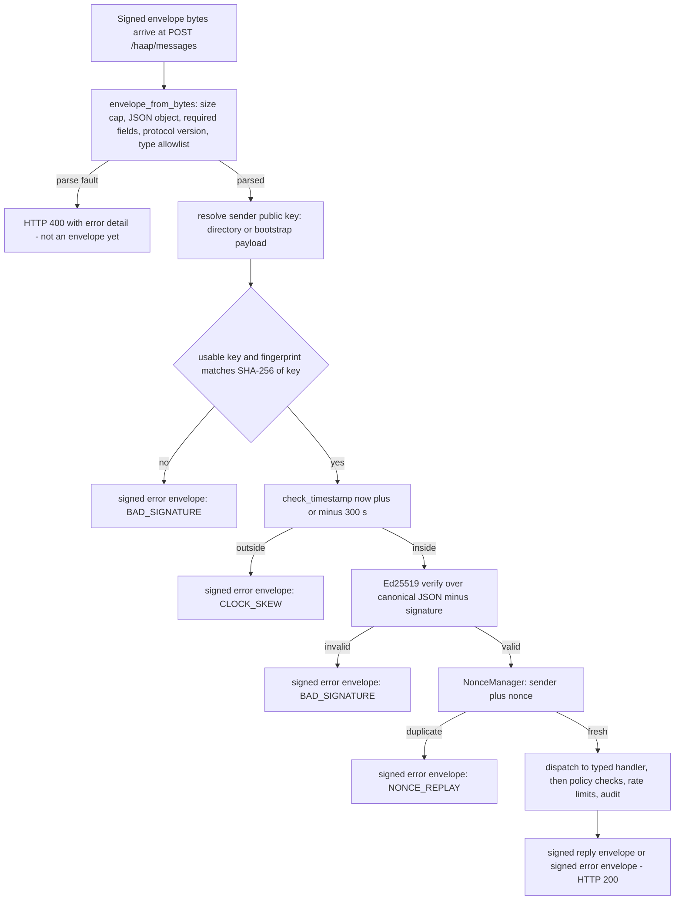
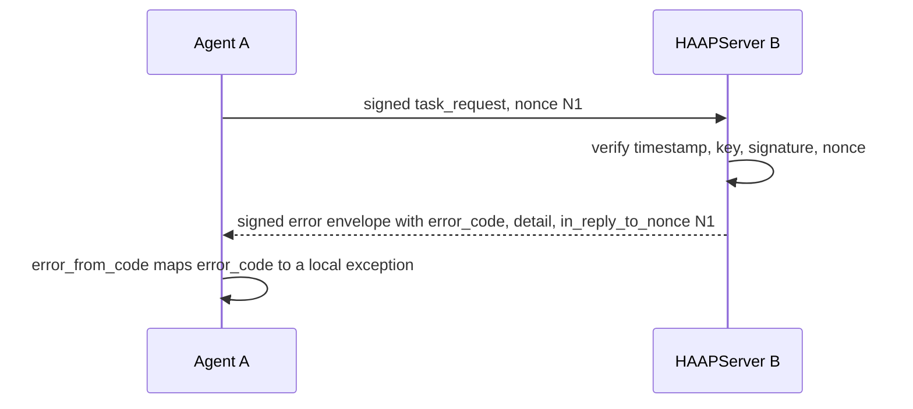

# Signed Envelope Protocol and Anti-Replay

Every HAAP message — friendship handshake, task delegation, marketplace request, error — is one signed JSON envelope. The envelope is the only thing two agents ever exchange: the transport (`HttpTransport`, `MemoryTransport`, future Matrix/email adapters) only has to deliver the serialized envelope bytes and return the reply. This page documents the wire format field by field, the deterministic canonical JSON that makes signatures reproducible on both sides, the exact inbound verification order, the anti-replay machinery, the versioned message-type catalog, the stable error codes that travel in `error` envelopes, and the hard invariants that no change may relax. The trust rationale and the T1–T10 threat mapping live in [security-model](../architecture/security-model.md); this page is the protocol mechanics.

## Wire format

A signed envelope is a JSON object with exactly these roles (docstring of `haap/envelope.py`, mirrored in `docs/ARQUITECTURA.md` §3.2):

```json
{
  "protocol_version":      "1.0",
  "message_type":          "task_request",
  "sender_fingerprint":    "HF-3f7a9c1b2d4e5f60",
  "recipient_fingerprint": "HF-83b91c82c444f558",
  "timestamp":             1788521676,
  "nonce":                 "<base64 of 16 random bytes>",
  "payload":               { ... },
  "signature":             "<base64 Ed25519 64 B>"
}
```

| Field | Type | Meaning |
|---|---|---|
| `protocol_version` | non-empty string | Wire protocol version; `PROTOCOL_VERSION = "1.0"` is the only accepted value at parse time (`haap/__init__.py`). A mismatch raises `ProtocolVersionError` (`PROTOCOL_VERSION_UNSUPPORTED`). |
| `message_type` | non-empty string | Member of the `MESSAGE_TYPES` allowlist (see [Message-type catalog](#message-type-catalog)). Unknown types are rejected before any handler runs. |
| `sender_fingerprint` | non-empty string | `HF-<16 hex>` handle of the signer; the short form of `SHA-256(public key)`. See [identity](../concepts/identity.md). |
| `recipient_fingerprint` | non-empty string | Intended destination identity. Bound into the signature so the envelope cannot be redirected to a third agent by field substitution. |
| `timestamp` | integer | UTC epoch seconds. Must fall inside `now ± 300` s (`MAX_CLOCK_SKEW`). |
| `nonce` | non-empty string | Randomness for anti-replay; generated as `base64(secrets.token_bytes(16))` by `sign_body`. |
| `payload` | JSON object | Type-specific body. Missing payload is normalized to `{}` at parse; a non-object payload is malformed. |
| `signature` | non-empty string | `base64` of the 64-byte Ed25519 signature over the canonical JSON of every field except `signature` itself. |

`SIGNED_FIELDS` documents the seven covered fields; the implementational guarantee that binds them is `signing_payload()`, which signs whatever remains after dropping only the `signature` key — so an extra top-level field would also be covered by the signature. `recipient_fingerprint` is signed and validated as present, but the local router does not re-check it against the receiving identity; replies are always addressed back to `sender_fingerprint`.

## Deterministic canonical JSON

Signatures are computed over canonical bytes, so both sides must serialize identically. `canonical_json()` (`haap/envelope.py`) is that serializer:

- dict keys are recursively **sorted** (by `str(key)`), separators are **compact** (`{`,`}`,`[`,`]`, `:`, `,`, no whitespace), strings are encoded UTF-8 with `ensure_ascii=False` (no unnecessary `\u` escapes), integers render as ASCII digits.
- Only native JSON values are allowed: dict, list, str, int, bool, None. **Floats are forbidden**: their representation is ambiguous across platforms, so any float anywhere in signed data raises `MalformedEnvelopeError` ("floats are not allowed in signed canonical JSON; use integers (epoch ms) or strings"). Payload keys must be strings; non-JSON types raise.
- The recursive payload walker `_check_payload_jsonable()` applies the same rules at **signing time**, so a sender can never emit a payload that would not canonicalize on the receiver.

```mermaid
flowchart TD
    subgraph SIGN["Sender - sign_body"]
        S1["payload validated: JSON-only, no floats, string keys"] --> S2["envelope minus signature passed to canonical_json"]
        S2 --> S3["Ed25519 sign with local private key, base64"]
        S3 --> S4["full envelope serialized with canonical_json for the wire"]
    end
    subgraph VERIFY["Receiver - verify pipeline"]
        V1["envelope_from_bytes: size, shape, version, type"] --> V2["resolve sender public key"]
        V2 --> V3["check_timestamp within plus or minus 300 s"]
        V3 --> V4["canonical_json of envelope minus signature"]
        V4 --> V5["Ed25519 verify with fingerprint-bound key"]
        V5 --> V6["NonceManager: mark sender plus nonce"]
    end
```



## Building, serializing and parsing

`envelope.py` exposes four functions that cover the whole lifecycle:

- **`sign_body(identity, message_type, recipient_fingerprint, payload, timestamp=None, nonce=None)`** — builds and signs an envelope. It rejects unknown `message_type` and non-JSON payloads, fills `timestamp` from `time.time()` when omitted, generates `base64(secrets.token_bytes(16))` as the nonce when omitted, and returns the envelope dict with `signature` set to `base64(identity.keypair.sign(signing_payload(envelope)))`. The local private key never leaves the `Identity` object.
- **`signing_payload(envelope)`** — the canonical bytes to sign or verify: the whole envelope minus the `signature` key. Because sender, recipient, timestamp, nonce, protocol version, message type and payload are all inside that input, none of them can be swapped after signing (field-substitution / MITM protection, threat T3).
- **`envelope_to_bytes(envelope)`** — serializes a complete envelope with `canonical_json`, producing the exact wire bytes.
- **`envelope_from_bytes(data)`** — the structural gate on the receiving side. It decodes UTF-8, enforces the size cap, parses JSON, requires the envelope be an object, requires non-empty string values for `protocol_version`, `message_type`, `sender_fingerprint`, `recipient_fingerprint` and `signature`, requires an integer `timestamp`, a non-empty `nonce`, `protocol_version == PROTOCOL_VERSION` (else `ProtocolVersionError`), a `message_type` inside `MESSAGE_TYPES`, and a dict `payload` (missing payload defaults to `{}`). Everything else is `MalformedEnvelopeError` (`MALFORMED_ENVELOPE`).

`HAAPServer.handle_message()` re-validates by round-tripping the dict through `envelope_from_bytes(envelope_to_bytes(envelope))` — i.e. it canonicalizes first, so a float smuggled into a payload raises `MalformedEnvelopeError` inside the routing try/except and becomes a signed `MALFORMED_ENVELOPE` error reply rather than a crash.

## Timestamp window

`MAX_CLOCK_SKEW = 300`. `check_timestamp()` rejects any message whose `timestamp` differs from the receiver's `now` by more than 300 s with `ClockSkewError` (`CLOCK_SKEW`). In `verify_envelope()` the timestamp check runs **before** the public-key lookup and the Ed25519 verification — stale or future messages are discarded cheaply without spending crypto effort, and a captured message replayed after the window fails here even if the nonce cache has been rebuilt. The window bounds the usefulness of captured traffic regardless of either side's clock discipline.

## Anti-replay: NonceManager

Every envelope carries a fresh nonce, and `NonceManager` (`haap/envelope.py`) remembers the `(sender_fingerprint, nonce)` pairs it has authenticated:

- **TTL 660 s** — `2 × MAX_CLOCK_SKEW + 60`, so a nonce outlives any timestamp window it could legally pass through. Replays inside the window hit `ReplayError` (`NONCE_REPLAY`); replays after it fail `CLOCK_SKEW` anyway.
- **Per sender** — the key is the pair, so different senders may reuse the same nonce value without collision.
- **Memory cap 100,000** (`MAX_SEEN`) with lazy pruning: when the cache exceeds the cap at `check_and_mark()` time, entries older than the TTL are deleted. Everything is guarded by a `threading.Lock`.
- The nonce is marked **after** the signature verifies, so unauthenticated garbage never pollutes the cache (an attacker cannot burn another agent's nonces without first producing a valid signature).
- The cache is deliberately in-memory and rebuilt on restart (see [local-state](../architecture/local-state.md)); nothing about anti-replay state is persisted.

## Verification pipeline

`verify_envelope(envelope, trusted_pubkeys, nonces=None, now=None)` performs, in order:

1. Structural/version validation (already done by `envelope_from_bytes`; the router re-runs it on the canonical round-trip).
2. `check_timestamp` — reject outside `now ± 300` s → `CLOCK_SKEW`.
3. Look up the sender's raw public key by `sender_fingerprint` in `trusted_pubkeys`; no mapping → `SignatureError` (wire code `BAD_SIGNATURE`; the `UNKNOWN_SENDER` class exists but server paths raise `SignatureError` instead, and `tests/test_server.py` asserts the wire code).
4. Fingerprint↔key consistency: `fingerprint_of_public_key(raw_pub) == sender_fingerprint`, else `SignatureError` — an impostor's own key cannot match the claimed fingerprint.
5. Ed25519 verification of `signing_payload(envelope)` against that key (`KeyPair.verify_with`), else `SignatureError`.
6. Nonce anti-replay via `NonceManager.check_and_mark` when a manager is provided.

The router (`HAAPServer.handle_message()`) is the single door for HTTP and in-memory traffic alike. Before step 2 it resolves the key with `_resolve_sender_pubkey()`: for **bootstrap types** (`hello`, `challenge`, `friend_request`, and the marketplace `service_search`, `service_book`, `service_cancel`, `service_quote`) the sender's public key travels in the payload — precisely because the receiver may not know the sender yet — and the router enforces `fingerprint == SHA-256(declared key)` before the key is used. For all other types the key must already be in the local directory (which includes pending and blocked records, so a known-but-blocked sender is still verified and then rejected with the proper error).



## Message-type catalog

`MESSAGE_TYPES` (`haap/envelope.py`) is the versioned allowlist of protocol 1.0 — the exact membership, verbatim:

```
hello, hello_ack, challenge, verify, friend_request, friend_accept,
capabilities, task_request, task_accept, task_result,
task_progress, error, ping,
service_search, service_quote, service_book, service_cancel
```

They group into four families:

- **Friendship / handshake**: `hello`, `hello_ack`, `challenge`, `verify`, `friend_request`, `friend_accept`.
- **Tasks**: `task_request`, `task_accept`, `task_progress`, `task_result`.
- **Utilities**: `capabilities`, `ping`, `error`.
- **Marketplace (open services)**: `service_search`, `service_quote`, `service_book`, `service_cancel` — signed requests that require **no prior friendship**; the business's policy decides acceptance (see [security-model](../architecture/security-model.md) and the marketplace tests), everything else stays deny-by-default.

The allowlist is enforced at three points: `sign_body` refuses to sign an unknown type, `envelope_from_bytes` refuses to admit one, and dispatch fails any type that reaches a server without a handler. Note the asymmetry: the catalog is the superset of everything the protocol defines, while the server implements handlers only for the types it *receives* (`hello`, `challenge`, `friend_request`, `friend_accept`, `task_request`, `task_result`, `ping`, `service_search`, `service_book`, `service_cancel`, `service_quote`). Reply-only types such as `hello_ack`, `verify`, `capabilities`, `task_accept` and `task_progress` have no server handler; if one arrives anyway it is answered with a signed `error` envelope (`HAAP_ERROR`, "unhandled type").

The public manifest (`/.well-known/haap.json`, `capabilities.py::MESSAGE_TYPES_PUBLIC`) advertises a narrower list — `hello, challenge, verify, friend_request, friend_accept, capabilities, task_request, task_accept, task_progress, task_result, ping, error` — omitting `hello_ack` (a reply the agent sends, not a capability it offers) and the four `service_*` types (open-services requests are gated by marketplace policy, not advertised as capabilities).

## Size caps

`MAX_PAYLOAD_BYTES = 1_000_000` (1 MB, anti-flooding, threat T5). `envelope_from_bytes` rejects any message whose UTF-8 length exceeds `MAX_PAYLOAD_BYTES + 4096` bytes (≈1 MB of payload plus 4 KB of envelope overhead) with `MalformedEnvelopeError` ("message exceeds maximum size"). This is the only size bound enforced in v1 — it is a coarse cap on the whole message, applied before JSON parsing.

## Error-envelope reply shape

Every rejection after the envelope parses is itself a **signed** `error` envelope (`server.py::_error_reply`), so the sender can attribute each failure to its own envelope and a third party cannot forge rejections:

```json
{
  "protocol_version": "1.0",
  "message_type": "error",
  "sender_fingerprint": "HF-<receiver>",
  "recipient_fingerprint": "HF-<original sender>",
  "timestamp": 1788521700,
  "nonce": "<fresh>",
  "payload": {
    "error_code": "NONCE_REPLAY",
    "detail": "duplicate nonce from sender HF-...",
    "in_reply_to_nonce": "<nonce of the rejected envelope>"
  },
  "signature": "<receiver's Ed25519 signature>"
}
```

- `error_code` is the stable machine-readable code (catalog below); `detail` is human-readable and truncated to 200 characters on the wire; `in_reply_to_nonce` echoes the nonce of the rejected envelope so a client with several in-flight requests knows which one failed.
- Verification failures and handler failures both flow through `_error_reply` inside `handle_message()`; both outcomes are audited (`message.rejected` with a 120-character excerpt for verification failures; `message.<type>` with `result="error"` for handler failures). See [security-model](../architecture/security-model.md) for audit details.
- The HTTP layer is deliberately thin (`server.py::_make_handler`): only a fault that happens **before** any cryptographic check — unparseable or structurally invalid JSON rejected by `envelope_from_bytes` — returns HTTP 400 with a truncated `{"error": ...}`. A parsed envelope gets HTTP 200 with the reply envelope (including error envelopes); a handler that returns nothing gets HTTP 202. Envelope-level failures therefore never look like HTTP transport errors, and `HttpTransport` never retries them (validation 4xx responses are terminal; only 408/429/5xx are retried with backoff).



## Stable error-code catalog

The error hierarchy lives in `haap/errors.py`; each class carries a short, stable ASCII `code` that travels verbatim in `error` envelopes. The complete catalog, verbatim (`code` ← exception class):

| Code | Exception | Wire semantics |
|---|---|---|
| `HAAP_ERROR` | `HAAPError` | Base / fallback; also the code for "unhandled type" dispatches |
| `PROTOCOL_VERSION_UNSUPPORTED` | `ProtocolVersionError` | `protocol_version` mismatch |
| `BAD_SIGNATURE` | `SignatureError` | Invalid Ed25519 signature, unknown sender (non-bootstrap), or fingerprint↔key mismatch |
| `UNKNOWN_SENDER` | `UnknownSenderError` | Catalog entry; server paths surface the same situation as `BAD_SIGNATURE` |
| `CLOCK_SKEW` | `ClockSkewError` | Timestamp outside `now ± 300` s |
| `NONCE_REPLAY` | `ReplayError` | Duplicate `(sender, nonce)` |
| `MALFORMED_ENVELOPE` | `MalformedEnvelopeError` | Structural/JSON/size/type violation; floats in signed data |
| `CHALLENGE_REQUIRED` | `ChallengeError` | Challenge missing, expired or reused in the handshake |
| `NOT_INITIALIZED` | `NotInitializedError` | No local identity (setup-time, not on-wire) |
| `FRIEND_NOT_FOUND` | `FriendNotFoundError` | Sender not in the directory / not accepted |
| `FRIEND_BLOCKED` | `FriendBlockedError` | Sender is blocked |
| `FRIEND_NOT_ACCEPTED` | `FriendNotAcceptedError` | Relationship not yet accepted |
| `DUPLICATE_REQUEST` | `DuplicateRequestError` | Duplicate friendship/task request |
| `PERMISSION_DENIED` | `PermissionDeniedError` | No grant for action+resource; blocked in marketplace |
| `RATE_LIMITED` | `RateLimitedError` | Token bucket empty; `transient=True`, carries `retry_after` |
| `TRANSPORT_ERROR` | `TransportError` | Client-side HTTP/transport failure; `transient=True`, carries HTTP `status` |
| `DISCOVERY_FAILED` | `DiscoveryError` | Messaging URL for a fingerprint could not be resolved |
| `TASK_ERROR` | `TaskError` | Generic task-lifecycle failure |
| `TASK_NOT_FOUND` | `TaskNotFoundError` | Unknown `task_id` |
| `TASK_STATE_INVALID` | `TaskStateError` | Illegal state transition |
| `TASK_LIMIT_REACHED` | `TaskOverloadError` | Local executor saturated; `transient=True`, carries `retry_after` |
| `UNEXPECTED_MESSAGE` | `UnexpectedMessageError` | Message received out of context |
| `FRIEND_REQUEST_DENIED` | `FriendRequestDeniedError` | Inbound request rejected by local policy |

`ERROR_MAP` translates every code back into its exception class; `error_from_code()` instantiates the right exception for a received code and degrades unknown codes to a generic `HAAPError` instead of crashing. The client applies this on every reply: `HAAPClient._send` and `_raw_send` inspect a reply whose `message_type == "error"` and raise `error_from_code(error_code, detail)` locally, after auditing the failure (see [client-and-transports](../operations/client-and-transports.md)). `detail` never carries secrets or internal tracebacks (threat T7).

## Hard invariants

These constraints are load-bearing for every present and future change (they appear again as non-negotiable rules in [security-model](../architecture/security-model.md)):

1. **The signature covers every field except `signature` itself**, over deterministic canonical JSON — sender, recipient, timestamp, nonce, protocol version, message type and payload are bound together. Relaxing this (or signing a subset) is a protocol break.
2. **Floats are forbidden anywhere in signed canonical JSON**; signed payloads must use integers (epoch ms) or strings. Introducing floats or non-deterministic ordering into signed data is a protocol break.
3. **The timestamp window is ±300 s** (`MAX_CLOCK_SKEW`) and is mandatory — never widen or disable `check_timestamp`.
4. **Anti-replay is mandatory**: every envelope carries a fresh nonce and the receiver must mark `(sender, nonce)` through `NonceManager` with the 660 s TTL; never sign a message without a nonce and never drop the replay check.
5. **The message cap is 1 MB** (`MAX_PAYLOAD_BYTES = 1_000_000`, parse bound + 4096 overhead bytes).
6. **`message_type` is an allowlist**, never an open dispatcher: unknown types are rejected at parse/sign and cannot reach a handler.

## Focused tests

The envelope-level guarantees are exercised end-to-end through the router in `tests/test_server.py` (the same code path the HTTP layer uses):

- `test_firma_invalida_rechazada` — a tampered signature yields a signed `error` envelope with `BAD_SIGNATURE`.
- `test_replay_rechazado` — resending the identical envelope (same nonce) yields `NONCE_REPLAY`.
- `test_timestamp_fuera_de_ventana` — a timestamp 4000 s in the past yields `CLOCK_SKEW`.
- `test_emisor_desconocido_rechazado` — a non-bootstrap message from an unknown sender yields `BAD_SIGNATURE` on the wire.
- `test_bootstrap_con_clave_falsa_rechazado` — a `hello` declaring a key whose SHA-256 does not match the claimed fingerprint yields `BAD_SIGNATURE` (impostor with own key cannot match a borrowed fingerprint).

Related pages: [security-model](../architecture/security-model.md) (threat model and invariants), [identity](../concepts/identity.md) (fingerprints and keypairs), [local-state](../architecture/local-state.md) (nonce cache is in-memory), [messaging-server](../operations/messaging-server.md) (routing and HTTP semantics), [friendship-handshake](../workflows/friendship-handshake.md) (which envelopes drive handshakes).
