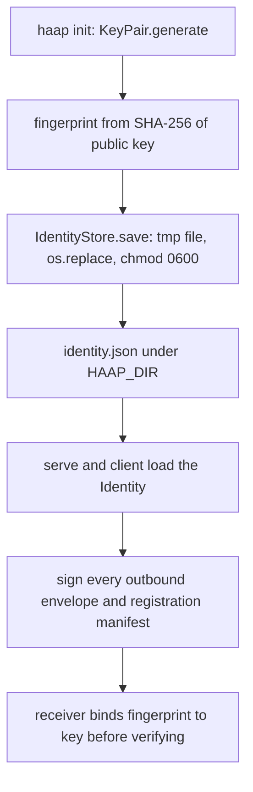
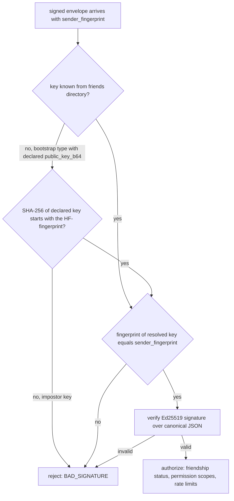

# Agent Identity: Ed25519 Keys and HF Fingerprints

Every HAAP agent — personal assistant, business, or even the public directory server — is identified by a cryptographic key pair it generates locally, not by a username or a service account. "Identity lives in the keys": the only thing another agent can ever prove about you is possession of your private key, and the only thing a receiver verifies about an inbound message is an Ed25519 signature over the exact message bytes. This page documents the key material (`haap/crypto.py`), the human-facing `HF-` fingerprint derived from the public key, the `Identity`/`IdentityStore` record and its `0600` persistence under `$HAAP_DIR`, the fingerprint↔key binding checks that make impersonation fail at every trust boundary, and the invariant that the private key never leaves the machine. The trust rationale and the T1–T10 threat mapping live in [security-model](../architecture/security-model.md); the persisted-file mechanics are in [local-state](../architecture/local-state.md); the wire format that carries fingerprints is in [envelope-protocol](../concepts/envelope-protocol.md).

## Key material and signing primitives (`haap/crypto.py`)

The module split is deliberate: `haap/crypto.py` holds only low-level Ed25519 primitives and encoding helpers, while the high-level identity (`Identity` dataclass and persistence) lives in `haap/identity.py`. Agents use Ed25519 with 32-byte raw keys, generated with the `cryptography` library:

- `KeyPair` is a dataclass holding `public_key` and `private_key` as raw 32-byte bytes. Both fields are `repr=False`, so an accidental log of the object never echoes key material.
- `KeyPair.generate()` creates a fresh pair via `Ed25519PrivateKey.generate()`; `KeyPair.from_private_bytes(raw)` reconstructs a pair from a stored private key and derives the public key from it.
- `sign(data)` returns the 64-byte Ed25519 signature produced by the local private key. `verify(data, signature)` and the static `verify_with(raw_pub, data, signature)` verify against the pair's key or against an arbitrary raw public key (other agents' keys); `verify_with` catches `InvalidSignature` and returns `False` instead of raising, which keeps verification failures on the caller's error path.
- `b64e`/`b64d` are standard base64 helpers used everywhere a key or signature crosses a JSON boundary (`identity.json`, envelope `signature`, bootstrap `public_key_b64`).

```python
@dataclass
class KeyPair:
    public_key: bytes = field(repr=False)   # raw 32 B
    private_key: bytes = field(repr=False)  # raw 32 B
```

## The `HF-` fingerprint

Fingerprints make a 32-byte key usable by humans, directories, logs and policy files. The derivation (`haap/identity.py`) is:

```
fingerprint = "HF-" + sha256(raw_public_key).hexdigest()[:16]
```

i.e. `HF-` followed by the first 16 hex characters of the SHA-256 digest of the **raw public key** — for example `HF-3f7a9c1b2d4e5f60`. The canonical machine-side form is enforced as `^HF-[0-9a-f]{16}$` where fingerprints are validated (registry registration). `fingerprint_of_public_key(pub_raw)` computes it and `fingerprint_matches(fp, pub_raw)` compares, both in `haap/identity.py`.

The fingerprint is a short **handle**, never a substitute for the key: cryptographic matching always uses the full public key. It is what `sender_fingerprint`/`recipient_fingerprint` carry on the wire, what `friends.json` entries are keyed by, what `policy.json` auto-approve rules match on, and what registry search results print. Because it is derived from the key, an agent cannot choose a friendly name to impersonate someone — a borrowed fingerprint only "works" with a key whose SHA-256 prefix equals it (see [binding checks](#fingerprintkey-binding-checks-fingerprint-and-key-must-agree)).

## The `Identity` record and its public projection

`Identity` (`haap/identity.py`) bundles the `KeyPair` with operator metadata:

| Field | Meaning | Default |
|---|---|---|
| `keypair` | the Ed25519 pair (private half never leaves) | required |
| `display_name` | human label shown to owners and friends | `"hermes-agent"` |
| `created_at` | UTC timestamp of creation | generation time |
| `endpoint_transport` | transport label for the messaging URL | `"https"` |
| `endpoint_url` | public URL where the agent receives messages | `""` |

The `fingerprint` property derives the `HF-` handle from `keypair.public_key` on demand, so fingerprint and key can never drift apart inside one object. `public_claims()` is the **only safe projection**: `{display_name, fingerprint}` plus an optional `endpoint {transport, url}` block when an endpoint is configured — no key material of any kind. Capability manifests are built exclusively from this projection (`build_manifest(ident.public_claims(), ...)` in `haap/capabilities.py`), so published manifests never carry keys; as defense in depth, `parse_manifest()` rejects any inbound manifest containing `private_key`, `public_key` or `signature` fields.

## Persistence: `identity.json`, `IdentityStore`, `$HAAP_DIR`

`IdentityStore` persists one agent's identity at `<directory>/identity.json` — the directory being `haap_dir()` unless an override is given:

```python
def haap_dir() -> str:
    return os.environ.get("HAAP_DIR", os.path.expanduser("~/.haap"))
```

`$HAAP_DIR` (default `~/.haap`) is the shared state root for the whole agent: `Directory` (`friends.json`), `AuditLog` (`audit.log`), `TaskRegistry`, and the roles/policy/capabilities loaders all default to `haap_dir()` and accept the same explicit `directory` override — which the CLI exposes as `--dir`. One directory holds exactly one agent's identity; `IdentityStore.create()` refuses to overwrite an existing `identity.json` unless `overwrite=True`, so multi-agent hosts give each agent its own subdirectory (the test suite does exactly this with `tmp_path/"a"`, `tmp_path/"b"`, ...).

`identity.json` is JSON in the versioned `haap-identity-v1` format: `format`, `display_name`, `fingerprint`, base64 `public_key` and `private_key`, `created_at`, and `endpoint {transport, url}`. Lifecycle rules:

- **Create** — `haap init` (CLI) calls `IdentityStore.create(display_name, endpoint_url)`, which generates a fresh `KeyPair` and saves it. Running init again on the same directory is refused with a `HAAPError` telling the operator to delete the file or use another `HAAP_DIR`.
- **Load** — `IdentityStore.load()` raises `NotInitializedError` (wire code `NOT_INITIALIZED`) with a "Run first: haap init" message when the file is missing.
- **Validate** — `Identity.from_dict()` reconstructs the pair from the stored private key and rejects bad files: an unknown `format` value, a missing `private_key`, or a stored `fingerprint` that does not equal the fingerprint recomputed from the private key all raise `HAAPError` — a corrupt or partially tampered file is never silently accepted. (The stored `public_key` field is informational; the actual pair is rebuilt from the private key.)
- **Save atomically with `0600`** — `IdentityStore.save()` writes through `identity.json.tmp`, `os.replace()`s it into place (atomic on POSIX), then `os.chmod(path, stat.S_IRUSR | stat.S_IWUSR)` so the final file is owner read/write only. The private key never lands in a world-readable file.



Caption: From key generation to signing: the identity lifecycle that produces `identity.json` and feeds every outbound signature.

## Fingerprint↔key binding checks: fingerprint and key must agree

The attack the whole design guards against is **spoofing** (threat T1): an impostor claiming someone else's `HF-` fingerprint. Because the fingerprint is a prefix of `SHA-256(public key)`, an impostor cannot pick a fingerprint and then find a key that hashes to it; the only remaining vector is a mismatch between the *claimed* fingerprint and the *actual* key used to sign. The code closes that gap at every boundary where a key first appears:

1. **Envelope verification (`envelope.verify_envelope`)** — for every inbound message, the sender's fingerprint must map to a raw public key in the receiver's trusted map, and `fingerprint_of_public_key(raw_pub)` must equal the claimed `sender_fingerprint` before the Ed25519 signature is even checked. A fingerprint with no registered key, or a key whose fingerprint differs, raises `SignatureError`, whose wire code is `BAD_SIGNATURE`.
2. **Bootstrap messages (`HAAPServer._resolve_sender_pubkey`)** — `hello`, `challenge`, `friend_request` and the marketplace `service_*` messages arrive precisely when the receiver may not know the sender yet, so the sender's public key travels in the payload. The router validates `fingerprint_of_public_key(declared key) == sender_fingerprint` and only then uses the key for signature verification. `tests/test_server.py::test_bootstrap_con_clave_falsa_rechazado` proves the guarantee: a fresh impostor key sent under A's fingerprint is rejected with `BAD_SIGNATURE`.
3. **The friends directory** — `friends.json` records each friend's fingerprint *together with* the friend's base64 public key; `Directory.public_keys()` maps fingerprint → raw key for verification and deliberately includes `pending` and `blocked` records, so a known sender can always be verified and then rejected with the correct error.
4. **Challenge-response** — the alliance handshake additionally proves private-key possession: the receiver answers `hello` with a random challenge in `hello_ack`, the requester signs the challenge text with its private key, and the receiver verifies that signature against the fingerprint-bound public key *before* registering the sender as a known agent (challenges expire after 120 s). Knowing a fingerprint or stealing a manifest is useless without the private key.
5. **Registry registration** — a public directory binds identity to keys too: the manifest fingerprint must match `^HF-[0-9a-f]{16}$`, the submitted public key's fingerprint must equal the manifest's fingerprint, and the manifest signature must verify against that key; completing the listing additionally requires an endpoint proof signed with the same verified key. The registry is a phone book, not a notary — identity is never *assigned* by it, only indexed.
6. **Endpoint refresh** — `HAAPClient.refresh_endpoint()` re-checks identity during discovery: a friend's `/.well-known/haap.json` manifest must carry the recorded fingerprint, otherwise it raises `DiscoveryError` ("possible endpoint substitution") rather than trusting a substituted URL.



Caption: The fingerprint↔key binding check runs before any signature is trusted, for known senders and for bootstrap payloads alike.

The server also treats its **own** identity as a trusted key: `HAAPServer.public_keys()` augments the friends map with `self.identity.fingerprint → self.identity.keypair.public_key`, and every reply it signs is addressed back to the sender's fingerprint. Registries are identities too: `RegistryServer` generates its own `KeyPair` on construction, derives its own `HF-` fingerprint from it, and signs the registration challenge it issues.

## The private key never leaves the machine

`haap/crypto.py` states the contract in its module docstring: *the private key NEVER leaves this machine and is never included in any message or public manifest*. The guarantees that make it true:

- **At rest** — the only on-disk copy is `<HAAP_DIR>/identity.json`, written atomically and `chmod`-ed to `0600`; `.gitignore` excludes `identity.json`, `*.key`, `*.pem`, `.env` and `secrets/` (plus per-agent `friends.json`, `audit/`, `data/`) so identity material is never committed to a repository.
- **On the wire** — envelopes carry only the 64-byte signature and the sender's fingerprint; the private key is used solely inside `identity.keypair.sign()` on the sending machine. Bootstrap payloads carry the *public* key when the receiver does not know the sender yet — never the private one.
- **In derived artifacts** — manifests are built from `Identity.public_claims()` (no keys) and inbound manifests containing key fields are refused; `AuditLog` redacts `challenge_token`, `private_key`, `signature` and `task_payload` values before writing; errors carry stable codes and truncated details, never keys or tracebacks.
- **Rotation** — because `identity.json` is the root of trust, its loss or theft is treated as full compromise (threat T6): rotation means generating a **new** identity — a new fingerprint — and re-establishing friendships. A friend detects the compromise/rotation because the next `hello` arrives from an unknown fingerprint.

Operationally the CLI is the identity's lifecycle front end: `haap init --name --endpoint` creates the identity and prints the fingerprint and the `0600` file path; `haap whoami` prints `public_claims()` as JSON; `haap serve` loads the identity to run the messaging server; `haap registry register` signs a manifest and proves endpoint control with it. In code, both `HAAPServer` and `HAAPClient` receive the loaded `Identity` and use it as the local signing authority for everything they send.

Related pages: [security-model](../architecture/security-model.md) (why identity lives in keys, T1/T6), [envelope-protocol](../concepts/envelope-protocol.md) (wire format, `sign_body`/`verify_envelope`), [local-state](../architecture/local-state.md) (`identity.json` among the persistent files). Companion workflows: friendship-handshake (challenge-response bootstrap), directory-registration (registry binding), manifests (public projection, no keys).
