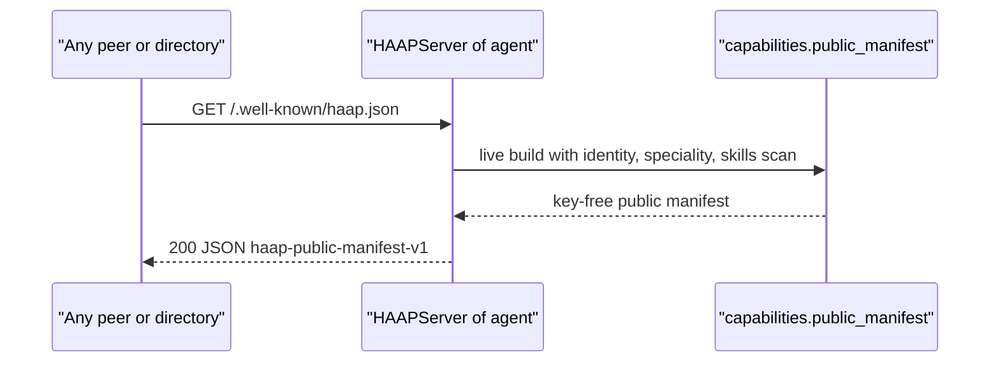
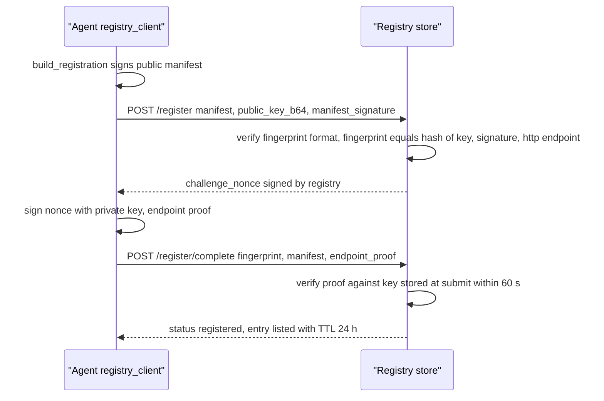
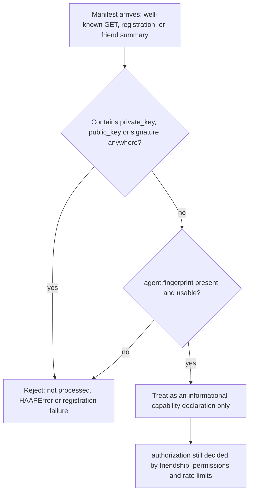

# Capability Manifests and the Well-Known Contract

A HAAP agent publishes *what it can do*, never *who it is cryptographically*: name, speciality, supported message types, exposed skills and tools, and the messaging endpoint. Those declarations are **capability manifests**, produced exclusively by `haap/capabilities.py` from the safe public projection of identity (`Identity.public_claims()`), and consumed by three distinct flows: HTTP discovery of a live agent (`GET /.well-known/haap.json`, mirroring the A2A Agent Card pattern), signed registration and search in a federated directory, and the capability *summary* attached to outbound `friend_request` envelopes. The load-bearing invariant of the whole design is that **a manifest never carries keys** — no `private_key`, no `public_key`, no `signature` field — enforced at generation (the builders only receive key-free projections) and again at parsing (`parse_manifest` rejects any manifest that contains them). Identity and fingerprint mechanics live in [identity](../concepts/identity.md); the envelope channel these manifests describe is in [envelope-protocol](../concepts/envelope-protocol.md); threat mapping and the phone-book-not-notary rationale are in [security-model](../architecture/security-model.md); file persistence semantics are in [local-state](../architecture/local-state.md).

## Two manifest formats, one module

`haap/capabilities.py` produces two deliberately different JSON documents, both key-free by construction:

| | Full local manifest | Public manifest |
|---|---|---|
| Builder | `build_manifest(identity_public, speciality, ...)` | `public_manifest(identity, speciality, ...)` |
| `format` | `haap-capability-manifest-v1` | `haap-public-manifest-v1` |
| Audience | the owner / embedder, for local inspection and deciding what to publish | every other agent, the directory, anyone doing discovery |
| Identity fields | whatever `public_claims()` returns (display_name, fingerprint, optional endpoint block) | flat `agent` block: `fingerprint`, `name`, `speciality`, `endpoint` (a single URL string) |
| Extra fields | `haap_version`, `generated_at`, full `message_types` list | `protocol_version: "1.0"`, `message_types`, `skills`, `tools` |

The full manifest built by `build_manifest` carries `format`, `haap_version` (the running package `__version__`), `agent`, `speciality`, `message_types` (`MESSAGE_TYPES_PUBLIC`), `skills`, `tools` (sorted, deduplicated) and a UTC `generated_at` timestamp. The public manifest is the same idea shrunk to what strangers may see: `format`, `protocol_version`, a flat `agent` block whose `endpoint` is `messaging_url or identity.endpoint_url`, and the `message_types`/`skills`/`tools` arrays. Both take an optional `skills_dirs` and `extra_tools` parameter, and both receive identity data that already excludes key material (`public_claims()` returns only `display_name`, `fingerprint` and the endpoint block — see [identity](../concepts/identity.md)).

`MESSAGE_TYPES_PUBLIC` (`hello, challenge, verify, friend_request, friend_accept, capabilities, task_request, task_accept, task_progress, task_result, ping, error`) is the capability advertisement: the set of envelope message types the agent offers to handle. It deliberately omits `hello_ack` (a reply, not an offered capability) and the four `service_*` marketplace types (open-services requests are gated by marketplace policy rather than advertised).

## Hermes skill introspection

The `skills` array of both formats is populated by `scan_installed_skills`, which lists the skills a Hermes agent has installed so peers can discover them. It scans the `SKILLS_CANDIDATES` directories — `~/.hermes/skills` and `~/.hermes/profiles/default/skills` (overridable per call via `skills_dirs`) — and, for each immediate subdirectory containing a `SKILL.md`, contributes `{"name", "description"}`. Skill names are deduplicated first-seen across the candidate roots.

`_read_frontmatter` parses the `SKILL.md` YAML frontmatter **without a YAML dependency**: a regex extracts only the `name` and `description` keys between the leading `---` fences; anything unreadable degrades to the directory name as the skill name and an empty description. This keeps manifest generation dependency-free and conservative — a broken frontmatter in one skill never fails the whole manifest.

## Publishing: the `/.well-known/haap.json` contract

`HAAPServer` exposes the public manifest over plain HTTP alongside the envelope intake point (`haap/server.py` module docstring):

| HTTP route | Purpose |
|---|---|
| `POST /haap/messages` | signed envelope intake (handshake, tasks, marketplace) |
| `GET /.well-known/haap.json` | the agent's public capability manifest (no keys) |
| `GET /health` | liveness |

The well-known document is **generated live on every request**: `HAAPServer.well_known_manifest()` calls `public_manifest(self.identity, speciality=..., skills_dirs=..., extra_tools=...)`, so the advertised speciality, skills and tools always reflect the running server's construction arguments (`haap serve --speciality "citas-peluqueria"` sets it), and the handler answers `200 application/json` at exactly that path with `404 {"error": "not found"}` for anything else. There is no on-disk copy being served and no caching: the agent's `speciality`, plus whatever `skills_dirs`/`extra_tools` an embedder passed to `HAAPServer`, are re-serialized per GET.

The `agent.endpoint` value in the served document is `identity.endpoint_url` — the base URL (e.g. `https://salon.example:8443`) — because peers derive the messaging URL by appending `/haap/messages`. The document is **unsigned**: it is a public, unauthenticated discovery card whose only client-side check is fingerprint agreement (see [Re-verification by discovery clients](#re-verification-by-discovery-clients-clientrefresh_endpoint)). The A2A-standard analogue is the Agent Card at `/.well-known/agent-card.json`; HAAP deliberately uses the same well-known pattern with its own format name (`docs/ARQUITECTURA.md` §10).

Caption: The well-known contract: every GET regenerates the public manifest from the server's identity, speciality and Hermes skill scan — no keys are involved at any step.

## The full manifest at rest: `capabilities.json`

The full `haap-capability-manifest-v1` document is meant for the owner, not the network: its module docstring frames `<HAAP_DIR>/capabilities.json` as the local artifact "so the owner can decide what to publish". The persistence API is explicit and inert by default:

- `export_manifest(manifest, directory=None, filename=CAPABILITIES_FILENAME)` writes the given manifest as indented JSON to `<directory>/capabilities.json` (defaulting the directory to `haap_dir()`) and returns the path.
- `load_manifest(directory=None, filename=CAPABILITIES_FILENAME)` reads it back and raises `HAAPError` ("no manifest at ...") when the file is absent.

Nothing in the shipped code calls `export_manifest` — neither `haap capabilities` nor `haap serve` persists the file; it exists only when an embedder explicitly exports it (see [local-state](../architecture/local-state.md)). The manifest actually served to other agents is always the live `public_manifest` result, never a reload of this file.

## Registration: signing the public manifest, keys beside it

The directory never sees a key inside a manifest, so the registry must bind the manifest to a key *alongside* it. `registry_client.build_registration(identity, endpoint_url, ...)` returns `(manifest, public_key_b64, manifest_signature)`: a `public_manifest` (with `messaging_url` set to the declared endpoint) plus the identity's base64 public key and an Ed25519 signature over the manifest's deterministic serialization — `json.dumps(manifest, sort_keys=True, separators=(",", ":"), ensure_ascii=False)`, the same canonical compact form used for envelopes ([envelope-protocol](../concepts/envelope-protocol.md)).

`RegistryStore.submit_registration` (`haap/registry.py`) then enforces, in order: fingerprint matches `^HF-[0-9a-f]{16}$`; the submitted public key's fingerprint equals the manifest's `agent.fingerprint`; the manifest signature verifies with that key; and the declared endpoint starts with `http://` or `https://`. Only then does it issue the proof-of-endpoint challenge. The verified key is remembered **in the challenge state** — the code comments this explicitly: "the manifest itself never carries keys" — so the second round trip, `complete_registration`, can verify the endpoint proof (the agent signing the challenge nonce) against the key validated at submit time, within the 60 s `CHALLENGE_TTL_S` window, and only then lists the entry (which stores the manifest, `registered_at`, `last_seen`, and a truncated proof). Re-registering the same fingerprint updates the entry; entries without a heartbeat expire after `ENTRY_TTL_S` (24 h), pruned lazily on read.

Caption: Registry registration keeps keys out of the manifest and binds them at submit time: the same key must produce both the manifest signature and the endpoint proof.

Once listed, the manifest is the directory's searchable record: `/search` matches the `capability` filter against the union of `tools`, skill names and `agent.speciality` (case-insensitive substring), filters `q` against the full manifest JSON, and returns only entries that are still alive (`GET /agents/{fingerprint}` behaves likewise). `registry_client.search()` and the CLI's `haap registry search --capability ...` consume it.

## Re-verification by discovery clients: `client.refresh_endpoint`

Because a directory is only a phone book, a client that discovers an agent anywhere re-verifies directly against the agent's own well-known document. `HAAPClient.refresh_endpoint(friend_fp)` strips `/haap/messages` from the friend's recorded endpoint, fetches `/.well-known/haap.json`, and:

1. raises `DiscoveryError` ("possible endpoint substitution") when `agent.fingerprint` does not equal the recorded fingerprint — a directory that poisons a listing cannot redirect the client to a substituted URL;
2. on match, computes `manifest agent.endpoint + "/haap/messages"` and prepends it to `FriendRecord.endpoints` when it is new, returning the refreshed URL.

The two tests `test_refresh_endpoint_validates_fingerprint` and `test_refresh_endpoint_accepts_matching_fingerprint` (`tests/test_client.py`) pin both halves of the contract.

## Manifests inside the friendship handshake: the capability summary

The third consumption point is bootstrap friendship. `HAAPClient.start_friendship` builds the **full** local manifest with `build_manifest` but transmits only a summary on the wire — `{"speciality": ..., "format": ...}` inside the `friend_request` payload — never the full document and never key material. On receipt, `HAAPServer._on_friend_request` stores the summary as `FriendRecord.declared_capabilities`, and that record feeds three downstream decisions:

- `RequestPolicy.evaluate` reads `payload.capabilities.speciality` to match `policy.json` auto-approve and deny rules by speciality (deny-by-default and queue decisions otherwise apply — see [security-model](../architecture/security-model.md));
- the owner notification card (`build_request`) carries the declared capabilities so the human sees what the requester claims to do before approving;
- `haap friends requests` prints the declared speciality from the record for the same review.

Note what this means for the envelope protocol: the `capabilities` message type exists in the envelope allowlist (`envelope.MESSAGE_TYPES`) and is advertised inside every manifest's `message_types`, but the v1 router implements no `_on_capabilities` handler — `HAAPServer.handle_message` dispatches to `_on_<type>` only for handlers that exist and answers everything else with an `error` envelope (`unhandled type`). Manifest exchange is therefore HTTP (`/.well-known/haap.json`), registry registration, and the `friend_request` summary; manifest bytes never travel inside signed envelopes in v1.

## Parsing inbound manifests and the no-keys invariant

`parse_manifest(data)` (`haap/capabilities.py`) is the canonical validator for manifests received from another agent (JSON `str`, `bytes` or already-parsed `dict`). It is deliberately strict and defensively redundant:

1. non-JSON input raises `HAAPError` ("invalid manifest JSON"); non-object JSON raises "manifest must be a JSON object";
2. `agent.fingerprint` must be a string, else "manifest missing agent.fingerprint";
3. **forbidden-field sweep** — if `private_key`, `public_key` or `signature` appears at top level or inside `agent`, the manifest is rejected with "manifest contains forbidden field ...: not processed". The docstring states the rationale: defense in depth — even a *signed* manifest carrying keys is not processed.

The same no-keys rule holds at the boundaries that do not call `parse_manifest`: `public_manifest`/`build_manifest` only receive `Identity.public_claims()` output (key-free by construction), the registry validates the *key beside* the manifest rather than inside it, and `tests/test_server.py::test_well_known_manifest_sin_claves` asserts the served document's string form contains no "private" at all. The private key's only appearances in the whole system are `identity.json` on disk (mode 0600) and `KeyPair.sign` inside the local process — see [identity](../concepts/identity.md).

Caption: Manifests are informational: they describe capabilities and drive discovery, but never authorize anything and never carry keys — authorization stays in friendship grants.

## Invariants and failure semantics

- **Manifests never authorize.** A directory entry or well-known document says nothing about what the agent will actually let a peer do; inbound `task_request`s are still gated by friendship status, the granted permission matrix and rate limits ([security-model](../architecture/security-model.md)). Capabilities influence *discovery* and *policy auto-approve matching by speciality* only.
- **The public document is unsigned and unauthenticated** at serve time; the *registered* copy is signature-verified at `/register`, and re-verification of a live agent is the fingerprint check in `refresh_endpoint`. This is the T9 (malicious directory) mitigation: poisoning search results can hide an agent but cannot impersonate one.
- **Deterministic signing bytes.** Signing and verification of registration manifests both serialize with `sort_keys=True`, compact separators, `ensure_ascii=False` — matching the canonicalization that envelope signatures rely on, so a manifest produced by `build_registration` verifies at `submit_registration` byte-for-byte.
- **Failure codes.** Invalid inbound manifests raise `HAAPError` locally; registration rejections surface as `DiscoveryError` on the client carrying the registry's `error` text; fingerprint mismatch during discovery is `DiscoveryError` too. All are non-secret, human-readable failures by design.

## Operations and extension points

- `haap capabilities [--speciality X] [--show-all]` prints the full local manifest (summary counts by default, full JSON with `--show-all`); it never writes `capabilities.json`.
- `haap serve --speciality "..."` is the configuration knob for what the well-known document advertises; embedders can additionally inject `skills_dirs` and `extra_tools` into `HAAPServer` or the manifest builders.
- `haap registry register --registry URL --endpoint URL --speciality ...` drives the signed registration flow of `registry_client.register`; `haap registry search --capability ...` queries it. Keep a listing alive with `HeartbeatLoop` (default 6 h interval, well below the 24 h entry TTL).
- Skill discovery is re-runnable and side-effect free: `scan_installed_skills` can be called with custom `skills_dirs` (the module-level candidates honor `~/.hermes` locations, matching Hermes' install layout), which is the documented seam for embedding HAAP next to Hermes.

## Focused tests

- `tests/test_server.py::test_well_known_manifest_sin_claves` — the served manifest carries the right fingerprint and speciality, and its string form contains no "private".
- `tests/test_server.py::test_http_layer_end_to_end` — the real `ThreadingHTTPServer` serves `/health` and `/haap/messages` alongside the well-known path.
- `tests/test_client.py::test_refresh_endpoint_validates_fingerprint` / `..._accepts_matching_fingerprint` — discovery re-verification rejects substituted endpoints and adopts matching ones.
- `tests/test_registry.py` — signed registration with proof-of-endpoint, bad-signature rejection, fingerprint↔key mismatch rejection, failed endpoint proof not listed, double registration as update, capability search.
