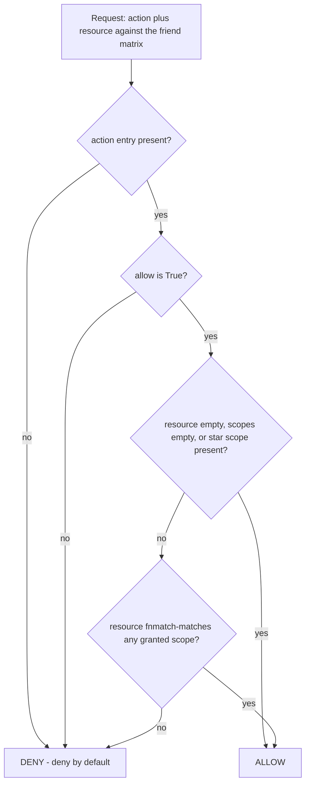
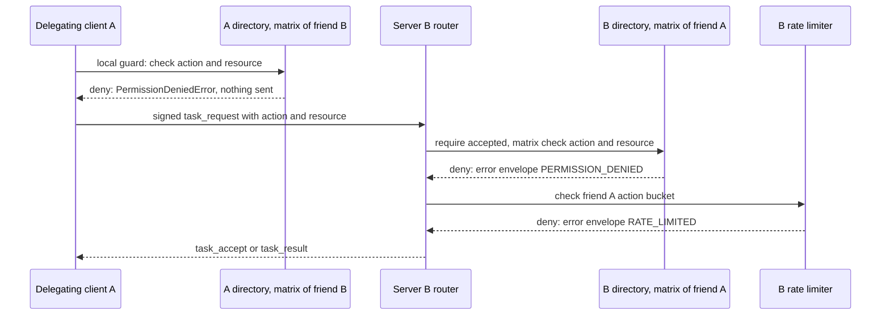

# Permissions Matrix, Scopes and Named Roles

HAAP agents never trust each other wholesale: every capability one agent grants another is recorded as a small, per-friend JSON matrix — `{action: {"allow": bool, "scopes": [...]}}` — that the grantor's server enforces on inbound messages and the grantee's client mirrors as a local guard on outbound ones. The model is **deny-by-default**: an action that is absent from the friend's matrix, or present with `allow: false`, is denied, no exceptions and no "implied" rights. Because humans must not hand-craft matrices, approvals are made with **named roles** (`guest`, `client`, `partner`, `family`, `admin`, plus user-defined ones) that bundle a matrix with a rate-limit policy into one word the owner can reason about.

This page documents the authorization vocabulary and evaluation rules (`haap/permissions.py`), where the matrix lives and how it changes over a relationship's life (`haap/directory.py`), the two enforcement points that consult it (inbound in the server's task pipeline, outbound in the client's pre-send guard), and the role templates and override mechanism (`haap/roles.py`) including how the friend-request policy caps auto-grants. The trust rationale, threat mapping and the "never relax" invariants live in [security-model](../architecture/security-model.md); file layout and record persistence in [local-state](../architecture/local-state.md); token buckets and the audit log in [rate-limiting-and-audit](rate-limiting-and-audit.md); the handshake where approvals happen in [friendship-handshake](../workflows/friendship-handshake.md); the hosts that consult the matrix in [messaging-server](../operations/messaging-server.md) and [client-and-transports](../operations/client-and-transports.md).

## The matrix and the evaluator are separate

The authoritative record is `FriendRecord.permissions` (`haap/directory.py`): a dict keyed by action name whose values are `{"allow": bool, "scopes": [str, ...]}`. It is serialized inside `friends.json`, one entry per friend, and describes **what that friend may do against the record-owning agent**. `FriendRecord` exposes small conveniences over it — `has_permission(action)` (the allow flag only) and `permission_scopes(action)` — but no evaluation logic.

Evaluation lives in `PermissionMatrix` (`haap/permissions.py`), which deliberately holds **no permission state**: it is constructed with an optional `AuditLog` and operates on whatever friend matrix dict it is handed, so the same evaluator serves the server (checking a record it just loaded) and the client (checking its local copy) with no duplication of state. A single agent holds one matrix per friend; two friends of the same agent are fully independent — granting `file:read` to one friend grants nothing to any other.

## Deny-by-default evaluation

`PermissionMatrix.check(friend_permissions, action, resource)` is the whole decision procedure, and every branch except one ends in denial:



Caption: `PermissionMatrix.check()` — every missing, disabled or unscoped path denies; only an explicit grant whose scopes cover the resource allows.

Concretely (`permissions.py`):

- A non-dict matrix, a missing action entry, or an entry whose `allow` is falsy all return `False` immediately.
- Only when the action is granted does scope matching run, via `scope_allows(action, scopes, resource)`.
- Scope matching is `fnmatch` globbing over the request `resource` string: an empty resource (`""` — used by actions that have no resource, e.g. `chat:converse`) always passes once the action is granted; an empty scope list or a list containing `"*"` allows **any** resource for that action; otherwise the resource must glob-match at least one pattern in `scopes`.
- A *grant* therefore means writing `{"allow": True, "scopes": [...]}` for the action — and since only listed actions are checked at all, adding a brand-new action to the protocol is safe: it is denied for every existing friend until a role or an explicit owner grant lists it (see [security-model](../architecture/security-model.md), invariant 3).

The consequence the module docstring states bluntly is that **the local matrix only lists what is granted**; there is no "default allow" tier, no group membership, and no transitive trust through other friends.

## The action catalog

`permissions.py` defines the shared action vocabulary agents grant one another, together with the direction each action faces:

| Action | Direction | Meaning | Scope convention |
|---|---|---|---|
| `chat:converse` | inbound and outbound | friend may open conversational exchanges/pings | none (no resource) |
| `read:schedule` | inbound | friend may query the agent's schedule | none |
| `read:calendar` | inbound | friend may query the agent's calendar | none |
| `file:read` | inbound | friend may read files | path globs, e.g. `~/docs/*` via `path_scopes()` |
| `file:write` | inbound | friend may write files | destination path globs via `path_scopes()` |
| `exec:terminal` | inbound | friend may request command execution | allowed command prefixes, e.g. `haap *` via `command_scopes()` |
| `task:delegate` | inbound | friend may delegate tasks to me → I execute them | task/resource space, e.g. `booking:*` |
| `task:submit` | outbound | local guard: I may delegate tasks to this friend (the friend's server will in turn require me to hold `task:delegate` in *their* matrix) | same task/resource space |

The direction split is encoded in two module constants: `INBOUND_ACTIONS` (`chat:converse`, `read:schedule`, `read:calendar`, `file:read`, `file:write`, `exec:terminal`, `task:delegate`) is the set the **server** checks against a sender's matrix; `OUTBOUND_ACTIONS` (`task:submit`, `chat:converse`) is the set the **client** enforces as a local guard before anything leaves the machine. `path_scopes(*globs)` and `command_scopes(*prefixes)` are convenience builders for the file and exec scope lists.

Today the only fully wired enforcement of the catalog is the task-delegation pipeline (next section); the read/file/exec/chat keys form the shared vocabulary plus scoping rules that any future resource handler plugs into by choosing its action key and resource — and deny-by-default means they grant nothing until a matrix entry appears. A role's matrix therefore has exactly the same JSON shape on both sides of a friendship: what it grants against the grantor is *mirrored* as the outbound guard the grantee's client enforces, so both ends of a delegation agree without any central policy server.

## Where the matrix lives and how it changes

The matrix is per-friend state on the *record owner* side. Its lifecycle tracks the friendship state machine (`pending_out → pending_in → accepted / blocked`, see [friendship-handshake](../workflows/friendship-handshake.md)):

- **Outbound start — `Directory.add_pending_out()`.** When this agent initiates a friendship (`haap friends add`, or `HAAPClient.start_friendship`), the new `pending_out` record receives a matrix. The parameter semantics encode deny-by-default carefully: `permissions=None` installs the conservative `DEFAULT_GRANT_TEMPLATE` (`chat:converse`, `task:delegate`, `task:submit`, all with empty scopes — never file/exec); an explicit `permissions={}` means "deny everything". `DEFAULT_PERMISSIONS = {}` in `directory.py` is the commented example of the fully closed matrix.
- **Human approval — `Directory.approve()`.** Accepting an inbound request flips `pending_in → accepted` and stamps the *whole* granted matrix plus optional rate limits in one call (`rec.permissions = dict(grant or DEFAULT_GRANT_TEMPLATE)`). Note the truthiness test: any falsy grant — `None` or an empty dict `{}` — installs the conservative template, so an approval that should grant nothing is expressed by approving first and then revoking actions (or editing the record). This is the function behind both `haap friends approve --role <name>` and policy auto-approvals.
- **Fine-grained audited edits — `PermissionMatrix.grant()` / `revoke()`.** Post-approval adjustments go through audited operations: `grant()` writes `{"allow": True, "scopes": [str(s) ...]}` for the action, `revoke()` deletes the entry, both under a reentrant lock, and each emits a `permission.grant` / `permission.revoke` event on the attached `AuditLog`. Revocation-by-deletion is what makes deny-by-default stick: removing an action entry denies it again, including for scopes that were not listed.
- **The kill switch — `Directory.block()`.** Blocking forces `status="blocked"` and clears the matrix to `{}`, so a blocked fingerprint retains no grant at all; `deny()` on a `pending_in` request deletes the record outright (see [security-model](../architecture/security-model.md) for the blocked-state behavior at every boundary).

The two sides' matrices are independent local files — nothing in the protocol copies a matrix between agents. Agreement is achieved because both sides start from the same templates: the requester's `pending_out` record and the approver's grant both default to (or are explicitly set to) the same conservative template or the same named role, and the `friend_accept` reply carries the exact matrix the approver installed so the requester can see (and, if it wants, mirror) what was actually granted. `tests/test_client.py::test_local_guard_blocks_disallowed_action` exploits exactly this independence: a peer granted `task:submit` with `"*"` scopes, but the delegator's *own* record for that peer is empty, and the delegator's client refuses to send.

## Enforcement point 1 — inbound: the server task pipeline

`HAAPServer._on_task_request` is the reference enforcement sequence and the only handler today that consults the matrix:

```python
rec = self.directory.require(sender, statuses=("accepted",))
action = str(env["payload"].get("action") or "task:submit")
resource = str(env["payload"].get("resource") or "")
if not rec.has_permission(action) or not self.permissions.check(
        rec.permissions, action, resource):
    raise PermissionDeniedError(...)
self.rate_limiter.check(sender, action, rec.rate_limits)  # raises if exceeded
task = self.tasks.create(...)
```

Three gates run **in order**, and each is cheaper than the next: (1) the sender must be an *accepted* friend (`FRIEND_NOT_FOUND` otherwise); (2) the payload's `action` (default `task:submit`) plus `resource` must pass the matrix against the *sender's* record (`PermissionDeniedError`, wire code `PERMISSION_DENIED`); (3) the per-`(friend, action)` token bucket must have tokens (`RateLimitedError`, wire code `RATE_LIMITED`). Only after all three does the server create the task and invoke the executor callback — so a denied or throttled request never consumes model/executor cost (threat T8 in [security-model](../architecture/security-model.md)). The dual check `has_permission(action)` *and* `permissions.check(...)` is belt-and-braces: the second subsumes the first (allow flag plus scopes).



Caption: One delegation crosses two independent matrices: B's record of A authorizes the inbound request, A's record of B authorizes the outbound send; rate limiting is a separate gate after permission.

## Enforcement point 2 — outbound: the client local guard

`HAAPClient._send` runs the mirror-image guard for `task_request` **before the envelope leaves the machine**: it requires the friend be accepted, resolves `action` (default `task:submit`) and `resource` from the payload, and re-checks *its own* record of the friend through the same `rec.has_permission()` + `self.permissions.check(...)` pair, raising `PermissionDeniedError` locally on failure. Only then is the message signed and transported. The point of the guard is defense in depth and cost control: the delegating agent refuses disallowed traffic itself instead of learning about the denial from a remote error envelope, and the local record is the counterpart of what the peer's server will enforce.

Marketplace open services (`service_search`, `service_book`, ...) deliberately sit **outside** the friendship matrix: they require only self-contained signature verification, a non-blocked sender, and the business's own policy (`marketplace_policy.auto_accept`) plus a stricter marketplace rate limit — authorization there is per-message business logic, not a per-friend grant.

## Named role templates

`haap/roles.py` turns matrix authoring into one-word approvals. A role bundles a **permission matrix + rate limits + optional `ttl_days`** so the human owner approves a `friend_request` with `--role partner` instead of hand-composing JSON. Semantics are the same as every matrix: the role states what the *approved agent* may do against the *grantor*, and is mirrored as the outbound guard on the grantee side. The built-ins are `guest`, `client`, `partner`, `family`, `admin`:

| Role | Granted matrix (actions and scopes) | Rate-limit bundle (per-friend `*`, then per-action) | Use |
|---|---|---|---|
| `guest` | `chat:converse` only — no tasks at all | capacity 10, refill 0.05/s | conversational ping only |
| `client` | + `task:delegate`/`task:submit` scoped `booking:*`, `service:*` | 20 / 0.1/s, plus `task_request` 5 / 0.05/s | marketplace-style booking scopes |
| `partner` | + `read:schedule`, `read:calendar`, task scopes widened to `*` | 60 / 0.5/s | trusted partner, broad delegation |
| `family` | identical matrix to `partner` | 120 / 1.0/s | full-personal agents, high limits |
| `admin` | + `file:read` `*`, `file:write` `*`, `exec:terminal` `haap *` | 240 / 2.0/s | only agents you fully control |

Two design points are load-bearing. First, the entitlement ladder `guest < client < partner < family < admin` is monotonic in what it grants *and* in the rate-limit bundle — the policy engine reuses the same ladder for capping (next section). Second, `admin` is the **only** role that ships `file:read`/`file:write`/`exec:terminal`; no lower role ever touches files or runs commands, which `tests/test_policy.py::test_builtin_roles_load_and_shape` pins down (guest has no `task:delegate`; admin's `exec:terminal` is `allow: True`). All built-ins carry `ttl_days: None` — the field is reserved in the bundle shape but no built-in ships an expiry. Approving a friend with a role stores the role's `permissions` *and* `rate_limits` into the friend record together, so the two halves of the abuse controls are always installed as one unit.

## Custom roles: `roles.json` and `extends`

The operator may override built-ins or add roles in `$HAAP_DIR/roles.json`. `load_roles()` deep-copies the built-ins, then applies the file on top:

```json
{
  "vip": {
    "extends": "partner",
    "description": "VIP clients",
    "rate_limits": {"*": {"capacity": 500, "refill_per_sec": 5.0}}
  }
}
```

Mechanics (`roles.py`, pinned by `tests/test_policy.py::test_user_role_override_with_extends`):

- A user role may name an `extends` base — a built-in or an earlier user role in file order. The merge is **shallow at the top level**: `{**base, **user_spec_without_extends}`, so whole dictionaries such as `permissions` or `rate_limits` are replaced wholesale, never merged action-by-action. The `vip` example inherits `partner`'s entire permission matrix (its `task:submit` stays allowed) while overriding only the rate limits.
- Unknown `extends` names resolve to an empty base rather than an error; entries with a non-string name or non-dict spec are skipped.
- Missing, unreadable or non-dict `roles.json` simply returns the built-ins, and JSON errors are swallowed — **a bad roles file never breaks the server or an approval** (it fails soft, unlike the friends store; see [local-state](../architecture/local-state.md)).

`resolve_role(name, directory)` returns `(name, spec)` and raises `ValueError` listing the known roles for an unknown name (`tests/test_policy.py::test_unknown_role_raises`). Because `load_roles` re-reads the file on **every** call, `roles.json` edits take effect at the next approval with no restart. `role_summary()` renders the one-line-per-role listing behind `haap friends roles`.

## Capping auto-approvals: the role ladder in the policy engine

The friend-request policy engine (`haap/policy.py`, `RequestPolicy`) decides each inbound `friend_request` as **deny / auto-approve / queue**, and when it auto-approves it must never out-grant the owner's intent. `_cap_role()` enforces that with the same ladder the built-ins define:

- `max_role` (default `partner`; `DEFAULT_MAX_ROLE`) is the ceiling for **every** auto-approval. A rule naming `admin` is downgraded when the cap is lower (`tests/test_policy.py::test_policy_auto_approve_by_speciality_capped`: a rule requesting `admin` under `max_role: client` grants `client`).
- An explicitly requested role is likewise reduced to the cap — both when it drives a queued suggestion (`wants admin → would grant client`) and when a rule-less auto-approval falls back to it.
- An **unknown or custom role auto-approves capped at `client`** — custom roles are always treated as no more trusted than the built-in client tier unless the owner raises `max_role` (which only understands the built-in ladder).
- Human decisions are not capped: the queue path notifies the owner, and `haap friends approve --role <any>` (`cli.py`) resolves the requested role without `_cap_role`, since a human override is exactly the point of queueing.

Auto-approval then resolves the (capped) role spec and calls `directory.approve()` with exactly `spec["permissions"]` and `spec["rate_limits"]`, and the reply `friend_accept` carries `granted` — the **actual matrix just installed** — plus `granted_role` (`server.py`). Transparency is intentional: if the requester asked for `admin` and the policy granted `client`, the requester's agent learns precisely what it received (the role matrix has `task:submit` but no `file:write`), rather than guessing from silence — see `tests/test_policy.py::test_auto_approve_grants_role_and_informs_peer`. The same `directory.approve` + role-template code path is what the human CLI runs, so the granted matrix is identical whether approval is automatic or manual (`test_approve_with_role_template` asserts the record's matrix equals the role spec exactly).

## Failure semantics

- **Unknown role at resolve time** → `ValueError` listing known roles; unknown role requested for *auto-approval* → silently capped to `client`, never an error.
- **Scope mismatch or missing grant** → inbound `task_request` returns a signed `error` envelope with `PERMISSION_DENIED`; the outbound guard raises `PermissionDeniedError` locally first.
- **Corrupt `roles.json`** → built-ins only; **corrupt `policy.json`** → defaults (`queue`, empty rules, `max_role: partner`).
- **Empty matrix vs. default template** → the two APIs differ deliberately: `add_pending_out` tests `permissions is not None`, so an explicit `{}` there is a real grant of nothing while `None` installs the conservative template; `approve()` tests truthiness (`grant or DEFAULT_GRANT_TEMPLATE`), so any falsy grant falls back to the template. Both default paths are deny-by-default (`chat:converse` + both task keys, never file/exec); the difference is only how much is listed.
- **Blocked fingerprint** → matrix cleared, so even a technically valid grant lookup finds nothing.

## Focused tests

- `tests/test_policy.py::test_builtin_roles_load_and_shape` — the five roles exist; guest has no `task:delegate`; admin's `exec:terminal` is enabled.
- `tests/test_policy.py::test_user_role_override_with_extends` / `test_unknown_role_raises` — `extends` inherits permissions and overrides rate limits; unknown role names raise.
- `tests/test_policy.py::test_policy_auto_approve_by_speciality_capped` — role requests are capped by `max_role` on the ladder.
- `tests/test_policy.py::test_auto_approve_grants_role_and_informs_peer` — auto-approval installs the role matrix and reports `granted`/`granted_role`; `file:write` stays absent for `client`.
- `tests/test_policy.py::test_approve_with_role_template` — the CLI approval path stores exactly the role's permissions and rate limits.
- `tests/test_server.py::test_task_request_aceptada_con_permiso`, `test_task_permiso_denegado`, `test_task_rate_limit` — accepted → permission → rate-limit ordering on the inbound pipeline.
- `tests/test_client.py::test_local_guard_blocks_disallowed_action` — the outbound guard denies with an empty local matrix even when the peer granted `"*"`.

## Related pages

- /openwiki/architecture/local-state.md
- /openwiki/architecture/security-model.md
- /openwiki/concepts/rate-limiting-and-audit.md
- /openwiki/operations/client-and-transports.md
- /openwiki/operations/messaging-server.md
- /openwiki/workflows/friendship-handshake.md
