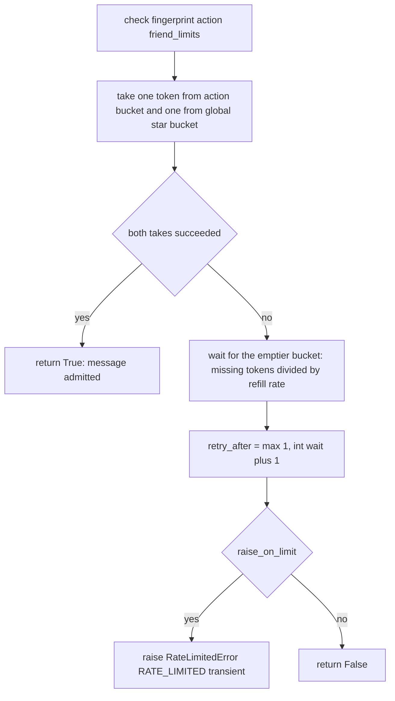
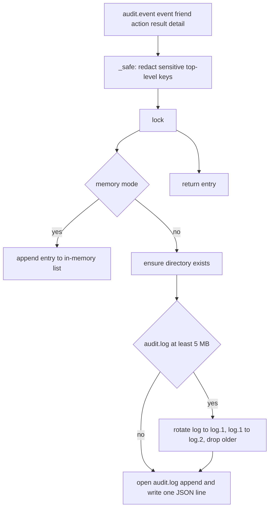

# Abuse Controls: Token Buckets and Append-Only Audit

HAAP pairs a permission matrix (what a friend *may* do, see [permissions-and-roles](permissions-and-roles.md)) with two abuse controls that answer different questions. **Token buckets** answer "how much, how fast" — they put a hard, per-friend cap on message-driven cost so a malicious or buggy peer cannot flood the agent (threat T5) or force unbounded executor/LLM spend (threat T8). The **append-only audit log** answers "what happened" — every accepted or rejected security decision leaves a durable trace that names who, which action, and the outcome, while redacting secrets so the log stays safe to share (threat T7). The threat rationale and the "never relax" invariants live in [security-model](../architecture/security-model.md); where the files and in-memory stores live is documented in [local-state](../architecture/local-state.md).

| Control | Module | Question it answers | State |
|---|---|---|---|
| Permission matrix | `permissions.py`, `directory.py` | What may this friend do against me? | durable in `friends.json` |
| Token buckets | `rate_limiter.py` | How often / how much, per friend and action? | in-memory only |
| Audit log | `audit.py` | What was decided, accepted or rejected? | durable in `audit.log` |

## Token-bucket rate limiting

`RateLimiter` (`haap/rate_limiter.py`) is a token-bucket throttle keyed per `(friend, action)` plus one **global bucket per friend** (action `"*"`). Every checked message consumes one token from the action bucket **and** one from the friend's global bucket; when either is empty the message is rejected with `RateLimitedError` (wire code `RATE_LIMITED`, marked transient) telling the sender how long to wait.

### Bucket math: burst capacity with continuous refill

A `_Bucket` holds `capacity` (the burst), `tokens` (current), `refill_per_sec` (continuous refill rate), and `last_refill` (a `time.monotonic()` stamp). Buckets are created **full** (`tokens = capacity`), so a friend always gets one full burst. Refill is computed lazily on access, never by a timer:

```python
def _refill(self, now: float) -> None:
    if self.refill_per_sec > 0:
        elapsed = now - self.last_refill
        self.tokens = min(self.capacity, self.tokens + elapsed * self.refill_per_sec)
    self.last_refill = now

def take(self, now: float | None = None) -> bool:
    now = time.monotonic() if now is None else now
    with RateLimiter._GLOBAL_LOCK:
        self._refill(now)
        if self.tokens >= 1.0:
            self.tokens -= 1.0
            return True
        return False
```

Tokens accumulate fractionally up to `capacity`; `take()` requires at least 1.0 token and removes exactly one. A `refill_per_sec` of 0 disables refill (a pure burst), and `wait_seconds()` then returns infinity. Token math is serialized by the **process-wide class lock** `RateLimiter._GLOBAL_LOCK` (`rate_limiter.py::_Bucket.take`), while a per-instance lock protects the bucket *dictionary*; this keeps `take` atomic even when several server/client instances in one process share the class.

### Configuration: friend record, default catalog, resolution order

Per-friend limits live in `FriendRecord.rate_limits` (`directory.py`): an action-keyed map of `{action: {"capacity": int, "refill_per_sec": float}}`, persisted inside `friends.json` next to the permission matrix and stamped at approval time (`Directory.approve(..., rate_limits=...)`, policy auto-approval from a role spec, or `haap friends approve --role <name>` — see [permissions-and-roles](permissions-and-roles.md) and `roles.py`, where every built-in role bundles a rate-limit set with its matrix).

When a friend configures no limit for an action, `RateLimiter` falls back to its own default catalog (`rate_limiter.DEFAULT_CATALOG`; the smaller `directory.DEFAULT_RATE_LIMITS` is an illustrative copy of the same idea):

| Bucket key | capacity | refill_per_sec |
|---|---|---|
| `"*"` (per-friend global) | 60 | 0.5 |
| `task_request` | 5 | 0.05 |
| `task_result` | 10 | 0.1 |
| `task_progress` | 20 | 0.2 |
| `chat:converse` | 20 | 0.2 |
| `hello` | 10 | 0.1 |
| `friend_request` | 3 | 0.02 |
| `verify` | 10 | 0.1 |
| `error` | 10 | 0.1 |

`config_for(friend_limits, action)` resolves `(capacity, refill)` in order: the friend's own entry for the action (an empty entry counts as absent) → the catalog's entry for the action → the catalog's `"*"` global entry. Each *field* may fall back independently to the global values, so a friend can tighten only `capacity` while inheriting the refill rate. An empty `friend_limits` therefore means "the defaults", which is why `RateLimiter.check()` can always be called with just a fingerprint and action.

### The check: two buckets per message

`RateLimiter.check(fingerprint, action, friend_limits, raise_on_limit=True)` runs the whole decision:

```python
ok_action = self._bucket(fingerprint, action, cap_a, refill_a).take(now)
ok_global = self._bucket(fingerprint, "*", cap_g, refill_g).take(now)
if ok_action and ok_global:
    return True
if not raise_on_limit:
    return False
wait = max(self._bucket(...action...).wait_seconds(now),
           self._bucket(... "*" ...).wait_seconds(now))
retry_after = max(1, int(wait) + 1)
raise RateLimitedError(... retry_after=retry_after)
```



Caption: `RateLimiter.check()` — both bucket takes run unconditionally; one empty bucket rejects the message with an integer `retry_after` in seconds.

Two details matter. First, the takes run unconditionally, so a message that fails the global bucket may still have consumed a token from the action bucket — a rejected burst shortens the room a sender has to retry. Second, `retry_after` is derived from the **emptier** of the two buckets and is an integer ceiling with a minimum of 1 second, so the wire value is a plain, clock-independent "wait at least this long" hint. `RateLimitedError` (`errors.py`) carries `code = "RATE_LIMITED"` and `transient = True` — the error hierarchy's marker that the sender may retry — and the server converts it into a **signed** `error` envelope via `_error_reply` (`server.py`) with `error_code`, a human `detail` truncated to 200 characters, and `in_reply_to_nonce`, so the rejection itself is authentic and attributable to the exact envelope that failed (see [envelope-protocol](envelope-protocol.md) for the code catalog).

### Where the check actually runs

Today there are exactly three enforcement points, all calling `self.rate_limiter.check(...)`:

1. **Inbound `task_request` (alliance mode)** — `server.py::_on_task_request`, after the friendship-status and permission gates and immediately before the task is created and the executor invoked:
   ```python
   self.directory.require(sender, statuses=("accepted",))
   if not rec.has_permission(action) or not self.permissions.check(...):
       raise PermissionDeniedError(...)
   self.rate_limiter.check(sender, action, rec.rate_limits)  # raises if exceeded
   task = self.tasks.create(...)
   ```
   Because the permission check precedes the rate-limit check, a denied `task_request` never reaches the executor **and never consumes a token** — the core denial-of-wallet defense (threat T8). The bucket key is the *sender's* fingerprint and the action string from the payload (default `"task:submit"`); limits come from the sender's `FriendRecord.rate_limits`, falling back to the catalog.
2. **Marketplace open services** — `server.py::_check_marketplace_sender` runs for `service_search`, `service_book` and `service_cancel` (no friendship needed, so there is no friend record to read). It rejects blocked fingerprints with `PERMISSION_DENIED`, then applies a **dedicated, stricter inline catalog**: a `marketplace` action bucket of capacity 10 / refill 0.05 per second plus a global of 20 / 0.1. Open-business traffic is thus throttled harder than alliance traffic by construction.
3. **Outbound `task_request` from the client** — `client.py::_send` runs the mirrored local guard (accepted friend + matrix) and then `self.rate_limiter.check(self.identity.fingerprint, "task:submit")` *before the envelope leaves the machine*, keyed on the local agent's own fingerprint — an outbound self-throttle using the default catalog so a misbehaving local loop cannot flood a peer.

Everything else — `hello`, `challenge`, `friend_request`, `friend_accept`, `ping`, inbound `task_result` — is **not** token-gated today (the catalog already names `hello`, `friend_request`, `verify` and `error` buckets, but no handler calls `check` for them). Inbound flooding before friendship is instead bounded by the 1 MB envelope cap and the challenge/nonce machinery in [envelope-protocol](envelope-protocol.md).

Bucket state is deliberately ephemeral: the `_buckets` dict lives only in the process and is rebuilt full on restart, exactly like the nonce cache and pending handshake challenges (see [local-state](../architecture/local-state.md) for the persistent-versus-memory split). `RateLimiter.reset(fingerprint=None)` clears one friend's buckets or all of them, and `configure(key, action, capacity, refill)` lets an embedder pre-create a bucket; neither is called by the server or client today.

## Audit: the append-only record

`AuditLog` (`haap/audit.py`) writes one JSON object per line to `<HAAP_DIR>/audit.log` — `$HAAP_DIR` (default `~/.haap`) or an explicit directory — so the trail is plain-text greppable and survives restarts. Every security decision (handshake outcomes, permission checks, rate-limit hits, tasks, marketplace traffic) is meant to leave a trace; the module docstring's rule is "who, what action, result and NON-sensitive detail".

### Entry shape

```python
entry = {
    "ts": round(ts if ts is not None else time.time(), 3),
    "event": event,        # dotted name, e.g. "message.task_request"
    "friend": friend,      # the peer fingerprint ("" for local edits)
    "action": action,      # optional action key
    "result": result,      # "ok" default; "error" | "deny" on rejections
    "detail": _safe(detail),
}
```

`ts` is epoch seconds rounded to milliseconds. `detail` carries only *context*: the error class name and a short excerpt on rejections, the policy reason, the role granted, the service or truncated booking id — never payloads or key material.

### Redaction invariant (threat T7)

Before anything is written, `_safe(detail)` replaces the value of any top-level detail key in `_SENSITIVE_KEYS` with the literal `"<redacted>"`:

```python
_SENSITIVE_KEYS = {"challenge_token", "private_key", "signature", "task_payload"}
```

`challenge_token` covers handshake challenges, `signature` covers any signature material an embedder might try to log, `private_key` is belt-and-braces for the one file that must never leak, and `task_payload` keeps task content (which can contain arbitrary user or business data) out of the log. Combined with the wire rule that error `detail` strings never carry internal tracebacks, this is what makes an `audit.log` safe to share for forensics.

### Append, rotation, and modes

All mutation happens under a single per-instance lock. In **file mode** every `event()` call opens `audit.log` in append mode and writes one line — entries are never rewritten, modified, or deleted in place. When the current file reaches `MAX_FILE_BYTES` (5 MB) the writer rotates: `audit.log -> audit.log.1 -> audit.log.2`, keeping `KEEP_ROTATED = 2` backups and dropping anything older. Rotation failures are swallowed (`except OSError: pass`) — logging must never break the protocol. In **memory mode** (`AuditLog(memory=True)`) entries accumulate in a list instead; this is what tests inject, and it is also `HAAPServer`'s fallback when no `audit` is passed (`server.py` constructs `AuditLog(memory=True)`), whereas the real `haap serve` command builds a file-mode log (`cli.py::cmd_serve`).



Caption: `AuditLog.event()` — redaction happens before the lock; file-mode writes are single-line appends with size-based rotation under the same lock; rotation errors are swallowed.

### Reading entries

`recent(last=50, since=None, friend="", event_prefix="")` is the read API: in file mode it re-reads and parses the whole log per call (skipping malformed lines), sorts entries by `ts`, filters by minimum timestamp / friend fingerprint / event-name prefix, and returns the newest `last` entries. The CLI exposes it as `haap audit [--last N] [--friend FP]`, printing one line per entry.

### What every accepted or rejected decision records

The server router's try/except structure in `handle_message` is the coverage guarantee: verification failures are caught and logged as `message.rejected` with `result="error"` and the exception class plus a 120-character excerpt; a failure raised inside a typed handler is logged as `message.<type>` with `result="error"` and the error class; a success is logged as `message.<type>`. Because both the rejection path and the handler path funnel through the same router, no handled inbound message can succeed or fail silently. Producers and their events:

| Producer | Events | Detail recorded |
|---|---|---|
| Server router (`server.py::handle_message`) | `message.rejected`; `message.<type>` (`result=ok` or `error`) | error class; ≤120-char message excerpt on failures |
| Server friendship handlers | `friend_request.denied_by_policy` (`result="deny"`); `friend_request.auto_approved`; `friend_request.queued` | policy reason; granted role |
| Server marketplace handlers | `marketplace.search`; `marketplace.book`; `marketplace.cancel` | service; `booking_id` truncated to 40 chars |
| Client (`client.py`) | `client.friend_request.sent`; `client.task.completed`; `client.marketplace.booked`; `client.<type>.error`; `client.marketplace.book.error` | remote error code on failures; service/`when` on bookings |
| Permission edits (`permissions.py`) | `permission.grant`; `permission.revoke` | action, scopes |

`event` names are dotted and stable enough to prefix-filter (`event_prefix`), e.g. all inbound outcomes under `message.` or all client traffic under `client.`. The append-only + redaction pair is security-model invariant 5/6 and AGENTS.md rule 6 — never make entries mutable in place, and keep the redaction list applied to everything written.

## Lifecycle and operational summary

- **Per-friend limits are durable configuration, buckets are not.** Editing `FriendRecord.rate_limits` (via approval with a role, or by hand in `friends.json`) changes the throttle for the *next* request; the running buckets themselves reset to full whenever the process restarts. There is no persisted "abuse memory" across restarts, by design (see [local-state](../architecture/local-state.md)).
- **Defaults live in code.** The effective default catalog is `rate_limiter.DEFAULT_CATALOG`; the marketplace's stricter inline limits live in `server._check_marketplace_sender`. Role templates in `roles.py` (and user overrides in `$HAAP_DIR/roles.json`) carry rate-limit bundles so a human approval picks limits with the same one word as permissions.
- **The rejection is transparent.** A throttled sender receives a signed `error` envelope with `error_code: RATE_LIMITED` and a `retry_after` hint; clients translate it back into a transient local `RateLimitedError` via `ERROR_MAP`/`error_from_code` (`errors.py`), so callers can back off instead of failing hard.
- **Read the trail with `haap audit`**; because of redaction the file is safe to share with a peer or embedder for debugging.

## Focused tests

Rate limiting is exercised end-to-end through the same router the HTTP layer uses:

- `tests/test_server.py::test_task_rate_limit` — a friend approved with `rate_limits={"task:submit": {"capacity": 1, "refill_per_sec": 0.0001}}` gets one accepted `task_request` and a `RATE_LIMITED` error envelope on the second.
- `tests/test_marketplace.py::test_marketplace_rate_limit` — 12 `service_search` messages against the capacity-10 `marketplace` bucket pass initially and are eventually limited; `test_blocked_sender_cannot_use_marketplace` covers the blocked check that precedes the limit.
- The client-side guard is exercised by `tests/test_client.py::test_local_guard_blocks_disallowed_action` (permission, not rate, but the same pre-send path in `_send` that calls `rate_limiter.check`).

Audit logging is exercised by construction: every fixture in `test_server.py`, `test_marketplace.py`, `test_policy.py`, and `test_client.py` attaches `AuditLog(memory=True)`, so every handled message in the suite runs the real `event()`/redaction code path while asserting protocol behavior.

Related pages: [security-model](../architecture/security-model.md) (T1–T10 threat table, hard invariants), [permissions-and-roles](permissions-and-roles.md) (the permission gate that precedes the rate-limit gate, role bundles), [envelope-protocol](envelope-protocol.md) (signed `error` envelopes and the error-code catalog), [local-state](../architecture/local-state.md) (which state is durable vs in-memory), [identity](identity.md) (the fingerprint keys that identify friends in logs and buckets).
