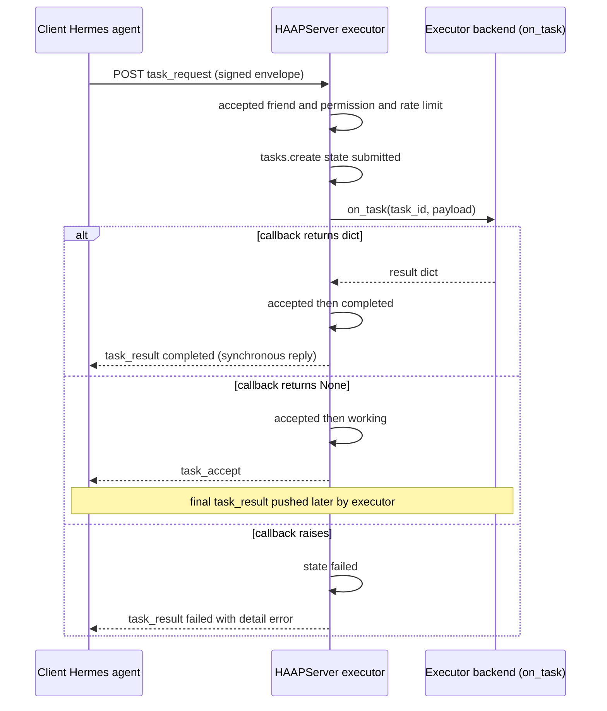
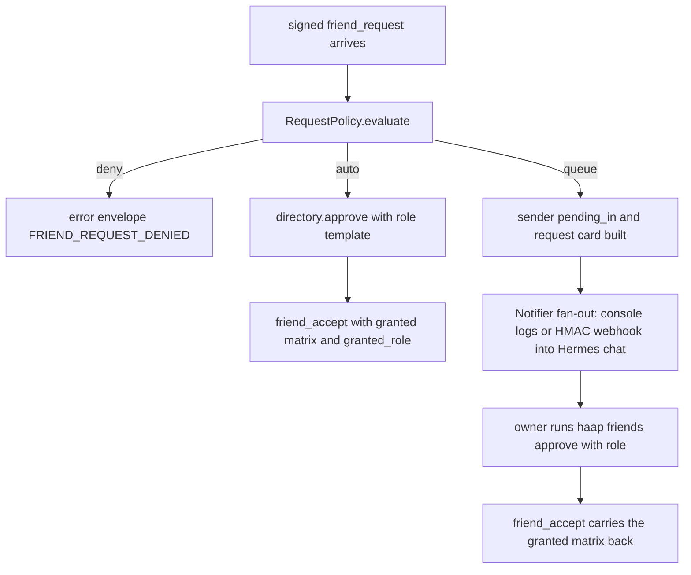
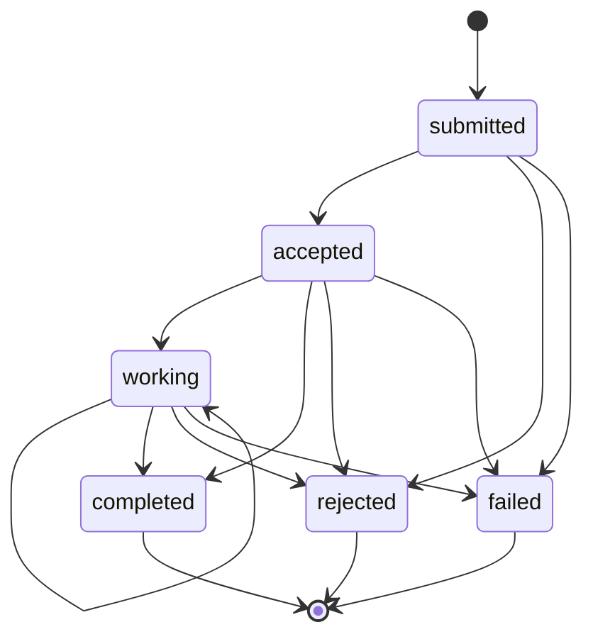

# External Integrations: Hermes, Well-Known Discovery and A2A

HAAP exists so that autonomous **Hermes agents** on different machines can
discover each other, verify identity, negotiate permissions and collaborate.
The protocol's boundaries with the outside world are deliberately few: an
injectable executor and notification surface on `HAAPServer`, capability
manifests that introspect a Hermes installation's skills, an HTTP
`/.well-known/haap.json` discovery card that mirrors the A2A (Agent2Agent)
standard's pattern, and a directory service used for discovery. This page maps
that boundary and — because several external bridges are documented design
rather than shipped code — marks each surface as **implemented** or
**documented/roadmap**:

| Surface | Status | Where |
|---|---|---|
| `on_task` task executor (sync result, async push, failure) | ✅ implemented | `haap/server.py`, `haap/tasks.py` |
| Marketplace bookings routed through `on_task` into a business backend | ✅ implemented | `haap/server.py`, `demo_marketplace.py` |
| Queued `friend_request` → owner card via `ConsoleNotifier` / `WebhookNotifier` / `CompositeNotifier` | ✅ implemented | `haap/policy.py`, `haap/server.py` |
| Hermes skill introspection for manifests (`~/.hermes/skills` scanning) | ✅ implemented | `haap/capabilities.py` |
| `MemoryTransport` and `HttpTransport` | ✅ implemented | `haap/transport.py` |
| `MatrixTransport` / `EmailTransport` equivalents | ⏳ documented only (ARQUITECTURA §9) | `docs/ARQUITECTURA.md` |
| Native Hermes inbound webhook bridge (webhook → HAAP router; owner-chat notifications via the `on_friend_request` callback) | ⏳ documented design / roadmap | `docs/ARQUITECTURA.md` §4, §11; `README.md` |
| A2A `Agent Card` interop bridge (manifest ↔ `agent-card.json`, JSON-RPC ↔ envelope) | ⏳ documented future work, not v1 | `docs/ARQUITECTURA.md` §10 |

The envelope mechanics, identity and threat model that these integrations
depend on are covered in [envelope-protocol](../concepts/envelope-protocol.md),
[identity](../concepts/identity.md) and
[security-model](../architecture/security-model.md); the manifest formats are
detailed in [manifests](../concepts/manifests.md).

## Wiring a Hermes agent into `HAAPServer`: the executor boundary

`HAAPServer` is constructed with two injectable callbacks that are explicitly
described as the Hermes wiring — "webhook → owner chat" for friend requests and
"task execution" for delegated work — plus a `notifier`, a `policy`, and
`skills_dirs`/`extra_tools` for manifest generation:

```python
HAAPServer(identity, directory,
           on_friend_request=None,   # cb(fp, manifest) -> None (notify owner)
           on_task=None,             # cb(task_id, payload) -> None | dict (result)
           ...)
```

The attributes can also be assigned after construction; the canonical
`demo_marketplace.py` sets `server_biz.on_task = write_to_calendar` after
building the server, where `write_to_calendar` writes the booking into a local
iCalendar file as a stand-in for the business's real CalDAV calendar.

### Inbound `task_request`: gating order and `on_task` semantics

The executor boundary is only reached after a strict, ordered gate — the same
ordering that bounds denial-of-wallet (see
[rate-limiting-and-audit](../concepts/rate-limiting-and-audit.md)):

1. the sender must be a friend in `accepted` state, or the reply is an `error`
   envelope with `FRIEND_NOT_FOUND`;
2. the sender's granted matrix must allow the requested `action`/`resource`
   (deny-by-default), or `PERMISSION_DENIED`;
3. the token-bucket rate limit for `(friend, action)` must pass, or
   `RATE_LIMITED`.

Only then is a task created (`state: submitted`) and `on_task(task_id, payload)`
invoked. The callback's return value selects the reply path:

- **Returns a dict** — synchronous executor. The task legally walks
  `submitted → accepted → completed` and the direct HTTP reply is a
  `task_result` envelope with `state: "completed"` carrying the dict as
  `detail`.
- **Returns `None`** — asynchronous executor. The task moves
  `accepted → working` and the reply is a `task_accept` envelope; the final
  result is pushed later as a `task_result` envelope, which the receiving
  side records into its local task registry by `task_id` and `state`.
- **Raises** — the task is marked `failed` and a `task_result` with
  `state: "failed"` and a truncated `detail.error` is returned; the exception
  never leaks to the sender as a raw error.



_Sequence of the inbound delegated-task boundary: authorization gate, then the injectable `on_task` executor, whose three return behaviors map to completed, asynchronous, or failed replies._

### Marketplace bookings reuse the same pipeline

The open-services mode (`service_search`/`service_book`, no prior friendship)
routes bookings through the very same `on_task` boundary so a real business
backend — the salon's calendar — is the single integration point. When a
`service_book` arrives and the business's `marketplace_policy.auto_accept` is
off, the request is refused with `PERMISSION_DENIED`; when it is on, the server
creates a task with `action: "booking:reserve"`, invokes `on_task(task_id,
payload)`, merges the returned dict into the booking record, and answers a
completed `task_result` (with an `MKT-<ts>` task id). A raised callback maps to
a `TASK_ERROR` error envelope. Marketplace senders are separately gated: not
blocked, plus a stricter dedicated marketplace token bucket (capacity 10,
refill 0.05/s) on top of the generic one.

## Friend requests that reach the owner

Incoming `friend_request` envelopes from unknown agents are evaluated by the
`RequestPolicy` engine against `$HAAP_DIR/policy.json` in three ordered
outcomes (see [permissions-and-roles](../concepts/permissions-and-roles.md)):

- **deny** — blocklisted or `default: deny`; answered with an `error`
  envelope `FRIEND_REQUEST_DENIED`, never bothering the owner;
- **auto-approve** — a rule matched by fingerprint or speciality, capped by
  `max_role`; the sender is answered with a `friend_accept` that carries the
  **exact granted matrix** (`granted` + `granted_role`), a transparent
  counter-offer rather than silence;
- **queue** (default) — the sender is recorded `pending_in` and the owner is
  handed an **actionable card** through the configured notifier.

The queued path is where the owner-integration happens. `build_request` shapes
the canonical card — `type: "haap.friend_request"`, sender `fingerprint`,
`name`, message, requested vs suggested role, the declared capabilities, and
ready-to-copy `how_to_approve` / `how_to_deny` CLI commands — and
`_on_friend_request` sends it through the server's notifier while replying
`friend_request {received: true, pending_human: true, suggested_role}` to the
requester.



_Friend-request inbound flow: policy decides deny, auto-approve, or queue, and the queue path reaches the human owner through the notifier chain._

### Notifiers: console, HMAC-signed webhook, composite

All notifiers implement `notify(request) -> None` and **must never raise** —
notification failure never breaks the friendship protocol:

- **`ConsoleNotifier`** (the server default) prints the card to stderr, where
  it lands in the service logs.
- **`WebhookNotifier(url, secret)`** POSTs the card JSON to a URL with an
  `X-HAAP-Signature: sha256=<hex>` header computed as HMAC-SHA256 over the body
  using the shared secret, with a 5-second timeout. Its designed target is "a
  Hermes webhook subscription that lands in the owner's chat, so the approval
  command can be copied straight from the phone" — the bridge that turns a
  queued request into a chat notification.
- **`CompositeNotifier(*notifiers)`** fans out to several at once (e.g. console
  + Hermes webhook).

### The `on_friend_request` distinction: declared hook vs running path

A nuance matters for integrators: `HAAPServer` **accepts and stores an
`on_friend_request` callback** documented as owner notification, and the
README/ARQUITECTURA describe that callback pushing requests into the owner's
Hermes chat (Matrix/Telegram). In the current implementation, however, the
queue path notifies exclusively through the `Notifier` object
(`self.notifier.notify(request_card)`); `on_friend_request` is stored on the
server but no code path invokes it today. That native Hermes approval wiring —
an inbound Hermes webhook feeding the HAAP router plus owner-chat
notifications — is a roadmap item, not shipped code.

## Hermes skill introspection

Both manifest formats advertise the agent's `skills` array, populated by
`scan_installed_skills` from the directories where a Hermes agent installs
skills: `~/.hermes/skills` and `~/.hermes/profiles/default/skills`
(`SKILLS_CANDIDATES`, overridable per call). For each immediate subdirectory
containing a `SKILL.md`, the scanner extracts only the `name` and `description`
keys from the YAML frontmatter using a dependency-free regex (a broken
frontmatter degrades to the directory name plus an empty description, never
failing the whole manifest) and deduplicates by skill name across candidate
roots. This is what lets a peer discover what another Hermes agent can do
before any conversation starts; the format-level detail is in
[manifests](../concepts/manifests.md).

## The discovery contract: `/.well-known/haap.json` and A2A

`HAAPServer` exposes three HTTP routes from the stdlib `ThreadingHTTPServer`
HTTP layer (no framework):

| Route | Behavior |
|---|---|
| `POST /haap/messages` | the only envelope intake: parses a signed envelope JSON (malformed → `400`), runs the router, replies `200` with the reply envelope or `202` when there is none |
| `GET /.well-known/haap.json` | the agent's **public** capability manifest, generated **live on every request** — no cached or on-disk copy — from the server's `speciality`, `skills_dirs` and `extra_tools` |
| `GET /health` | liveness `{"status": "ok"}` |
| anything else | `404 {"error": "not found"}` |

The served document is the key-free `haap-public-manifest-v1` card:
`format`, `protocol_version`, a flat `agent` block (`fingerprint`, `name`,
`speciality`, `endpoint`) and the `message_types`/`skills`/`tools` arrays.
`agent.endpoint` is a **base URL** (`messaging_url or identity.endpoint_url`),
from which peers derive the messaging endpoint by appending `/haap/messages`.
The document is deliberately **unsigned**: it is a public discovery card whose
only client-side check is fingerprint agreement. A2A's analogue is the Agent
Card at `/.well-known/agent-card.json`; HAAP reuses the same well-known pattern
with its own format name and state names, per the ARQUITECTURA comparison:

| Concept | A2A | HAAP |
|---|---|---|
| Discovery | Agent Card in `/.well-known/agent-card.json` | manifest in `/.well-known/haap.json` (same pattern) |
| Lifecycle | submitted/working/completed/failed/… | the same state names (`tasks.py`) |
| Transport | JSON-RPC 2.0 + SSE | its own signed envelope (simpler) |
| Security | OpenAPI schemas (API key/OAuth) | **challenge-response friendship + human approval + granular permissions — HAAP's differentiator, since A2A ships no trust layer** |

The lifecycle states are A2A-aligned by name and enforced locally per agent:
`submitted → accepted → working → completed`, with `rejected`/`failed` as
terminal exits (an executor's permission problems are transport-level errors
before the task exists; rejection and failure are executor decisions). Invalid
transitions raise `TaskStateError`, and the registry records both directions —
tasks we delegated (client, `role: delegate`) and tasks we executed (server,
`role: server`) — so both sides keep a mirror of every delegated task.



_Task lifecycle with A2A state names as enforced by `haap/tasks.py`: terminal states are `completed`, `rejected`, and `failed`; the synchronous executor path legally walks `submitted → accepted → completed`._

### Re-verification after discovery

Because the directory is a "phone book, not a notary", discovery results must
be re-checked against the agent itself: `HAAPClient.refresh_endpoint` fetches a
friend's `/.well-known/haap.json` (stripping `/haap/messages` from the stored
endpoint to find the well-known base) and refuses to trust the document unless
its `agent.fingerprint` equals the recorded one, raising
`DiscoveryError("well-known manifest fingerprint mismatch — possible endpoint
substitution")` otherwise. A compromised directory can hide or poison search
results but cannot impersonate an agent whose identity lives in its Ed25519
key. The same self-contained bootstrap rule protects the HTTP intake itself:
messages from **unknown** senders are only honored for bootstrap types
(`hello`, `challenge`, `friend_request`, and the open-services
`service_search`/`service_book`/`service_cancel`/`service_quote`), which must
carry the sender's public key in the payload so the router can check
`fingerprint == SHA-256(key)` before verifying the signature.

## Transport portability: implemented vs documented

The signed envelope is transport-agnostic — a transport only needs
`send(envelope, url) -> dict | None` (reply envelope, or `None` for
fire-and-forget). Two adapters are implemented in `haap/transport.py`:

- **`MemoryTransport(deliver)`** — hands the envelope to a delivery function,
  typically the peer's `handle_message`, in-process with no network or
  threads; used by the tests and by two agents in one process.
- **`HttpTransport`** — HTTPS POST of the envelope JSON through a
  `requests.Session`, 30 s default timeout, up to 3 retries with backoff
  `[0.5, 2.0, 5.0]`. Failure semantics are explicit: HTTP `200` with a body
  returns the reply envelope; `202` means accepted-with-no-reply and returns
  `None`; only transient statuses (`408, 429, 500, 502, 503, 504`) are
  retried; validation 4xx errors and exhausted retries raise `TransportError`.

**Matrix and Email are documented adapters, not code**: ARQUITECTURA §9
describes Matrix as signed envelopes carried as events in a closed room
(ideal when both agents already live in Matrix) and Email as the envelope as a
signed JSON attachment with high latency, noting both only need to implement
`send()`. The `HttpTransport` docstring likewise refers to "the Hermes webhook
bridge, which signs and forwards to the HAAP router" as the intended future
inbound form — again documented design.

## The reference registry deployment: haap-directory

Two distinct registry artifacts must not be confused (AGENTS.md is explicit):

- **`haap/registry.py` inside this repo** — a minimal, in-memory reference
  implementation of the directory (`POST /register`, `/register/complete`,
  `/heartbeat`, `GET /search`, `GET /agents/{fingerprint}`, `GET /health`),
  with proof-of-endpoint (a signed nonce proving control of the declared
  endpoint), a 24-hour entry TTL with lazy pruning, and a 10 000-agent
  anti-flooding cap. Its client (`haap/registry_client.py`) provides
  `register`, `search`, `heartbeat` and a `HeartbeatLoop` daemon thread that
  renews the entry every 6 hours by default.
- **`acoalex/haap-directory`** — the separate, live **public** directory
  service. README documents it as the reference deployment:
  **https://acoalex.com/haap-directory** (code and SPEC at
  github.com/acoalex/haap-directory), and notes that production should run the
  standalone `haap-dird` service rather than the in-repo reference server. The
  public directory's entry expiry is 7 days without renewal, kept alive by the
  same `HeartbeatLoop` pattern.

Registration flows, proof-of-endpoint mechanics and heartbeat renewal are
shared across both, and the discovery client is wire-compatible: an agent
registers once (`haap registry register`) and is then findable by capability
(`haap registry search`) by any other agent in the world, which re-verifies the
result against the agent's own well-known manifest before trusting it.

## Failure and safety invariants across the boundary

Across every external surface the same invariants hold: unverified senders are
never trusted beyond self-contained bootstrap checks; every rejection or
acceptance is audited and errors travel as signed `error` envelopes with
stable codes and no internal detail; `on_task` exceptions and notifier
failures are contained so a broken executor or webhook degrades the protocol
but never crashes it; and every inbound cost (task execution, marketplace
request, LLM spend) is rate-limited before any callback runs. Those guarantees
are the reason HAAP can open an HTTP endpoint to the whole internet while its
permission model stays deny-by-default.
