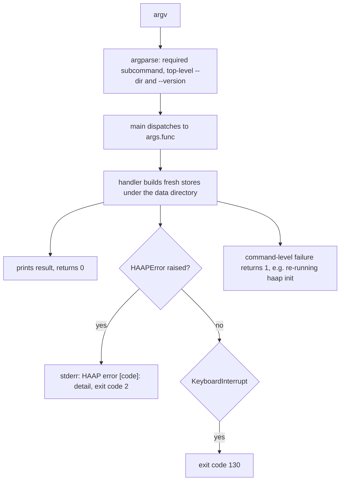
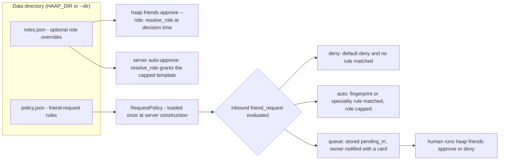

# CLI Commands and Runtime Configuration

The `haap` command is the operator surface of a HAAP agent: it creates and inspects the local identity, drives the human side of the friendship state machine, lists capabilities, tasks and audit entries, and runs the two long-lived processes (the messaging server and a federated directory). Everything the CLI does is a thin wrapper over the persistent stores and policy engine described in [local-state](../architecture/local-state.md) and [permissions-and-roles](../concepts/permissions-and-roles.md); it never sends signed envelopes itself. Network operations — starting a friendship over the wire, delegating a task, wiring notifiers — are intentionally left to the Python API (`HAAPClient`/`HAAPServer` construction, see [client-and-transports](client-and-transports.md) and [messaging-server](messaging-server.md)). Runtime behavior is configured by human-editable JSON files under the agent's data directory, most importantly `roles.json` (named permission templates) and `policy.json` (friend-request rules).

## Entry point, dispatch and exit codes

The executable is declared in `[project.scripts]` as `haap = "haap.cli:main"` (`pyproject.toml`). `main()` builds one `argparse` parser (`build_parser()`) with a required subcommand for each command family; each subcommand registers its handler with `set_defaults(func=...)`, and `main()` simply calls `args.func(args)`. Handlers construct fresh store objects (`IdentityStore`, `Directory`, `TaskRegistry`, `AuditLog`) per invocation from the resolved data directory, act on the JSON files, and return an integer exit code.



Caption: Dispatch and exit contract of `haap.cli:main` — handlers return 0 on success, raise `HAAPError` for protocol/state errors (exit 2), or return 1 for local command failures.

The exit-code contract is stable and observable:

- **0** — success, including `serve`/`registry serve` after Ctrl+C (their handlers catch `KeyboardInterrupt`, call `server.stop()`, print "server stopped"/"directory stopped" and return 0).
- **1** — command-level failures printed to stdout, e.g. `haap init` on a directory that already has an identity ("identity already exists at ...").
- **2** — any `HAAPError` (or subclass) raised inside a handler, caught by `main()` and printed to stderr as `HAAP error [<code>]: <detail>`; e.g. `whoami` before `init` (`NOT_INITIALIZED`), `task send` (always refused), or `registry register` without an endpoint.
- **130** — `KeyboardInterrupt` that reaches `main()`.

## The data directory: `--dir` and `HAAP_DIR`

Every store falls back to `haap_dir()`:

```python
def haap_dir() -> str:
    return os.environ.get("HAAP_DIR", os.path.expanduser("~/.haap"))
```

The CLI exposes the same override as `--dir` ("HAAP data directory (default $HAAP_DIR or ~/.haap)"), registered on the **top-level** parser, so it must appear before the subcommand: `haap --dir /srv/agent-b friends list`. `HAAP_DIR` works regardless of argument order. All commands that touch state resolve the directory the same way — `haap init`, `haap friends *`, `haap task list`, `haap serve`, `haap audit`, `haap capabilities` — and one directory holds exactly one agent's identity (a second `init` in the same place is refused). `whoami`/`friends list`/`audit` etc. are pure local-file operations and need no server running; a long-running `haap serve` keeps its own in-memory copies, so inspect files with a different tool only when you understand the locking caveat (no cross-process locks; see [local-state](../architecture/local-state.md)).

## Command reference

| Command | Purpose | Network? |
|---|---|---|
| `haap init --name --endpoint` | generate the agent identity (`identity.json`, mode 0600) | no |
| `haap whoami` | print the public identity claims as JSON | no |
| `haap friends list` / `requests` / `roles` | list relationships, the pending-in queue, available role templates | no |
| `haap friends add FP --public-key --name --endpoint` | record an outbound request locally (`pending_out`) | no |
| `haap friends approve FP --role R` / `--grant JSON` | human approval: `pending_in` → `accepted` with a permission matrix | no |
| `haap friends deny FP` / `remove FP` / `block FP` | reject, delete, or blacklist a fingerprint | no |
| `haap capabilities [--speciality S] [--show-all]` | print the capability manifest | no |
| `haap task list [--role R] [--friend FP]` | list locally recorded tasks (`tasks.json`) | no |
| `haap task send` | refused by design — delegation is Python-API only | — |
| `haap serve --host --port --speciality` | run the messaging server (default port 8443) | yes |
| `haap registry serve --host --port` | run a federated directory (default port 8444) | yes |
| `haap registry register --registry URL --endpoint URL --speciality S` | register with a directory (proof-of-endpoint flow) | yes |
| `haap registry search --registry URL --capability C --query Q` | discover agents in a directory | yes |
| `haap audit [--last N] [--friend FP]` | show recent entries from `audit.log` | no |

### init and whoami

`haap init --name "..." --endpoint "..."` generates a fresh Ed25519 key pair through `IdentityStore.create(display_name, endpoint_url)` and writes `<dir>/identity.json` atomically with `0600` permissions. `--name` defaults to `hermes-agent` and `--endpoint` (the public URL where the agent receives messages) may be omitted and added later; the endpoint is reused by `registry register` when no `--endpoint` flag is given. Running `init` again against the same directory refuses to overwrite ("identity already exists at ...", exit 1); the only way to regenerate is deleting the file or using another `HAAP_DIR`. `haap whoami` prints `Identity.public_claims()` as indented JSON — `display_name`, `fingerprint` and, only when configured, an `endpoint {transport, url}` block. This is deliberately the key-free projection used by manifests, so the CLI never echoes key material ([identity](../concepts/identity.md)).

```bash
haap init --name "Alex Personal Agent" --endpoint "https://your-vps.com:8443/haap/messages"
haap whoami
```

### friends: the human gate of the friendship state machine

The `friends` family manipulates `friends.json` records (`pending_out`, `pending_in`, `accepted`, `blocked`). The CLI is the **human decision point** of the alliance flow: requests that the server queues land in `pending_in`, and the owner decides here.

- **`friends list`** prints every record (`fingerprint`, padded `status`, `name`, endpoint count) or "(no friends)".
- **`friends requests`** prints the `pending_in` queue — fingerprint, name, message, declared speciality — and ends each entry with a ready-to-copy decision command, `haap friends approve <fp> --role [guest|client|partner|family|admin|...]`, listing the currently available roles.
- **`friends roles`** prints one line per available role template (built-ins plus `roles.json` overrides): name, description and the action keys the role grants.
- **`friends add FP --public-key <b64> --name --endpoint`** calls `Directory.add_pending_out(...)`, storing the peer's fingerprint, **public** key, name and endpoints as a `pending_out` record with the conservative default grant template. This subcommand performs **no network I/O**: it only writes the local record. Sending the actual wire-level `friend_request` (hello → challenge → request) is done from Python with `HAAPClient.start_friendship(...)`; the README documents the pair together.
- **`friends approve FP --role partner`** is the human approval: it resolves the named role with `resolve_role(role, dir)` (see `roles.json` below), takes that template's `permissions` matrix and `rate_limits`, and calls `Directory.approve(fp, grant=..., rate_limits=...)`, which transitions the record from `pending_in` to `accepted` and stores the granted matrix. `--grant '{"action": {"allow": true, "scopes": [...]}}'` supplies a raw matrix instead (approving without `--role`/`--grant` applies the built-in conservative template). The command prints "accepted: <fp> as role '<role|custom>'" and the granted actions. Approving a fingerprint that is not in `pending_in` raises `FriendNotFoundError` (exit 2).
- **`friends deny FP`** rejects an inbound request by deleting the `pending_in` entry; **`friends remove FP`** deletes any relationship record; **`friends block FP`** sets (or creates) a `blocked` record with an empty permission matrix — the server treats blocked fingerprints as absolute deny-by-default for every future message, which is also how marketplace abuse is stopped mid-flight (`haap friends block HF-...`).

An important operational boundary: **CLI approval changes local state only.** Nothing in `cli.py` sends envelopes, and the server emits a wire `friend_accept` only in its *auto-approve* branch of the policy engine. Completing the handshake for a queued-then-CLI-approved request therefore requires embedding integration that relays the acceptance — flagged on the README roadmap as the unfinished Hermes-webhook bridge. What the peer *does* always receive is transparency about the granted matrix: auto-approval's `friend_accept` carries the real `granted` matrix and `granted_role`, including when a requested role was capped.

```bash
haap friends add HF-83b91c82c444f558 --public-key "<b64 key>" \
    --name "Partner Agent" --endpoint "https://their-vps.com:8443/haap/messages"
haap friends requests
haap friends approve HF-83b91c82c444f558 --role partner
```

### capabilities

`haap capabilities [--speciality S] [--show-all]` builds the agent's capability manifest on the fly via `build_manifest(ident.public_claims(), speciality=...)`: format, HAAP version, the public agent claims, the speciality tag, the public message types, and — when Hermes skills are installed under the candidate skill directories — an introspection of each skill's `SKILL.md` frontmatter. Without `--show-all` it prints one summary line (fingerprint, display name, `skills:`/`tools:` counts); with `--show-all` it dumps the full manifest as JSON. The CLI only prints: it never writes `capabilities.json` (that optional export, used to decide what to publish, is `capabilities.export_manifest()` for embedding code).

### task list (and why `task send` is refused)

`haap task list [--role delegate|submit] [--friend FP]` reads the local `tasks.json` through a file-backed `TaskRegistry` and prints task id, state, role, friend fingerprint and a prompt excerpt (or "(no tasks)"). `haap task send` deliberately raises `HAAPError` with the message "task send requires a running friend server; use the Python API (server.py + transport.py) — CLI delegation lands with client.py": delegation over the wire is `HAAPClient.delegate_task(...)`. Practical consequence: `HAAPServer` and `HAAPClient` default to an **in-memory** `TaskRegistry` (`memory=True`), so under a stock CLI setup nothing ever writes `tasks.json` and `task list` stays empty until an embedding process passes a file-backed registry.

### serve: the messaging server

`haap serve --host 0.0.0.0 --port 8443 --speciality S` loads the local identity, a file-backed `Directory` and `AuditLog`, constructs `HAAPServer` and starts it on a `ThreadingHTTPServer` bound to the given address. It prints the agent fingerprint, the listening address and the three exposed endpoints:

| Endpoint | Purpose |
|---|---|
| `POST /haap/messages` | signed envelope intake (handshake, tasks, marketplace) |
| `GET /.well-known/haap.json` | public manifest (no keys) |
| `GET /health` | liveness |

The process then blocks (a 3600 s sleep loop) until Ctrl+C, which calls `server.stop()` and exits 0. Because `HAAPServer` defaults its `policy` to `RequestPolicy(directory.directory)` and its `notifier` to `ConsoleNotifier`, a plain `haap serve` evaluates inbound `friend_request` messages against the data directory's `policy.json` (loaded once at server construction) and prints pending-approval cards to **stderr** — the same cards `haap friends requests` summarizes. Marketplace catalogs, task executors and webhook notifiers are constructor arguments of `HAAPServer`, so only an embedding Python process can enable them (see [messaging-server](messaging-server.md)).

### registry serve / register / search

`haap registry serve --host 0.0.0.0 --port 8444` runs the in-repo `RegistryServer` — an **in-memory** federated directory with proof-of-endpoint registration, heartbeat renewal and capability search — and prints its own generated directory fingerprint plus the listening address. The README recommends it for demos and community/sector directories, and points production deployments at the standalone `haap-dird` service of the `acoalex/haap-directory` repository.

`haap registry register --registry URL --endpoint URL --speciality S` performs the full signed registration flow against the directory: it builds and signs a public manifest, POSTs it to `/register`, signs the returned `challenge_nonce` as the endpoint proof, and completes at `/register/complete`. The endpoint comes from `--endpoint` or, failing that, the identity's declared `endpoint_url`; with neither, the command raises `HAAPError` ("no endpoint declared: pass --endpoint or set it at haap init", exit 2). `haap registry search --registry URL --capability C --query Q` GETs `/search` and prints matching agents (fingerprint, speciality, name, endpoint) or "(no results)".

```bash
haap registry register --registry https://acoalex.com/haap-directory \
    --endpoint https://your-agent.com:8443/haap/messages \
    --speciality your-speciality
haap registry search --registry https://acoalex.com/haap-directory --capability citas-peluqueria
```

Keeping an entry alive is also Python-side: `HeartbeatLoop(registry_url, fingerprint)` runs a daemon thread that heartbeats every 6 h (see [federated-directory](federated-directory.md)).

### audit

`haap audit [--last N] [--friend FP]` reads the append-only `audit.log` (JSON lines under the data directory, default `--last 30`) and prints timestamp, event, friend and result per line, optionally filtered to one friend. The log is rotated by size — 5 MB per file, keeping 2 rotated copies — and sensitive keys (`challenge_token`, `private_key`, `signature`, `task_payload`) are redacted before anything is written ([rate-limiting-and-audit](../concepts/rate-limiting-and-audit.md)).

## Human-editable runtime configuration

Three JSON files under the data directory tune runtime behavior. `identity.json` and `friends.json` are *machine-owned* (written atomically by `IdentityStore`/`Directory`); `roles.json` and `policy.json` are the operator-editable knobs the README tells you to hand-edit.



Caption: Where the operator-editable configuration files are consumed: `roles.json` is reloaded on every role resolution, `policy.json` is read once per `RequestPolicy` (i.e. per `haap serve` start).

### roles.json — named role templates

Built-in roles (`guest`, `client`, `partner`, `family`, `admin`) always exist; `roles.json` overlays user roles on top of them (`load_roles`). A user role is a spec dict; `"extends": "<base>"` inherits from a built-in (or an earlier user role), the `extends` key is consumed, and every other top-level key replaces the inherited one wholesale — so overriding only `rate_limits` keeps the inherited `permissions` intact, but to add permissions you must restate the whole `permissions` object.

```json
{
  "vip": {
    "extends": "partner",
    "description": "VIP clients",
    "rate_limits": {"*": {"capacity": 500, "refill_per_sec": 5.0}}
  }
}
```

A missing or unreadable `roles.json` silently falls back to the built-ins, and invalid entries are skipped ("never break the server"). `roles.json` is re-read on every resolution call — `resolve_role` calls `load_roles` each time — so edits take effect on the next `friends approve` or the next auto-approval decision without restarting anything. Resolution failures surface as `ValueError` listing the known roles (an unknown `--role` in `friends approve` propagates as a traceback, not a clean `HAAPError`).

### policy.json — the friend-request decision engine

Every inbound `friend_request` is evaluated by `RequestPolicy` in a fixed order (deny → auto-approve → queue), configured by `policy.json`:

```json
{
  "default": "queue",
  "auto_approve": [
    {"fingerprint": "HF-3f7a9c1b2d4e5f60", "role": "partner"},
    {"speciality": "citas-peluqueria", "role": "client"}
  ],
  "max_role": "partner"
}
```

- `"default": "queue"` (recommended, and the fallback when the file is missing or malformed): anything that matches no rule is stored as `pending_in` and the owner is notified with an actionable card.
- `"default": "deny"` (closed mode): senders not matching an `auto_approve` rule are rejected immediately with `FRIEND_REQUEST_DENIED`.
- `auto_approve` rules match **first rule wins**, on either exact `fingerprint` or case-insensitive `speciality` (from the request's declared capabilities).
- `max_role` caps every auto-approval on the ladder guest < client < partner < family < admin: a rule that requests `admin` under `"max_role": "client"` grants `client`; **unknown/custom role names are auto-capped at `client`**. The requester is told exactly what was granted (`granted` matrix + `granted_role` in the `friend_accept`), so a capped grant is a transparent counter-offer, never an ambiguous silence.

Unlike `roles.json`, `policy.json` is read **once** when the `RequestPolicy` object is constructed — for a stock `haap serve`, that is at server startup. Changing `policy.json` while the server runs therefore requires a restart (or embedding code that constructs a fresh `RequestPolicy`). Pending undecided requests expire after 7 days (`PENDING_TTL_DAYS`), enforced when they are next seen.

## Running a server as a service

The README's production recipe runs `haap serve` as a systemd unit next to the Hermes gateway (English original, `README.en.md`):

```ini
[Unit]
Description=HAAP messaging server
After=network-online.target

[Service]
User=YOUR_USER
ExecStart=/usr/local/bin/haap serve --port 8443
Restart=on-failure

[Install]
WantedBy=multi-user.target
```

```bash
sudo systemctl enable --now haap
```

Operational notes from the same recipe: open the port in the firewall (`sudo ufw allow 8443/tcp`); for HTTPS put the server behind a reverse proxy (Caddy/nginx) or a tunnel (cloudflared), because the built-in `http.server` is plain HTTP. The default `ConsoleNotifier` prints friend-request cards into the service's stderr — i.e. into the systemd journal — which is how the owner sees "decide: haap friends approve HF-... --role ...".

## Boundaries: what the CLI deliberately does not do

- **No outbound envelopes.** `friends add` records intent locally, `friends approve` decides locally, `task send` is refused; starting friendships (`start_friendship`), delegating tasks (`delegate_task`) and marketplace calls (`service_search`, `service_book`) all require `HAAPClient` from Python.
- **No notifier/marketplace/executor wiring.** `WebhookNotifier`, `CompositeNotifier`, `marketplace_catalog`, `marketplace_policy` and `on_task` are `HAAPServer` constructor arguments ([messaging-server](messaging-server.md)).
- **No background heartbeat.** Keeping a registry entry alive is a `HeartbeatLoop` daemon thread, not a CLI flag.

## Focused tests

The pytest suite (41 tests) does not import `haap.cli`, so the argparse surface itself is untested; the CLI's behaviors are pinned through the library calls it wraps:

- `tests/test_policy.py::test_approve_with_role_template` reproduces the exact `friends approve --role` code path — `resolve_role("client", dir)` then `Directory.approve(fp, grant=spec["permissions"], rate_limits=spec["rate_limits"])` — asserting the granted matrix equals the role template and the rate limit lands on the record.
- `tests/test_policy.py` also covers `roles.json` inheritance (`test_user_role_override_with_extends`), unknown-role failure, and every policy outcome the server/CLI surface depends on: default queueing, fingerprint auto-approve, speciality auto-approve **capped** by `max_role`, and deny-all default.
- `tests/test_registry_client.py::test_full_registration_and_discovery` exercises the same `register`/`search` functions the `registry register`/`registry search` subcommands call.
- The serve-side policy behavior (queue → notify → stay `pending_in`; auto-approve → `friend_accept` with granted role) is covered by the server integration tests in `tests/test_policy.py` and `tests/test_server.py`.
