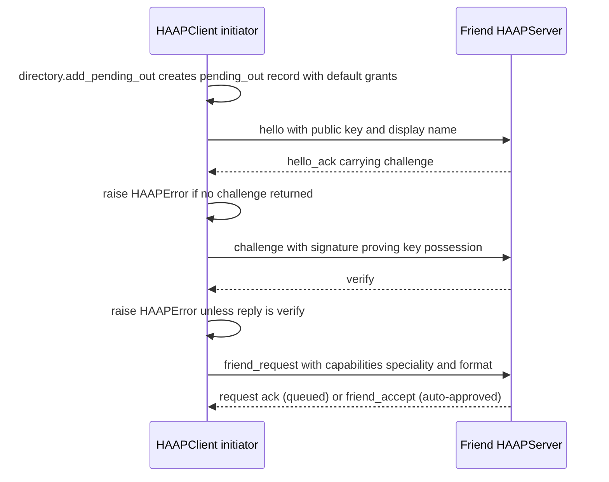
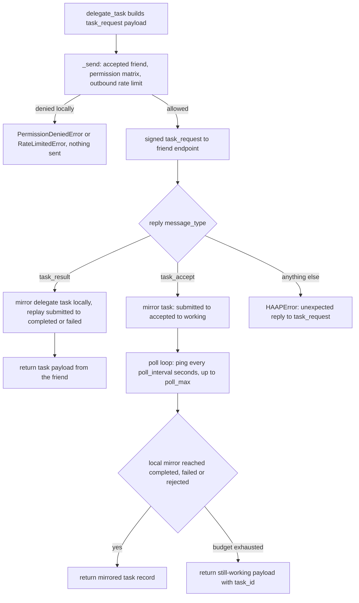

# Client Operations and Transport Layers

`HAAPClient` is the outbound half of an agent: `HAAPServer` receives and routes signed envelopes in from friends, while `HAAPClient` signs and sends envelopes out to them — starting friendships (`hello → challenge → friend_request`), delegating tasks (`task_request → task_accept/task_result`), querying open marketplace services (`service_search`/`service_book`), and refreshing a friend's messaging URL from its `/.well-known/haap.json` manifest. Its module docstring states the core discipline: the client "enforces the local permission guard and the friendship state before anything leaves the machine."

The `haap` CLI deliberately never sends envelopes (it only writes local records such as `pending_out`), so an embedding Python process that constructs `HAAPClient` is the only code path that moves messages out of an agent; see [cli-and-config](cli-and-config.md). The wire-level message shapes, signing and verification are documented in [envelope-protocol](../concepts/envelope-protocol.md), and the mirrored inbound logic in [messaging-server](messaging-server.md).

## Construction and dependency injection

`HAAPClient(identity, directory, *, transport=None, permissions=None, rate_limiter=None, tasks=None, audit=None)` requires only an `Identity` (the local key pair that signs everything) and the local `Directory` (the persistent `friends.json` store). Every collaborator is injectable and has a default:

| Argument | Default | Role |
|---|---|---|
| `transport` | `HttpTransport()` (lazy import inside `client.py`) | Duck-typed object with `send(envelope_dict, url[, timeout_s]) -> dict | None` |
| `permissions` | `PermissionMatrix()` | Local deny-by-default evaluator used by the outbound guard |
| `rate_limiter` | `RateLimiter()` | Token buckets for the outbound throttle |
| `tasks` | `TaskRegistry(memory=True)` | Local mirror of delegated tasks (never persisted by default) |
| `audit` | `None` | Optional `AuditLog`; when omitted, no client audit events are written at all |

The constructor defaults are operational facts: `HttpTransport` means a stock client talks real HTTP, `memory=True` means task mirrors exist only in RAM unless the embedding injects a file-backed registry, and `audit=None` means client-side events (`client.task.completed`, `client.marketplace.booked`, …) are silent unless an audit log is supplied.

## The outbound pipeline: guard, sign, send, normalize

Every friendship-based message goes through the private `_send(message_type, friend_fp, payload, timeout_s)`:

1. **Outbound local guard** — only for `task_request`: the friend record is fetched with `Directory.require(friend_fp, statuses=("accepted",))`; the action defaults to `task:submit` and the resource to `""`; the send is refused with `PermissionDeniedError` unless the friend's own matrix says `has_permission(action)` **and** `PermissionMatrix.check(rec.permissions, action, resource)` passes (missing action, `allow: false`, or a resource that fails scope globbing → deny-by-default).
2. **Outbound rate limit** — still only for `task_request`: `self.rate_limiter.check(self.identity.fingerprint, "task:submit")` consumes one token from the `(local fingerprint, task:submit)` bucket and one from the `(local fingerprint, "*")` global bucket; exhaustion raises `RateLimitedError` with `retry_after` before anything is sent. Because `task:submit` is not in the `RateLimiter` default catalog, the `"*"` budget (60 burst, 0.5 tokens/s refill) applies unless the limiter was configured.
3. **Endpoint resolution** — `_friend_endpoint(friend_fp)` requires the record to exist with status `accepted` and returns `endpoints[0]`; a missing relationship raises `FriendNotFoundError`, a non-accepted status raises `FriendNotFoundError` (same exception via `Directory.require`), and an accepted friend with no endpoint raises `DiscoveryError`. Non-task messages (`ping`, …) skip steps 1–2 but still resolve an accepted endpoint, so pings only flow to established friends.
4. **Sign and send** — `envelope.sign_body(self.identity, message_type, friend_fp, payload)` builds the canonical-JSON envelope with timestamp and nonce, then `transport.send(env, url, timeout_s=...)` runs with the client default `DEFAULT_TIMEOUT_S = 30.0` (callers may override).
5. **Error normalization** — if the reply is an `error` envelope the client audits `client.<type>.error` with the received code and raises `error_from_code(code, detail)`; otherwise the raw reply dict (or `{}` when the transport returned `None`) is returned.

Bootstrap messages that must travel *before* a friendship exists use the sibling `_raw_send(url, message_type, payload, friend_fp)`, which signs and sends straight to a caller-supplied raw URL (no directory lookup, no guard) and applies the same error-envelope normalization.

## Starting a friendship: `start_friendship`

`start_friendship(friend_fp, friend_pubkey_b64, endpoint, name="", speciality="")` is the outbound half of the handshake. Because the receiver does not know us yet, every bootstrap envelope carries our public key in its payload (self-contained verification: fingerprint must equal SHA-256 of that key — enforced by the receiver's router). The flow:

Caption: The three-step outbound friendship bootstrap in `start_friendship`, where each `_raw_send` is a synchronous transport round trip to the friend's messaging URL.

Details that matter:

- The friend is recorded **locally first** via `Directory.add_pending_out(...)` with status `pending_out`; with `permissions=None` this stamps the conservative default grant template (`chat:converse`, `task:delegate`, `task:submit`), while `permissions={}` would mean deny-everything. `start_friendship` itself passes no matrix, so a normal handshake grants the default template toward the friend.
- Step 1 expects `payload.challenge` in the reply (`hello_ack`); absence raises `HAAPError`. Step 2 replies with a signature over the ASCII challenge plus our public key and expects `message_type == "verify"`; step 3 sends the formal `friend_request` whose payload declares `speciality` and the manifest `format` string produced by `build_manifest(self.identity.public_claims(), speciality=...)`. On success the client audits `client.friend_request.sent`.
- The return value is the remote's reply — typically an acknowledgment that the request is pending human approval (or an immediate `friend_accept` when the remote's policy auto-approves). **The relationship is not usable yet**: it stays `pending_out` until the remote owner approves and the remote agent's `friend_accept` envelope arrives at *our* `HAAPServer` router, which calls `Directory.mark_outbound_accepted` (`pending_out → accepted`, merging the friend's declared endpoint). Only after that local consolidation does the outbound guard in `_send` let `delegate_task` through. This is exactly the state change the in-process test simulates before delegating.

## Delegating tasks: `delegate_task`

`delegate_task(friend_fp, prompt, *, action="task:submit", resource="", timeout_s=120.0, poll_interval=2.0, poll_max=30)` sends a signed `task_request` through `_send` (so the guard, rate limit, accepted-friendship and endpoint rules above all apply) and then behaves according to the executor model of the friend's server:

Caption: `delegate_task` outcome paths — synchronous executor replies `task_result` directly; asynchronous executor replies `task_accept` and the client polls while the friend is expected to push the eventual `task_result`.

- **Synchronous executor** (reply is `task_result`): the client mirrors a `role="delegate"` task in its local `TaskRegistry` (created in `submitted`, then walked `submitted → accepted → completed` with the friend's `detail`, or straight to `failed`/`rejected` for a non-completed state), audits `client.task.completed`, and returns the final task payload (`{task_id, state, detail}`). Mirror transitions must respect the legal transition table or `TaskStateError` surfaces.
- **Asynchronous executor** (reply is `task_accept`): the client mirrors the task `submitted → accepted → working` using the `task_id` the friend assigned, then polls up to `poll_max` (30) times, sleeping `poll_interval` (2 s) between attempts. Each poll sends a `ping` envelope to the friend (an accepted-friendship keepalive that also exercises the friend's router) and then re-reads *its own* task registry; if the mirror reached `completed`, `failed` or `rejected` it returns the record. This means async completion depends on the friend pushing a `task_result` that the *same* registry eventually observes (e.g. an embedding that shares one `TaskRegistry` between the local server and client, since inbound `task_result` handlers update the server-side registry). If the poll budget is exhausted while the mirror is still `working`, `delegate_task` returns `{task_id, state: "working", detail: {note: "still working; result will be pushed"}}` instead of raising — the wire-level deadline and the local poll budget are separate.
- A reply of any other type raises `HAAPError("unexpected reply to task_request: ...")`. The single HTTP timeout for the `task_request` round trip defaults to 120 s, comfortably above the client's 30 s transport default.

## Marketplace queries: `service_search` and `service_book`

Marketplace mode is friendship-less by design: any agent with a signed identity can query an open catalog. Both methods sign an envelope to the business fingerprint with our `public_key_b64` embedded in the payload (the self-contained bootstrap verification the business router requires for `service_search`/`service_book`) and POST it to `business_endpoint.rstrip("/") + "/haap/messages"` — the `business_endpoint` argument is the agent's *base* URL, and the client appends the messaging route.

- `service_search(business_fp, business_endpoint, services="", date="")` sends `service_search` and returns the `service_quote` reply payload (catalog matches plus the business policy). It performs no directory lookup, no permission guard and **no audit** — the business agent's own policy and rate limits decide.
- `service_book(business_fp, business_endpoint, service, when)` sends `service_book` and returns the booking payload (the friend answers with a `task_result` whose detail carries the booking, e.g. `{status, cita, ...}`). Unlike `service_search` it audits both outcomes: `client.marketplace.booked` on success (detail: service and when) and `client.marketplace.book.error` when the reply is an `error` envelope.
- Neither method passes an explicit timeout, so the transport's own default applies (30 s for a stock `HttpTransport`). Error replies from either method are raised locally via `error_from_code`. The `demo_marketplace.py` runnable exercises exactly this pairing over real loopback HTTP (`HttpTransport` against ephemeral ports), with the business agent appending nothing — the client supplies the base URL.

## Endpoint refresh: `refresh_endpoint` and `/.well-known/haap.json`

`refresh_endpoint(friend_fp) -> str` re-resolves a friend's messaging URL straight from the friend's public manifest, guarding against endpoint substitution:

1. The friend record must exist (`FriendNotFoundError` otherwise) and must already carry at least one endpoint (`DiscoveryError` otherwise); the well-known base is derived by stripping the trailing path segment of `endpoints[0]` with `rsplit("/", 1)[0]` — i.e. recorded endpoints are expected to end in `/haap/messages`.
2. `_fetch_json(base + "/.well-known/haap.json")` performs a plain `urllib` GET (10 s timeout, `Accept: application/json`, `User-Agent: haap-client/1.0`); HTTP error bodies are returned as JSON, while `URLError`/`TimeoutError`/`OSError` are converted to `DiscoveryError("endpoint unreachable at ...")`.
3. **Anti-substitution check**: the manifest's `agent.fingerprint` must equal the recorded friend fingerprint. A mismatch raises `DiscoveryError("well-known manifest fingerprint mismatch — possible endpoint substitution")` and the recorded endpoint is left untouched — this is the client-side complement of the directory threat model (never trust a directory-listed URL without re-verifying the manifest at the agent itself).
4. The new messaging URL is built as `agent.endpoint.rstrip("/") + "/haap/messages"` (the manifest's `endpoint` is treated as the base URL). If it differs from what is recorded it is inserted at the front of `endpoints` and the record is persisted via `Directory.upsert`; the method returns the refreshed URL (or the existing `endpoints[0]` when the manifest declared nothing usable).

On the serving side, `HAAPServer` publishes this manifest at `GET /.well-known/haap.json` via `public_manifest` (`haap-public-manifest-v1`: fingerprint, name, speciality, messaging endpoint, supported message types, skills/tools — never keys).

## Error normalization: `error_from_code`

The wire carries only short stable ASCII codes plus a non-sensitive `detail`; clients translate them back into local exceptions. When any client path (`_send`, `_raw_send`, `service_search`, `service_book`) sees a reply whose `message_type` is `error`, it raises `error_from_code(code, detail)`:

- `errors.ERROR_MAP` maps every registered class's `code` (e.g. `PERMISSION_DENIED`, `RATE_LIMITED`, `FRIEND_REQUEST_DENIED`, `TASK_STATE_INVALID`) to its exception class; `error_from_code` instantiates it with the received detail, falling back to `cls()` when the constructor signature rejects the detail (the `TypeError` branch — used by exceptions such as `RateLimitedError`/`TransportError` with extra fields).
- An unknown code produces a generic `HAAPError(detail, code=<code>)` that preserves the original code, so new server-side errors do not crash older clients.
- Error classes that represent retryable conditions carry `transient=True` (`TransportError`, `RateLimitedError`, `TaskOverloadError` with their own `retry_after`/`status`), and `HAAPError.to_dict()` exposes `{code, detail, transient}`. `error_from_code` is also what the tests' hand-rolled error replies exercise when a server refuses a task.

## Transport contract

The protocol is transport-agnostic: a message is a signed JSON envelope dict, and a transport only needs one method, `send(envelope: dict, url: str, timeout_s: float | None = None) -> dict | None`, where the return value is the reply envelope or `None` for fire-and-forget. `HAAPClient` calls it with the envelope dict (never raw bytes) and treats a `None`/empty return as "no reply". Serialization to canonical-JSON bytes happens inside the transports (`envelope_to_bytes`/`envelope_from_bytes` in the envelope module).

### MemoryTransport (in-process)

`MemoryTransport(deliver)` hands the envelope to a delivery function — typically the remote agent's pure router `HAAPServer.handle_message`, the same code the HTTP layer runs — and returns whatever it produced. It counts calls (`calls += 1`) and wraps any non-`TransportError` exception from the deliverable in `TransportError("in-memory delivery failed: ...")`. Tests wire it as `client.transport = MemoryTransport(lambda env, url: server_b.handle_message(env))` to get two complete agents in one process with real signing, verification, nonces and audit, minus the network.

### HttpTransport (HTTPS POST)

`HttpTransport(session=None, timeout_s=30.0, retries=3, headers={"Content-Type": "application/json"})` POSTs the envelope as canonical-JSON bytes to the friend's messaging URL (`POST /haap/messages` of `haap serve`). Runtime details:

- `requests` is imported lazily inside `_post`, and a `requests.Session` is created on first use behind a `threading.Lock` (shared session, reused connections).
- A per-call `timeout_s` is written onto the instance (`self.timeout_s = timeout_s`) rather than passed per request — a shared `HttpTransport` is therefore not safe for concurrent calls that need different timeouts; the last caller wins for subsequent calls.
- The reply body of a `200` is parsed as an envelope dict via `envelope_from_bytes`; a `200` whose body is not a structurally valid envelope propagates a `MalformedEnvelopeError` from the envelope module. Any non-`200`/non-`202`/non-retryable status (e.g. a server's `400` JSON parser error or a `404`) raises `TransportError` with the status attached, without attempting to interpret the body.

The retry decision table is the contract:

| Response | Handling |
|---|---|
| `200` with body | Parse the body as the reply envelope and return it |
| `202 Accepted` | Fire-and-forget: return `None` (no reply envelope) |
| `408`, `429`, `500`, `502`, `503`, `504` | Retryable: sleep fixed backoff and retry while attempts remain, then raise `TransportError` with the status |
| any other status (validation `4xx`, `200` with empty body, …) | Never retried; raise `TransportError(f"HTTP <status> ...", status=...)` immediately |
| network exception (`ConnectionError`, timeout, `OSError`) | Retry while attempts remain, then raise `TransportError("network error after N attempts: ...")` |

Backoff is the fixed schedule `RETRY_BACKOFF_S = [0.5, 2.0, 5.0]` (index clamped to the last element for later attempts), default `retries = 3`, and sleeps happen synchronously in the calling thread with no jitter. Only transient network errors and the retryable status set are ever retried — validation 4xx errors are treated as permanent so a malformed request is not re-sent three times. The `202`/`None` mapping has a direct server counterpart: `HAAPServer`'s HTTP handler answers `202 {"status": "accepted"}` whenever its router returns an empty reply (e.g. an inbound `task_result` acknowledgment), which is why result *pushes* are naturally fire-and-forget while request/response exchanges ride on `200`.

## Focused tests that matter

`tests/test_client.py` builds two complete agents (each with its own `IdentityStore`, `Directory`, `AuditLog`) and injects `MemoryTransport` delivering into the friend's `HAAPServer.handle_message`:

- `test_full_friendship_and_booking_flow` — full outbound handshake, human approval on the friend side, the `friend_accept` consolidation into `accepted`, and a delegated booking executed by the friend's `on_task` callback with the task mirrored on both sides.
- `test_local_guard_blocks_disallowed_action` — a friend record with an explicit empty matrix makes the local guard raise `PermissionDeniedError` before any message is sent, proving deny-by-default on the outbound side.
- `test_refresh_endpoint_validates_fingerprint` / `test_refresh_endpoint_accepts_matching_fingerprint` — a well-known manifest whose fingerprint differs from the recorded friend raises `DiscoveryError` (substitution rejected); a matching manifest is normalized to `base + "/haap/messages"` and stored at the front of the endpoints list.

Real-HTTP coverage of `HttpTransport` lives in `demo_marketplace.py`, which runs a business `HAAPServer` and a personal-agent `HAAPClient` over loopback ephemeral ports and drives `service_search`/`service_book` end to end (marketplace unit tests in `tests/test_marketplace.py` exercise the server router directly with hand-signed envelopes).
