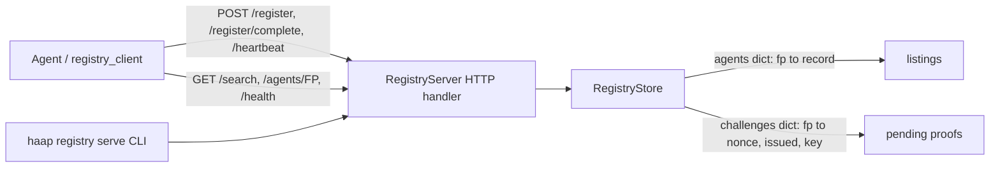
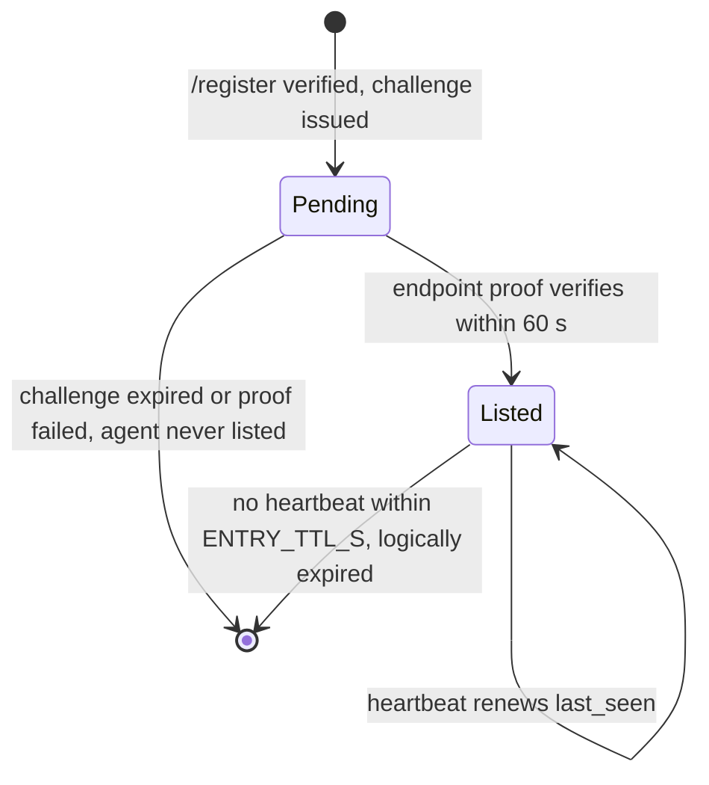
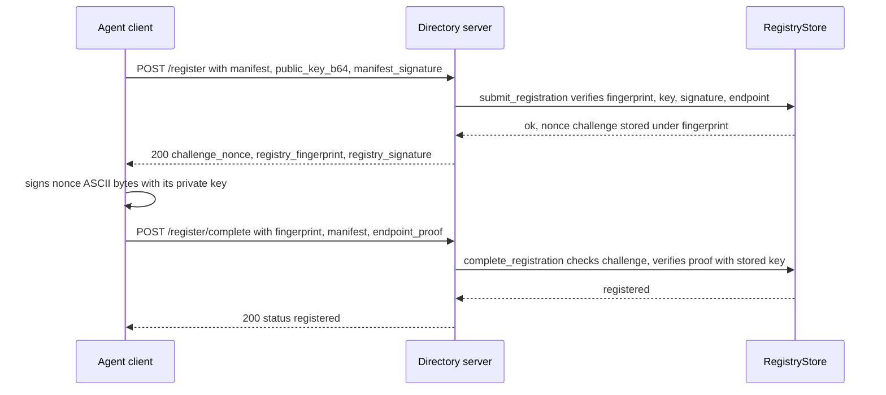

# Federated Directory System (Reference Registry)

The HAAP federated directory is the ecosystem's public "phone book": agents register a signed capability manifest so other agents (and humans) can discover them by speciality, capability and free text. In this repository the directory is **`haap/registry.py`**, a deliberately minimal **in-memory reference implementation** with two cooperating halves: `RegistryStore` (the index state) and `RegistryServer` (a zero-dependency stdlib `http.server` API). The client side lives in **`haap/registry_client.py`** (`build_registration`, `register`, `search`, `heartbeat`, `HeartbeatLoop`), and the CLI exposes it as `haap registry serve|register|search` (`haap/cli.py`). The repo also carries **`docs/DIRECTORY_SERVICE_BRIEF.md`**, an implementation brief for a separate, production-grade directory service — see [Relationship to the production brief](#relationship-to-the-production-brief) below; that service is **not** implemented in this repository.

## What the directory is (and is not)

The directory is a **phone book, not a notary** ([identity](../concepts/identity.md) explains why). Identity lives in the agents' Ed25519 keys; the directory never decides who anyone is. Its only jobs are:

- index **signed** manifests whose fingerprint matches the declared public key, and
- verify that the registering agent **controls the messaging endpoint** it declares (proof-of-endpoint: the agent signs a registry-issued nonce).

Because the directory is not an identity authority, a compromised or malicious directory can hide or poison search results but cannot impersonate an agent: after discovery a client can (and should) fetch the agent's own `/.well-known/haap.json` and check that the fingerprint matches (see ARQUITECTURA §6.2). `RegistryStore` accordingly never stores keys in the manifest or exposes them: the verified public key lives only in the short-lived pending challenge, and each `RegistryServer` signs the challenges it issues so agents can identify the directory they are talking to.



Caption: The reference directory stack in this repo — `registry_client` and the CLI talk HTTP to `RegistryServer`, which owns `RegistryStore`; no persistence layer exists, so state is process-local.

## Components and state model

| Piece | Location | Responsibility |
|---|---|---|
| `RegistryStore` | `haap/registry.py` | In-memory index of listed agents and pending challenges, all reads/writes under one `threading.RLock`; entry TTL configurable per instance |
| `RegistryServer` | `haap/registry.py` | `ThreadingHTTPServer` wrapper: HTTP routes, JSON parsing, registry-signed challenge responses |
| `registry_client` | `haap/registry_client.py` | Agent side: build + sign the manifest, run the two-round-trip registration, search, heartbeat, keep-alive daemon |
| CLI `registry` family | `haap/cli.py` | `haap registry serve` (run a directory), `register`, `search` |

Defaults live at the top of `registry.py`:

```python
ENTRY_TTL_S = 24 * 3600          # expiry without heartbeat
CHALLENGE_TTL_S = 60             # proof-of-endpoint window
MAX_AGENTS = 10_000              # anti-flooding cap for the directory
```

`RegistryStore` keeps two dicts. `_agents` maps fingerprint → record `{manifest, registered_at, last_seen, endpoint_proof, endpoint_nonce}` (the proof is stored truncated to its first 64 characters and never returned by any read path — search and profile fetches return only the manifest). `_challenges` maps fingerprint → `(nonce, issued_epoch, public_key_b64)`. A `threading.RLock` serializes every mutation and read, so `RegistryServer`'s threaded handler is safe. **All state is in memory: restarting the process starts an empty directory.**



Caption: Lifecycle of one agent entry in `RegistryStore` — registration is a pending-challenge state first, listing happens only after proof-of-endpoint, and expiry is lazy (see below).

## Registration: proof-of-endpoint over HTTP

Registration is the two-round-trip flow implemented by `do_POST` in `RegistryServer` and driven end to end by `registry_client.register`. `submit_registration` performs the entire server-side verification **before** any challenge is issued:

1. `manifest.agent.fingerprint` must match `^HF-[0-9a-f]{16}$` (format from [identity](../concepts/identity.md): `HF-` + first 16 hex chars of SHA-256 of the raw public key).
2. `public_key_b64` must decode, and `fingerprint_of_public_key(raw_pub)` must equal the declared fingerprint.
3. The manifest signature must verify with `KeyPair.verify_with(raw_pub, canonical_json(manifest), sig)`, where canonical JSON is exactly

```python
json.dumps(manifest, sort_keys=True, separators=(",", ":"), ensure_ascii=False).encode()
```

4. `manifest.agent.endpoint` (trailing `/` stripped) must start with `http://` or `https://`.

Only then is a random 32-byte base64 nonce stored as a pending challenge keyed by the fingerprint, together with the verified public key — the manifest itself never carries keys, and the agent is **not** listed at this step. Any verification failure returns `(False, message)` and the HTTP layer answers `400 {"error": message}`.



Caption: The reference registration flow — the directory signs the nonce it returns, and the agent must sign that nonce back to prove endpoint control before it is listed.

On success `POST /register` answers **200** with the challenge:

```json
{"challenge_nonce": "<nonce>",
 "registry_fingerprint": "HF-...",
 "registry_signature": "<base64 Ed25519 signature by the registry over the nonce ASCII>"}
```

The `registry_signature` lets an agent verify it reached the intended directory; the reference `registry_client` checks only for `challenge_nonce` and does not verify the registry signature.

`complete_registration` is **single-use and expiry-checked**: it pops the pending challenge first — so *any* completion attempt for a fingerprint consumes its challenge, and a failed or expired completion forces the agent to start over at `POST /register` — then rejects on challenge age above `CHALLENGE_TTL_S`, on a caller-supplied public key that differs from the submit-verified one (store-level check), or on an endpoint proof that fails `KeyPair.verify_with(raw_pub, nonce.encode("ascii"), proof)` against the **submit-verified** key. Proof-of-endpoint binding therefore always comes from the key retained in the challenge: the HTTP handler never forwards the `public_key_b64` that the client also sends in `/register/complete` (the client sends `{fingerprint, manifest, endpoint_proof, public_key_b64}`; the handler consumes only the first three). A proof signed by a different key is rejected and the agent is **not** listed — pinned by `test_failed_endpoint_proof_not_listed`. Success writes the agent record and answers `200 {"status": "registered"}`; failure answers `400 {"error": message}`.

Completing a second registration for an already-listed fingerprint **updates** the record in place (fresh `registered_at`/`last_seen`), never duplicates it — `RegistryStore.count()` stays 1 (`test_duplicate_registration_updates`).

## Heartbeat, search and profile endpoints

`RegistryServer` (stdlib `http.server`, `ThreadingHTTPServer`) exposes exactly this surface; bodies are JSON parsed from `Content-Length`, and non-JSON POST input yields `400 {"error": "invalid JSON"}`:

| Method/path | Request | Response |
|---|---|---|
| `GET /health` | — | `200 {"status": "ok", "agents": <alive count>}` |
| `GET /search?capability=X&q=Y` | query params | `200 {"results": [manifest, ...]}` |
| `GET /agents/{HF-<16 hex>}` | path fingerprint | `200 <manifest>` or `404 {"error": "not registered or expired"}` |
| `POST /register` | `{manifest, public_key_b64, manifest_signature}` | `200 {challenge_nonce, registry_fingerprint, registry_signature}` or `400 {"error": msg}` |
| `POST /register/complete` | `{fingerprint, manifest, endpoint_proof, public_key_b64}` | `200 {"status": "registered"}` or `400 {"error": msg}` |
| `POST /heartbeat` | `{fingerprint}` | `200 {"status": "ok"}` or `404 {"status": "unknown"}` |

Any other path answers `404 {"error": "not found"}` (the `/agents/` route only matches `HF-[0-9a-f]{16}`).

**Search semantics** (`RegistryStore.search`): `capability` is a case-insensitive substring match against `agent.speciality` plus every `tools[]` name and `skills[].name` in the manifest; `q` is a case-insensitive substring over the whole manifest JSON. Results are the stored manifests themselves — server-side record fields (timestamps, proofs) never leak out. The HTTP handler passes the first occurrence of each query parameter and always returns the `{"results": [...]}` envelope.

**Heartbeat nuance that matters operationally**: in the reference implementation `POST /heartbeat {fingerprint}` is an *unauthenticated liveness renewal* — `heartbeat()` just refreshes `last_seen` when the fingerprint maps to a currently live record. No timestamp or signature is verified at this layer, so knowing a fingerprint is enough to keep its entry alive. The signed-heartbeat contract (signature over `heartbeat:{fingerprint}:{timestamp}`, ±300 s clock window) is specified for the production service in the brief, not implemented by this reference server. `GET /health` counts **alive** entries (`store.count()` filters expired records).

## Expiry, capacity and failure semantics

- **Expiry is lazy and logical.** An entry is alive iff `now - last_seen <= entry_ttl`. `get` returns `None`, `heartbeat` refuses, and `search`/`count` skip records past that threshold — but **no code path removes records from the `_agents` dict**: reads filter rather than physically prune, so the dict only ever grows with distinct registered fingerprints. An expired agent disappears from every read path and must re-register (its old fingerprint slot can then be updated).
- **The `MAX_AGENTS` cap is checked only in `submit_registration` and only for fingerprints not already in the dict** (`len(self._agents) >= MAX_AGENTS and fp not in self._agents`). Because expired records are never removed, the comparison counts every distinct fingerprint that ever completed a registration; re-registration of any previously registered fingerprint is always admitted (that is the update path). A full directory rejects new fingerprints at submit time with the message "directory full".
- **Single-use challenges**: one nonce, one completion attempt; any failure (expired, wrong key, bad proof) consumes the challenge, so clients must restart at `/register`.
- **`RegistryServer` signs every challenge with its own generated `KeyPair`** (injectable via the constructor) and publishes its own fingerprint in `registry_fingerprint`; `start(host="0.0.0.0", port=8444)` binds a `ThreadingHTTPServer` whose `serve_forever` runs on a daemon thread, returns the HTTP server object (so `port=0` yields an ephemeral port, which the tests rely on), and `stop()` shuts it down cleanly.

## Client utilities (`haap/registry_client.py`)

The client side is what an agent uses to appear in any HAAP directory (reference or the production one, which must stay wire-compatible with it):

- `build_registration(identity, endpoint_url, speciality, skills_dirs, extra_tools)` → `(manifest, public_key_b64, manifest_signature)`: builds the public manifest via `capabilities.public_manifest` (`format: "haap-public-manifest-v1"`, **no keys** — see [manifests](../concepts/manifests.md)) and signs the canonical JSON form above with the agent keypair.
- `register(registry_url, identity, endpoint_url, ...)` → runs the whole flow: `POST /register`, signs the returned `challenge_nonce` ASCII bytes with the agent's private key, `POST /register/complete` with `{fingerprint, manifest, endpoint_proof, public_key_b64}`, and returns the final response only when `status == "registered"`. Any rejection or unreachable directory raises `DiscoveryError` (code `DISCOVERY_FAILED` from `haap/errors.py`), with the server's `error` text inside.
- `search(registry_url, capability="", q="")` → the `results` list of manifests; `heartbeat(registry_url, fingerprint)` → `True` exactly when the server answered `{"status": "ok"}`. Both use the shared `_request` helper (urllib, `Accept`/`Content-Type: application/json`, `User-Agent: haap-client/<version>`, 10 s timeout, 4xx bodies parsed rather than raised, network errors surfaced as `DiscoveryError`).
- `HeartbeatLoop(registry_url, fingerprint, interval_s=DEFAULT_HEARTBEAT_S)` → daemon keep-alive: `start()` spawns a daemon thread that heartbeats every `interval_s` (default `6 * 3600` s — well below the 24 h entry TTL so an entry cannot expire between beats), records the last outcome on `last_ok` (`False` on `DiscoveryError`), and `stop()` sets a `threading.Event` to end the loop.

```python
from haap.registry_client import HeartbeatLoop

HeartbeatLoop("https://acoalex.com/haap-directory",
              identity.fingerprint).start()
```

## CLI entry points

`haap registry serve | register | search` (`cmd_registry` in `haap/cli.py`):

- `haap registry serve --host --port` (default `0.0.0.0:8444`) constructs a plain in-memory `RegistryServer` and blocks until Ctrl+C, then stops it cleanly — this runs the **reference** directory, not the production service.
- `haap registry register --registry URL --endpoint URL --speciality` loads the local identity from the data directory and calls `registry_client.register`, raising `HAAPError` ("no endpoint declared: pass --endpoint or set it at haap init") when the agent has no endpoint; prints the returned `status`.
- `haap registry search --registry URL --capability --q` prints `fingerprint  speciality  name  endpoint` per matching manifest.

All handler errors funnel through `haap.cli.main`'s shared contract: `HAAPError` prints `HAAP error [<code>]: <detail>` to stderr and exits 2 (see [cli-and-config](cli-and-config.md)). Note the client defaults in `cmd_registry` — `register`/`search` target the `--registry` URL the operator supplies, and the README points agents at the publicly operated directory `https://acoalex.com/haap-directory`.

## Relationship to the production brief

`docs/DIRECTORY_SERVICE_BRIEF.md` is an **implementation brief for an AI coding agent — not implemented code in this repository**. It scopes a separate, production-grade HAAP Public Directory: a `haap/directory_service/` package plus a `haap-dird` CLI entry point, backed by **SQLite** (so a restart does not lose the index), with canonical `/v1` routes (`/v1/register`, `/v1/register/challenge`, `/v1/heartbeat`, `/v1/search` with geo and pagination), thin legacy aliases for the reference routes, per-IP rate limiting, an audit log, stable uppercase error codes, a 120 s challenge TTL, and payload/size caps. The brief explicitly describes this repo's `registry.py` as the "minimal in-memory reference implementation" whose logic, data shapes and external behavior the production service must reuse and remain wire-compatible with, states that `haap/registry.py`, `haap/registry_client.py` and the existing tests stay untouched unless a bug forces a change, and sets the acceptance bar at the *unmodified* `tests/test_registry.py` and `tests/test_registry_client.py` still passing. Nothing matching that brief (no `directory_service` package, no `haap-dird` script — `pyproject.toml` declares only the `haap` console script) exists in this repository; operators wanting persistence, hardening and observability run the separately operated service (`github.com/acoalex/haap-directory`, documented in the README as the production path), while `haap registry serve` remains the embedded reference directory.

## Focused tests

The reference behavior is pinned over real HTTP — the fixtures boot a `RegistryServer` bound to `127.0.0.1` with `port=0` and drive it with urllib:

- `tests/test_registry.py::test_registration_with_proof_of_endpoint` — full submit → registry-signed challenge → signed proof → `/register/complete` → listed, searchable by `q`, fetchable via `/agents/{fp}`.
- Rejection paths: `test_registration_bad_signature_rejected`, `test_registration_fingerprint_key_mismatch_rejected`, and `test_failed_endpoint_proof_not_listed` (a proof signed by an impostor key leaves the agent unlisted — `store.get` returns `None`).
- `test_duplicate_registration_updates` — re-registering the same fingerprint updates in place, `store.count() == 1`.
- `test_heartbeat_renews_and_expiry` — heartbeat renews; past a 2 s TTL the entry is gone and heartbeat returns `False` (this is how the reference tests expiry without sleeping for real hours).
- `test_search_by_capability_and_text` — `capability=caldav` matches the tools list, `q` substring-matches manifest text.
- `tests/test_registry_client.py::test_full_registration_and_discovery` — the **unmodified** `registry_client.register/search/heartbeat` against a live reference directory: register a business agent, heartbeat it, and have a second agent discover it by capability and free text.

## Operational notes and invariants

- **State is process-local and volatile**: restarting `RegistryServer` (or `haap registry serve`) drops every listing and challenge; keep-alive entries vanish with the process. This is by design for the reference implementation — persistence is the production service's job.
- **An entry lives only while heartbeats flow**: 24 h TTL by default, 6 h recommended renewal interval, unauthenticated in the reference.
- **Trust boundaries**: the directory never holds keys, search never leaks proofs or timestamps, and after discovery clients re-verify agents directly against their `/.well-known/haap.json` — a compromised directory can mislead discovery but not forge identity.
- **Capacity thinking**: because entries are never physically pruned, the 10 000 cap effectively counts distinct fingerprints that have ever completed registration in this process, and re-registration of an existing fingerprint always passes the cap check.

Related pages: [identity](../concepts/identity.md) · [manifests](../concepts/manifests.md) · [hermes-and-a2a](../integrations/hermes-and-a2a.md) · [cli-and-config](cli-and-config.md) · [testing overview](../testing/overview.md) · [directory-registration workflow](../workflows/directory-registration.md)
