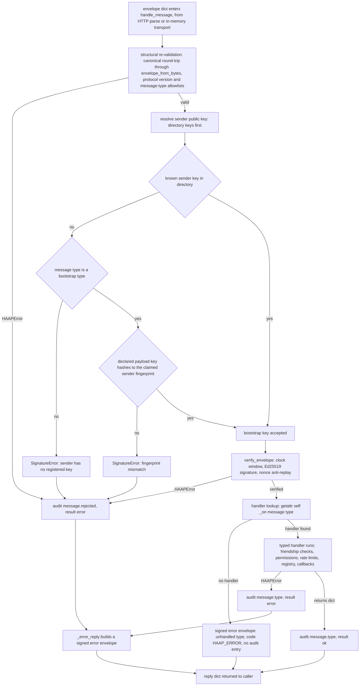

# Messaging Server: Router, HTTP Surface and Callbacks

`HAAPServer` (`haap/server.py`) is the inbound half of one agent: it receives signed envelopes from friends and strangers, verifies them, dispatches each to a per-type handler, and answers with a signed reply or a signed error envelope. The whole server is pure Python stdlib (`http.server.ThreadingHTTPServer` — zero web-framework dependencies) with exactly three routes: `POST /haap/messages` (envelope intake), `GET /.well-known/haap.json` (the public capability manifest), and `GET /health` (liveness). The outbound mirror — `HAAPClient`, transports, endpoint refresh — is documented in [client-and-transports](client-and-transports.md); the wire format, canonical JSON and verification steps this router orchestrates live in [envelope-protocol](../concepts/envelope-protocol.md); the trust rationale and threat model are in [security-model](../architecture/security-model.md).

The module docstring summarizes the architecture: the server is *"the same code that executes the HTTP layer"* when driven in-process — `handle_message` is the single routing door used by the real HTTP stack and by `MemoryTransport`-based tests alike. Handlers are deliberately injectable: `on_task` and the policy `Notifier` wire the server into an embedding host (Hermes webhook → owner chat, task executors, calendar backends), as covered in [hermes-and-a2a](../integrations/hermes-and-a2a.md).

## Construction and injectable pieces

`HAAPServer(identity, directory, *, ...)` requires only the local `Identity` (whose keypair signs every reply) and the persistent `Directory` (`friends.json`). Every collaborator is injectable with a default whose choice is an operational fact:

| Argument | Default | Role |
|---|---|---|
| `identity` | required | Local agent identity; its keypair signs all replies and error envelopes, its fingerprint is the server's own |
| `directory` | required | `Directory` — friends, their keys, statuses, granted matrices, rate limits, endpoints (`friends.json`) |
| `audit` | `AuditLog(memory=True)` | Security-decision trail; the in-memory default means an embedder that wants persistent audit must pass a file-backed log (as `cmd_serve` does) |
| `permissions` | `PermissionMatrix(audit=self.audit)` | Deny-by-default evaluator consulted by the task handler; shares the server's audit log |
| `rate_limiter` | `RateLimiter()` | In-memory token buckets per `(friend, action)` plus a per-friend global bucket |
| `tasks` | `TaskRegistry(memory=True)` | Local task registry; in-memory unless the embedder passes a file-backed one |
| `speciality` | `""` | Advertised in the well-known manifest (e.g. `"citas-peluqueria"`) |
| `marketplace_catalog` | `None` | Service → info/price dict published by `service_search` |
| `marketplace_policy` | `None` | Business rules echoed in quotes and enforced on booking (e.g. `{"auto_accept": True}`) |
| `policy` | `RequestPolicy(directory.directory)` | Friend-request decision engine; reads `policy.json` from the data directory **once at construction** (queue-all default) |
| `notifier` | `ConsoleNotifier()` | Human-facing friend-request cards; `WebhookNotifier`/`CompositeNotifier` replace it for chat delivery |
| `on_friend_request` | `None` | Reserved callback `cb(fp, manifest)` documented as the "notify owner" hook — **not invoked anywhere in the v1 router**; owner notification for queued requests flows through the policy `Notifier` instead |
| `on_task` | `None` | Executor callback `cb(task_id, payload) -> None | dict`; invoked by `_on_task_request` and `_on_service_book` |
| `skills_dirs` / `extra_tools` | `None` | Fed to the well-known manifest builder (Hermes skill introspection) |

Constructor code (`haap/server.py`): `self.audit = audit or AuditLog(memory=True)`, `self.permissions = permissions or PermissionMatrix(audit=self.audit)`, `self.tasks = tasks or TaskRegistry(memory=True)`, `self.policy = policy or RequestPolicy(getattr(directory, "directory", None))`, `self.notifier = notifier or ConsoleNotifier()`, plus `self.nonces = env_mod.NonceManager()`. The file-backed defaults used in production therefore come from whoever constructs the server, not from `HAAPServer` itself: `haap serve` passes a file-backed `AuditLog`, while `demo_marketplace.py` and the tests pass `AuditLog(memory=True)`.

## Runtime state and lifecycle

Per-server state is deliberately split between persistent stores and process memory:

- **Persistent**: friends (`Directory`), tasks (`TaskRegistry`), audit (`AuditLog`) — whatever backing the embedder supplied. The CLI's defaults persist under the agent's data directory (see [local-state](../architecture/local-state.md)).
- **In-memory**: the anti-replay `NonceManager` (`self.nonces`) and the handshake challenge table `self._pending_challenges: dict[fingerprint, (challenge, issued_ts)]`. A server restart rebuilds both — nothing about challenges or nonces is persisted, by design.
- **Locking**: an `RLock` guards the challenge table and all handlers that mutate `_pending_challenges`; the stores carry their own locks.

`start(host="0.0.0.0", port=8443)` binds a `ThreadingHTTPServer`, sets `daemon_threads = True`, and runs `serve_forever()` on a daemon thread, returning the bound server object (tests use `port=0` and read `server_address[1]`). `stop()` calls `shutdown()` and `server_close()`. Because the daemon thread dies with the process, an embedding that only calls `start()` never blocks. `ThreadingHTTPServer` is plain HTTP — TLS is a deployment concern (reverse proxy/tunnel in front of `haap serve`, see [cli-and-config](cli-and-config.md)).

## The routing pipeline: `handle_message`

`handle_message(envelope) -> dict` is the single door through which every inbound message passes — the HTTP layer feeds it the parsed envelope, `MemoryTransport`-based tests feed it directly, and both get identical semantics. The pipeline:

1. **Canonical re-validation** — the dict is round-tripped through `envelope_from_bytes(envelope_to_bytes(envelope))`, which re-serializes canonically and re-checks size, shape, required fields, protocol version and the `message_type` allowlist. This is how a float smuggled into a payload (or any other non-canonical construct) surfaces as `MALFORMED_ENVELOPE` inside the routing try/except instead of corrupting verification.
2. **Sender key resolution** — `_resolve_sender_pubkey` decides which public key to verify against (bootstrap vs. known sender, below).
3. **Full verification** — `env_mod.verify_envelope(envelope, {sender: pubkey}, nonces=self.nonces)`: timestamp window ±300 s, fingerprint↔key consistency, Ed25519 signature over canonical JSON, nonce anti-replay.
4. **Handler lookup and dispatch** — `getattr(self, f"_on_{mtype}")`, then invocation.
5. **Failure isolation** — any `HAAPError` raised at any point becomes a **signed** `error` envelope back to the sender, and both accepted and rejected messages are audited.



Caption: `handle_message` dispatch — structural gate, bootstrap vs. known-sender key resolution, `verify_envelope`, `_on_<type>` lookup, and the audited accept/reject funnel where every failure becomes a signed error envelope.

### Bootstrap vs. known-sender key resolution

`BOOTSTRAP_TYPES = frozenset({"hello", "challenge", "friend_request", "service_search", "service_book", "service_cancel", "service_quote"})` — the message types that arrive *precisely when the receiver may not know the sender yet* (friendship bootstrap and marketplace open services). Resolution order in `_resolve_sender_pubkey`:

- The sender's key is first looked up in `directory.public_keys()` — which deliberately includes `pending_*` **and** `blocked` records, so a known-but-blocked sender is still verified and then rejected with the proper error rather than being indistinguishable from an impostor.
- If no directory key exists **and** the type is a bootstrap type, the router reads `payload.public_key_b64`, decodes it, and requires `fingerprint_of_public_key(key) == sender_fingerprint` (SHA-256 binding); a mismatch raises `SignatureError`. An impostor's own key can never match a borrowed fingerprint, and a manifest-only attacker cannot answer the later challenge.
- Any other case (no directory key, non-bootstrap type, or bootstrap without a usable declared key) raises `SignatureError` — on the wire `BAD_SIGNATURE` — because no signature can be verified.

Trust does *not* come from the self-declared key: for the friendship flow it comes later from the challenge-response proof of key possession and then from human approval (see [friendship-handshake](../workflows/friendship-handshake.md)); for marketplace messages the business policy and the dedicated rate limit decide.

### Handler registration convention

Dispatch is plain reflection: message type `mtype` dispatches to the method `_on_<mtype>`. There is no central routing table in `server.py` — adding a handler *is* adding a method with that name; a message type without a matching method reaches the `handler is None` branch and is answered with a signed `error` envelope whose code is the generic `HAAP_ERROR` (`detail` = `"unhandled type: <mtype>"`). This branch is the fallback for every type the server only *sends* or that arrives out of context — `hello_ack`, `verify`, `capabilities`, `task_accept`, `task_progress`, `error` have no `_on_` handlers in v1 even though `envelope.MESSAGE_TYPES` allows them.

The handler contract: receive the fully verified envelope dict (payload at `env["payload"]`), do whatever work the type implies, and either return a reply dict (usually `env_mod.sign_body(...)`) or raise `HAAPError`. A handler that returns `{}` means "nothing to say back" — for example inbound `task_result` — and maps to HTTP 202 at the transport layer.

### Errors and audit on accept and reject

All post-parse rejections are **signed** `error` envelopes built by `_error_reply` — never plain HTTP errors — so the sender can attribute the failure to its own envelope and third parties cannot forge rejections:

```json
{ "message_type": "error",
  "payload": { "error_code": "NONCE_REPLAY",
               "detail": "duplicate nonce from sender HF-...",
               "in_reply_to_nonce": "<nonce of the rejected envelope>" } }
```

`error_code` is the stable class code, `detail` is human-readable and truncated to 200 characters, and `in_reply_to_nonce` echoes the rejected envelope's nonce (full wire shape and code catalog in [envelope-protocol](../concepts/envelope-protocol.md)).

The audit contract (see [rate-limiting-and-audit](../concepts/rate-limiting-and-audit.md)):

- **Verification failure** (raised before dispatch): `message.rejected` with `result="error"`, the exception class, and a 120-character excerpt of the message — no payload, no nonce, no secrets.
- **Handler failure** (a `HAAPError` raised inside `_on_<type>`): `message.<type>` with `result="error"` and the error class.
- **Handler success**: `message.<type>` with `result="ok"`, logged *before* the reply is returned, so even a `{}` reply (e.g. `task_result`) is recorded.
- **Unhandled type**: no audit entry is written at all — the dispatch-miss branch returns the signed error envelope directly. Router-level audit distinguishes exceptions (`result="error"`) from handlers that *return normally*: a handler that deliberately returns an inline error envelope (friend-request deny, marketplace `TASK_ERROR`) still yields a router-level `result="ok"` entry, while its own finer-grained event (`friend_request.denied_by_policy`, `marketplace.book`) records the actual outcome.

## Per-type handlers

| Message type | Handler | Behavior |
|---|---|---|
| `hello` | `_on_hello` | Issues a fresh random 32-byte challenge, stores `(challenge, ts)` in `_pending_challenges` keyed by sender, replies signed `hello_ack` with `challenge` and `protocol_version` |
| `challenge` | `_on_challenge` | Pops the pending challenge (none left → error), enforces 120-second expiry and exact challenge match, verifies the sender's Ed25519 signature over the ASCII challenge against its declared/directory key (`SignatureError` otherwise); then `directory.register_known` (implicit `pending_in`, never changes an existing status) and replies `verify {verified: True}` |
| `friend_request` | `_on_friend_request` | Records `pending_in` with declared capabilities, then evaluates the request policy (below) |
| `friend_accept` | `_on_friend_accept` | Consolidates the outbound friendship: `mark_outbound_accepted` (`pending_out → accepted`, merging the peer's declared endpoint; idempotent for double-initiated handshakes), replies `ping` |
| `task_request` | `_on_task_request` | Inbound delegation: relationship, permission and rate-limit checks, then task creation + executor dispatch (below) |
| `task_result` | `_on_task_result` | Applies the reported state/detail to the local task registry; returns `{}` (HTTP 202, fire-and-forget acknowledgement) |
| `ping` | `_on_ping` | Replies signed `ping {pong: True, ts}` |
| `service_search` | `_on_service_search` | Marketplace discovery: replies `service_quote` with catalog matches and policy |
| `service_book` | `_on_service_book` | Marketplace booking: gated by `auto_accept`, routes through the task pipeline when an executor exists |
| `service_cancel` | `_on_service_cancel` | Acknowledges cancellation with a completed `task_result` |
| `service_quote` | `_on_service_quote` | Unexpected at a business; politely refused with a signed error envelope |

### Friendship flow handlers

`_on_hello` → `_on_challenge` → `_on_friend_request` implement the receiving side of the handshake. `_on_friend_request` is where policy is applied; `RequestPolicy.evaluate(fp, payload)` (`haap/policy.py`) returns exactly one of three outcomes, each with its own reply path:

1. **deny** — policy default is `deny` or a deny rule matched: the pending record is removed and the sender receives a signed `error` envelope with `error_code: FRIEND_REQUEST_DENIED` (built inline, with `in_reply_to_nonce`). No owner interaction, audited as `friend_request.denied_by_policy`.
2. **auto** — an explicit allowlist rule (fingerprint or declared speciality) matched: `directory.approve` stamps the record with the resolved role template's permissions and rate limits (auto-approval never exceeds the policy's `max_role` cap), audited as `friend_request.auto_approved`, and the sender receives a signed `friend_accept` carrying `endpoint`, the granted permission matrix, and `granted_role`.
3. **queue** — the default: the record stays `pending_in` and the owner is notified through the `Notifier`. `build_request` renders the actionable card (`type: "haap.friend_request"`, fingerprint, name, message, requested/suggested role, and the exact `haap friends approve/deny` commands); `ConsoleNotifier` prints it to stderr, `WebhookNotifier` POSTs an HMAC-SHA256-signed copy to an owner-chat URL, `CompositeNotifier` fans out to several. Notification failures never break the protocol. The requester receives a signed `friend_request` acknowledgement (`{received: True, pending_human: True, suggested_role, note}`). Human approval later happens out-of-band (`haap friends approve --role ...`, which calls `Directory.approve`); the approved friendship is what the *other* side's `_on_friend_accept` handler will consolidate into `accepted` on both ends.

### Task handlers and the executor contract

`_on_task_request` enforces, in strict order:

1. **Relationship** — `directory.require(sender, statuses=("accepted",))`; anything else → `FRIEND_NOT_FOUND`.
2. **Permission** — the payload's `action` (default `task:submit`) and `resource` must pass `rec.has_permission(action)` **and** `PermissionMatrix.check(rec.permissions, action, resource)` (glob scope matching, deny-by-default); failure → `PERMISSION_DENIED`.
3. **Rate limit** — `rate_limiter.check(sender, action, rec.rate_limits)` consumes one token from the per-`(friend, action)` bucket and one from the friend's global bucket; exhaustion → `RATE_LIMITED` (transient, with `retry_after`).

Only after all three pass is a task created (`TaskRegistry.create(role="server", ...)` in state `submitted`) and the executor consulted — so a denied request never invokes `on_task` (the denial-of-wallet defense). The executor outcome then picks the path:

- **`on_task` returns a dict** → synchronous executor: registry walks `submitted → accepted → completed` with the result as detail, and the reply is a signed `task_result` with `state: "completed"`.
- **`on_task` raises** → the task is marked `failed` and the reply is a signed `task_result` with `state: "failed"` and a 200-character error detail (an error envelope here would lose the task id; a `task_result` keeps the protocol state machine intact).
- **`on_task` is absent or returns `None`** → asynchronous executor: registry walks `submitted → accepted → working` and the reply is a signed `task_accept` carrying the assigned `task_id`. The eventual outcome arrives later as a separate signed `task_result` envelope, which `_on_task_result` applies to the registry (any allowed transition per the A2A table) and acknowledges with HTTP 202. A server run by a plain `haap serve` has no executor, so task requests are accepted and left `working` forever — deferring real execution to an embedding that supplies `on_task` (see [task-delegation](../workflows/task-delegation.md)).

### Marketplace (open-services) handlers

Marketplace types require no prior friendship — the router's bootstrap key resolution already verified the sender self-containedly — and each request passes `_check_marketplace_sender`, which rejects `blocked` fingerprints (`PERMISSION_DENIED`) and applies a dedicated, stricter token budget (`marketplace` bucket: capacity 10, refill 0.05/s; global bucket: capacity 20, refill 0.1/s) rather than the friend-specific limits. Then:

- `service_search` substring-matches the requested service against `marketplace_catalog` and replies with a `service_quote` echoing the query, `available`, the matched services, and `marketplace_policy`; audited as `marketplace.search`.
- `service_book` refuses with `PERMISSION_DENIED` unless `marketplace_policy["auto_accept"]` is true; when an executor exists it reuses the task pipeline (`task_id` created with action `booking:reserve`, `on_task` called with the raw payload so the booking reaches the business backend, e.g. a CalDAV write) and replies `task_result {task_id: "MKT-<epoch>", state: "completed", detail: booking}`; an executor exception produces a signed `error` envelope with `TASK_ERROR`. Audited as `marketplace.book`.
- `service_cancel` audits `marketplace.cancel` and replies with a completed `task_result` acknowledging the booking id.
- An inbound `service_quote` at a business is unexpected and refused with a signed error envelope (`"service_quote not expected here"`).

`demo_marketplace.py` exercises the full loop over real loopback HTTP: a business agent publishing `marketplace_catalog` + `marketplace_policy={"auto_accept": True}` whose `on_task` writes an iCalendar entry, and a personal agent's `HAAPClient.service_search`/`service_book`.

## Error envelopes and HTTP status mapping

The HTTP layer (`_make_handler`) is deliberately thin, and its status mapping is a stable contract that `HttpTransport` relies on:

| Case | HTTP status | Body |
|---|---|---|
| `POST /haap/messages` body cannot even be parsed as an envelope (bad JSON, missing required fields, wrong protocol version, unknown message type, oversize) — a fault **before any cryptographic check** | `400` | `{"error": "<detail truncated to 150 chars>"}` |
| Parsed envelope whose handler returns a reply dict — **including every signed `error` envelope** | `200` | the reply envelope JSON |
| Parsed envelope whose handler returns `{}` (nothing to say; e.g. inbound `task_result`) | `202` | `{"status": "accepted"}` |
| `GET /health` | `200` | `{"status": "ok"}` |
| `GET /.well-known/haap.json` | `200` | the live public manifest |
| Any other path on either verb | `404` | `{"error": "not found"}` |

Consequences: envelope-level failures (bad signature, replay, permission denied, rate limit) always look like HTTP 200 carrying a signed error envelope, so `HttpTransport` never retries them — only the transport-level 408/429/5xx statuses are retried with backoff. The handler reads `Content-Length` and treats a missing body as `{}` (which then fails structural parsing → 400). Logging inside the handler is silenced (`log_message`), so the operational signal is the audit log, not the HTTP access log.

## The public manifest endpoint

`well_known_manifest()` returns `capabilities_mod.public_manifest(self.identity, speciality=self.speciality, skills_dirs=self.skills_dirs, extra_tools=self.extra_tools)` — i.e. the document at `GET /.well-known/haap.json` is **generated live on every request** from the server's construction arguments (format `haap-public-manifest-v1`: `agent` fingerprint/name/speciality/endpoint, public `message_types`, scanned `skills`, `tools`; never keys, never signed). There is no on-disk copy being served and no caching. Full manifest formats, skill scanning and the no-keys rule are documented in [manifests](../concepts/manifests.md); clients use this endpoint for endpoint refresh with fingerprint re-verification ([client-and-transports](client-and-transports.md)).

## Running it: `haap serve`

`cmd_serve` (`haap/cli.py`) is the stock wiring:

```python
ident = _load_identity(args)                          # IdentityStore(dir).load()
directory = Directory(getattr(args, "dir", None))
audit = AuditLog(getattr(args, "dir", None))          # file-backed audit.log
server = HAAPServer(ident, directory, audit=audit, speciality=args.speciality)
http = server.start(host=args.host, port=args.port)
```

It loads the identity from the agent data directory (`--dir` or `HAAP_DIR`, default `~/.haap`), opens the persistent `Directory`, hands the server a **file-backed** `AuditLog`, and binds `--host 0.0.0.0 --port 8443` by default. Then it prints the three endpoints and blocks on a 3600-second sleep loop until Ctrl+C, which calls `server.stop()` and exits 0. Nothing else is wired: there is no `on_task` (task requests are accepted and left `working`), no marketplace catalog or `auto_accept` policy (open-services handlers still answer — an empty catalog yields `available: false` — but nothing can be booked), and no custom notifier/policy (friend requests are evaluated against the data directory's `policy.json`, loaded at construction, and queued cards print to stderr via the default `ConsoleNotifier`). Webhook notifiers, task executors, skills/tools advertising and marketplace configuration are constructor arguments, so only an embedding Python process can enable them. The CLI surface, `policy.json`/`roles.json` configuration and the systemd/TLS deployment recipe are detailed in [cli-and-config](cli-and-config.md).

## Invariants and failure semantics

- **One door.** HTTP traffic and in-process traffic run through the identical `handle_message` pipeline; the HTTP layer adds only parsing and the status mapping. A change that alters `handle_message` semantics changes the wire behavior.
- **All replies are signed by the local identity** — handler replies and error replies alike, so the peer can authenticate every answer and rejections cannot be forged.
- **Deny-by-default everywhere**: unknown senders, unknown message types, ungranted actions/resources, blocked fingerprints and disabled `auto_accept` all resolve to signed error envelopes, never to partial execution.
- **Permission checks precede rate limiting and executor invocation** in the task path, so denied requests cost no model work.
- **Every accepted and rejected message leaves an audit trace** — except the unhandled-type dispatch miss, which returns a signed error envelope but writes no audit entry.
- **Anti-replay state is per-process**: nonces and pending challenges are in-memory, so restarting the server clears both (safe: replayed envelopes then fail the timestamp window anyway).
- **The built-in server is plain HTTP**; TLS belongs to the reverse proxy in front of it, and the protocol assumes HTTPS between agents on untrusted networks (T3 in [security-model](../architecture/security-model.md)).

## Focused tests

`tests/test_server.py` drives the router directly — two in-process agents (`two_agents` fixture) whose servers share no network — covering the full handshake to friendship (`test_handshake_completo_hasta_amistad`), task acceptance with a granted permission (`test_task_request_aceptada_con_permiso`), and the rejection codes `FRIEND_NOT_FOUND`, `PERMISSION_DENIED` and `RATE_LIMITED` (`test_task_sin_amistad_rechazada`, `test_task_permiso_denegado`, `test_task_rate_limit`). The security rejections (`BAD_SIGNATURE` for tampered/unknown/fake-bootstrap-key senders, `NONCE_REPLAY`, `CLOCK_SKEW`) are asserted in `test_firma_invalida_rechazada`, `test_replay_rechazado`, `test_timestamp_fuera_de_ventana`, `test_emisor_desconocido_rechazado`, and `test_bootstrap_con_clave_falsa_rechazado`. `test_well_known_manifest_sin_claves` asserts the served manifest's fingerprint/speciality and that its string form contains no "private". `test_http_layer_end_to_end` is the only test that starts the real `ThreadingHTTPServer` (ephemeral port) and verifies `GET /health` plus a `hello → hello_ack` exchange over HTTP. `tests/test_marketplace.py` covers catalog search, `auto_accept` booking through `on_task`, rejection without `auto_accept`, the dedicated marketplace rate limit, and blocked senders. `tests/test_client.py` wires two full agents with `MemoryTransport(lambda env, url: server_b.handle_message(env))` and asserts the end-to-end friendship/booking flow — evidence that `handle_message` is the one code path under both HTTP and in-memory operation.

Related pages: [envelope-protocol](../concepts/envelope-protocol.md) (wire format and verification) · [security-model](../architecture/security-model.md) (threat model and invariants) · [manifests](../concepts/manifests.md) (well-known document) · [rate-limiting-and-audit](../concepts/rate-limiting-and-audit.md) · [permissions-and-roles](../concepts/permissions-and-roles.md) · [cli-and-config](cli-and-config.md) (`haap serve`) · [client-and-transports](client-and-transports.md) (outbound mirror) · [local-state](../architecture/local-state.md) · [hermes-and-a2a](../integrations/hermes-and-a2a.md) · [friendship-handshake](../workflows/friendship-handshake.md) · [task-delegation](../workflows/task-delegation.md) · [marketplace-booking](../workflows/marketplace-booking.md) · [testing overview](../testing/overview.md).
