# Test Suite Map (41 Tests)

The whole behavioral suite of this repository is **41 pytest tests in six files** under `tests/`, runnable from the repo root after a dev install — there are no pytest plugins, no conftest fixtures, and no external services. Every test constructs real agents (identity + directory + server/client) inside `pytest tmp_path` directories and exercises production code paths directly: most tests drive the router with `HAAPServer.handle_message(...)`, the client end-to-end tests couple two full agents through `transport.MemoryTransport`, and only the server HTTP test plus the registry fixtures open real sockets (always `127.0.0.1` on an ephemeral port). Everything else is in-process and offline; the two client-discovery tests monkeypatch `haap.client._fetch_json` instead of touching the network.

The suite is the executable contract behind the operation pages: the `handle_message` pipeline of [messaging-server](../operations/messaging-server.md), the outbound half and transports of [client-and-transports](../operations/client-and-transports.md), and the [federated-directory](../operations/federated-directory.md) registry. Concept pages it exercises end to end: [envelope-protocol](../concepts/envelope-protocol.md) (canonical JSON, ±300 s clock window, nonce anti-replay, signed error envelopes), [permissions-and-roles](../concepts/permissions-and-roles.md) (deny-by-default matrices, role templates), and [rate-limiting-and-audit](../concepts/rate-limiting-and-audit.md).

## Running the suite

```bash
pip install -e ".[dev]"   # dev extra is only pytest>=7.0 (pyproject.toml)
pytest                    # collects 41 tests; no markers or plugin fixtures
```

Each test module starts with `sys.path.insert(0, str(Path(__file__).resolve().parents[1]))`, so the repo root is importable regardless of where pytest is launched from (AGENTS.md documents the same 41-test count). Runtime deps are `cryptography` and `requests` (used by `HttpTransport`), but the test suite itself never needs a real HTTP peer.

## Harness conventions

The suite is deliberately uniform, so a reader of one file understands all six:

- **Real identities, real directories, throwaway storage.** Identities come from `IdentityStore(str(tmp_path / "<name>")).create("<display name>")` — every agent gets its own `tmp_path` directory, so identity keys and `Directory` friends state never collide between tests and never touch `~/.haap`.
- **In-memory audit everywhere.** Every `HAAPServer` fixture is built with `audit=AuditLog(memory=True)`; file-backed persistence is not exercised by the suite.
- **Two wiring styles plus one socket style** (see diagram): (a) *direct router tests* sign an envelope with `env_mod.sign_body(sender_identity, message_type, recipient_fp, payload)` and call `server.handle_message(env)`, asserting on the reply envelope; (b) *end-to-end tests* give a `HAAPClient` a `MemoryTransport` whose `deliver` is the remote `server.handle_message`, so the client's real `start_friendship` / `delegate_task` code paths run against the real router; (c) the server HTTP test and the registry tests bind real `ThreadingHTTPServer`s on `127.0.0.1` with `port=0` and read the ephemeral `server_address[1]`.
- **Spanish test names and docstrings, English identifiers** — the repository convention (README/docs in Spanish, code in English).
- **Error assertions are protocol-level.** Negative paths assert on the signed `error` reply's `payload["error_code"]` (e.g. `PERMISSION_DENIED`, `BAD_SIGNATURE`, `NONCE_REPLAY`, `RATE_LIMITED`, `FRIEND_REQUEST_DENIED`), not on exceptions, except where a local client guard must raise before anything is sent (`PermissionDeniedError`, `DiscoveryError`).

```mermaid
flowchart TD
    subgraph direct["Direct router harness - test_server, test_marketplace, test_policy"]
        T1["test signs an envelope via env_mod.sign_body(sender, mtype, recipient_fp, payload)"] --> H1["server.handle_message(envelope)"]
        H1 --> R1["assert on signed reply or signed error envelope"]
    end
    subgraph mem["Client-to-server harness - test_client"]
        C["HAAPClient A with client_a.transport = MemoryTransport(lambda env, url: server_b.handle_message(env))"] --> H2["server_b.handle_message(envelope)"]
        H2 --> R2["reply envelope travels back to client_a, same semantics as HTTP"]
    end
    subgraph sock["Live socket harness - server HTTP test and registry fixtures"]
        T2["urllib.request against 127.0.0.1 on an ephemeral port"] --> H3["ThreadingHTTPServer started by server.start(port=0) or RegistryServer.start(port=0)"]
    end
```



Caption: the three wiring styles used across the six files — direct router calls, `MemoryTransport` client-to-server coupling, and live loopback HTTP — all ending in the same `handle_message`-equivalent router semantics the production HTTP layer uses.

## Fixtures at a glance

| Fixture | File | Yields | Wiring |
|---|---|---|---|
| `two_agents` | tests/test_server.py | `(id_A, id_B, server_A, server_B)` — server B carries `speciality="citas-peluqueria"` | Direct `handle_message` on either server; helper `_establecer_amistad` shortcuts to an approved, mutually-known friendship |
| `pair` | tests/test_client.py | `(id_A, id_B, server_b, client_a)` — client A wired to server B | `client_a.transport = MemoryTransport(lambda env, url: server_b.handle_message(env))` |
| `business` | tests/test_marketplace.py | `(id_biz, server)` with a published catalog and `marketplace_policy={"auto_accept": True}` | Direct `handle_message` with self-signed bootstrap envelopes |
| `registry` | tests/test_registry.py | `(url, rs)` — `RegistryServer` + `RegistryStore(entry_ttl=3600)` on loopback | Live HTTP: POST `/register`, `/register/complete`, GET `/search`, `/agents/{fp}` |
| `directory` | tests/test_registry_client.py | `(url, rs)` — default `RegistryServer` on loopback | Live HTTP via `haap.registry_client.register/search/heartbeat` |

The convenience helpers worth reusing when extending: `_pub_b64(identity)` / `_pub(ident)` (base64 public key for bootstrap payloads), `_signed_mp`/`_mp_env` (sign a marketplace or `friend_request` envelope with the sender's `public_key_b64` embedded — required because bootstrap receivers do not know the sender yet), and `_post`/`_get` (urllib wrappers that parse 4xx bodies instead of raising, so registry tests can assert on error payloads).

## Coverage boundaries per file

### tests/test_server.py — handshake, authorization and abuse of the router (12 tests)

The largest file pins the server-side contract end to end. The complete friendship handshake test walks `hello` → `hello_ack`+challenge → signed `challenge` → `verify` → formal `friend_request` (recorded `pending_in`) → human `directory.approve(...)` with a concrete grant → `friend_accept` → `accepted` on **both** sides. Task authorization is exercised as a matrix against the router: an approved friend with `task:submit`/`booking:*` gets a synchronous `task_result` with `state: "completed"` whose `detail` comes from the injected `sb.on_task` callback (the business backend hook); an unknown sender gets `FRIEND_NOT_FOUND`; an explicit `allow: False` grant gets `PERMISSION_DENIED`; a capacity-1 rate limit makes the second request `RATE_LIMITED`.

The security block pins the envelope invariants of [envelope-protocol](../concepts/envelope-protocol.md) at the router boundary: a tampered signature → `BAD_SIGNATURE`; replaying the identical envelope → `NONCE_REPLAY`; a timestamp 4000 s in the past → `CLOCK_SKEW`; a non-bootstrap `ping` from an unknown sender → `BAD_SIGNATURE` (no key to verify against); and a `hello` carrying a fake key that does not hash to the claimed fingerprint → `BAD_SIGNATURE` (an impostor cannot borrow a fingerprint). Finally, two surface tests: `well_known_manifest()` must expose fingerprint and speciality with no `"private"` substring, and the HTTP test boots the real `ThreadingHTTPServer` on an ephemeral loopback port, GETs `/health`, POSTs a signed `hello` to `/haap/messages`, and asserts the `hello_ack` challenge comes back through the actual socket.

### tests/test_client.py — outbound end-to-end flows (4 tests)

The `pair` fixture is the canonical two-agent client/server pattern: `HAAPClient` on side A, `HAAPServer` on side B, coupled by `MemoryTransport`. `test_full_friendship_and_booking_flow` runs the *client's* real `start_friendship` (hello/challenge/friend_request) until B holds A as `pending_in`, simulates B's human `approve` with a booking grant, marks A's `pending_out` accepted (mirroring the `friend_accept` the real server would route), then delegates a task with `client_a.delegate_task(...)` and asserts a `completed` result whose detail came from B's injected `booking_executor`, with the task recorded on **both** sides. `test_local_guard_blocks_disallowed_action` pins the deny-by-default outbound guard: with an empty local permission matrix the client raises `PermissionDeniedError` *before* any envelope leaves. The two `refresh_endpoint` tests pin discovery integrity: a `/.well-known/haap.json` whose fingerprint differs from the recorded friend must raise `DiscoveryError`; a matching fingerprint must update the stored endpoint.

### tests/test_marketplace.py — open service discovery/booking without friendship (5 tests)

Marketplace mode is the no-friendship path: every envelope is a bootstrap message signed by a stranger with `public_key_b64` in the payload, and only self-contained verification + business policy + the marketplace rate limit decide acceptance. The `business` fixture publishes a catalog (`corte` €15/30 min, `corte+barba` €22/45 min) with `marketplace_policy={"auto_accept": True}`. Tests pin: `service_search` → `service_quote` reporting availability and the matched catalog; `service_book` with `auto_accept` executing the injected `on_task` and replying a completed `task_result` (detail asserts `status: reserved`); bookings rejected when `auto_accept` is false (the error detail names `auto_accept`); the dedicated marketplace bucket (capacity 10, refill 0.05/s in `_check_marketplace_sender`) throttling a 12-request burst so the first requests pass and later ones error; and a `directory.block()`ed sender getting `PERMISSION_DENIED` even though no friendship exists.

### tests/test_policy.py — roles, the friend-request policy engine and notifications (12 tests)

This file tests `haap/roles.py` + `haap/policy.py` at three levels. Role-shape tests pin the five built-ins (`guest`, `client`, `partner`, `family`, `admin`), deny-by-default (guest has no `task:delegate`; admin alone has `exec:terminal`), a user `roles.json` override that `extends` a built-in (`vip` extends `partner`, inherits `task:submit`, overrides `rate_limits`), and `resolve_role` raising `ValueError` for unknown roles. Policy-engine unit tests drive `RequestPolicy.evaluate` directly: default `queue`; fingerprint allowlist rule → `auto` with the rule's role; speciality rule capped by `max_role` (an `admin` rule degrades to `client` under `"max_role": "client"`); `"default": "deny"` → `deny`.

The server-integration tests assert the three `_on_friend_request` branches through the router: a queued request stays `pending_in`, returns `pending_human: True`, and calls the injected notifier with an actionable card carrying `how_to_approve`; an auto-approved request replies `friend_accept` with `granted_role` and the *exact* granted role matrix (client: `task:submit` allowed, no `file:write`) and lands as `accepted`; a deny-default policy replies an `error` envelope with `FRIEND_REQUEST_DENIED` and leaves **no** directory record. `test_console_notifier_prints_card` verifies the default notifier output. The final test pins the CLI approval code path: human `directory.approve(...)` using `resolve_role("client", ...)["permissions"]`/`["rate_limits"]` — the same operation `haap` runs — yields exactly the role template, including `task_request` capacity 5.

### tests/test_registry.py — federated directory: proof-of-endpoint and abuse (7 tests)

The registry is a "phone book, not a notary", and the tests pin exactly that. Five tests run against the live-loopback `registry` fixture with urllib; two (duplicate updates, heartbeat/expiry) drive the pure in-memory `RegistryStore` directly so TTLs can be shortened without sockets. The core flow test walks two-phase registration: POST `/register` validates the signed manifest (fingerprint ↔ public-key binding) and returns a `challenge_nonce`; the agent signs the nonce; POST `/register/complete` with that proof lists the agent, which then appears in `/search?q=peluqueria` and `/agents/{fingerprint}`. Abuse rejection tests pin: forged manifest signature → error mentioning signature; manifest fingerprint vs. submitted public key mismatch → error mentioning the mismatch; endpoint proof signed by a *different* key → agent never listed and `verify_endpoint_proof` false. `test_duplicate_registration_updates` proves re-registering the same fingerprint updates the entry (`store.count() == 1`), and the heartbeat test proves renewal keeps an entry alive while silence past the `entry_ttl` expires it. Search semantics are pinned last: `capability=caldav` matches the manifest `tools`, free text `q=booking` matches the skill name while `q=reserva` matches nothing.

### tests/test_registry_client.py — one full discovery story (1 test)

The single end-to-end test composes the pieces the other files prove separately: a business agent registers with a live directory through `haap.registry_client.register(...)` (which performs the submit → sign-nonce → complete flow internally), confirms `heartbeat(...)` works for a registered agent, and a second (personal) agent discovers it with `search(url, capability="citas-peluqueria")` and again by free text `q=peluqueria`, verifying the returned fingerprint and messaging endpoint.

## Extending the suite for a new flow

Because the harness patterns are uniform, adding coverage for a new behavior is mostly choosing the wiring style:

1. **Router-only behavior on one agent** (a new message type, an authorization rule, an error path): reuse the `two_agents` shape. Drive `Directory` state directly (`register_known` + `approve` with a grant, or `_establecer_amistad`-style shortcuts) unless the flow under test *is* the handshake; sign each envelope with `env_mod.sign_body(sender, mtype, recipient_fp, payload)` and assert on the returned envelope (`message_type`, `payload`, or `payload.error_code` for negative cases). Every `HAAPServer` in the file is constructed with `AuditLog(memory=True)` and per-agent `tmp_path` dirs.
2. **Client-side or two-sided behavior** (a new `HAAPClient` operation, a flow spanning both agents): copy the `pair` pattern — `client_a.transport = MemoryTransport(lambda env, url: server_b.handle_message(env))` — and exercise the client's public methods so the local guard, signing and task recording all run for real. `MemoryTransport.send` simply calls `deliver(envelope, url)` and returns the reply dict; no threads, no network (see `haap/transport.py`).
3. **Marketplace / bootstrap messages** (`hello`, `challenge`, `friend_request`, `service_search`, `service_book`, `service_cancel`, `service_quote`): the receiver may not know the sender, so the sender's `public_key_b64` must travel in the payload (`_signed_mp`/`_mp_env` helpers exist for this); the router rejects a bootstrap envelope whose declared key does not hash to the claimed fingerprint. For any *non*-bootstrap type, register and approve the sender first or expect `BAD_SIGNATURE`.
4. **Policy/roles behavior**: write `policy.json`/`roles.json` into the per-agent `tmp_path` directory and either construct `HAAPServer` with that directory or reassign `server.policy = RequestPolicy(str(dir))`; policy files are read at construction/evaluation, so tests rewrite them before the server handles the request.
5. **Registry behavior**: use `RegistryStore` directly for pure state/TTL tests (constructing it with a tiny `entry_ttl`), or bind a `RegistryServer` with `start(host="127.0.0.1", port=0)` and read `server_address[1]`; use the `_post`/`_get` urllib wrappers so 4xx bodies are parseable.
6. **HTTP surface**: only if the behavior is truly about the socket layer — `start(host="127.0.0.1", port=0)`, `try/finally` with `stop()`, as `test_http_layer_end_to_end` does.

While adding tests, preserve the regression rails the existing 41 tests police: deny-by-default permissions (an action is `PERMISSION_DENIED` unless a grant or role template allows it); self-contained bootstrap verification (fingerprint == SHA-256 of the declared key); the ±300 s clock window and nonce anti-replay (`CLOCK_SKEW`, `NONCE_REPLAY`); human approval for friendships outside the policy engine; every accepted *and* rejected message audited; and no private key material in anything public (`well_known_manifest` carries no keys).

## Related pages

- [messaging-server](../operations/messaging-server.md) — the `handle_message` routing pipeline, handlers, bootstrap key resolution and error envelopes these tests pin.
- [client-and-transports](../operations/client-and-transports.md) — `HAAPClient` methods and the `MemoryTransport`/`HttpTransport` contract the client tests rely on.
- [federated-directory](../operations/federated-directory.md) — registry endpoints and proof-of-endpoint design proven by the registry tests.
- [cli-and-config](../operations/cli-and-config.md) — the approval/role-template CLI path pinned by `test_approve_with_role_template`.
- [envelope-protocol](../concepts/envelope-protocol.md), [permissions-and-roles](../concepts/permissions-and-roles.md), [rate-limiting-and-audit](../concepts/rate-limiting-and-audit.md), [security-model](../architecture/security-model.md) — concept pages whose invariants the suite asserts as error codes and envelope shapes.
