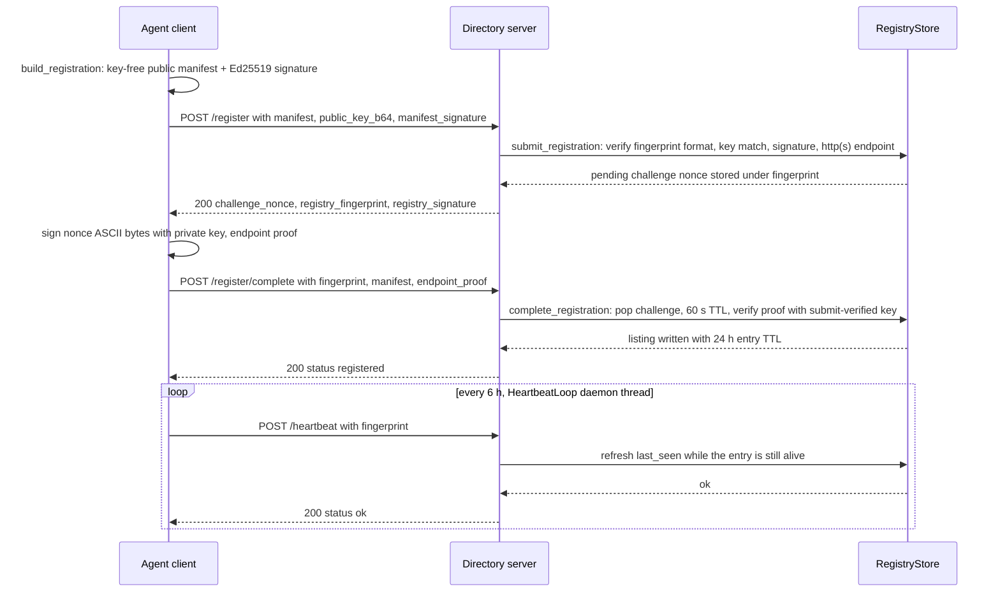

# Directory Registration and Discovery Workflow

This page walks the end-to-end workflow between a HAAP agent and the federated directory — from building and signing the manifest, through the two-phase registration that proves the agent controls its declared endpoint, through keeping the listing alive with heartbeats, to discovering other agents and re-verifying them directly afterwards. The guarantees below are exactly those implemented in [`haap/registry.py`](../operations/federated-directory.md) (the directory side: `RegistryStore` + `RegistryServer`) and [`haap/registry_client.py`](../operations/federated-directory.md) (the agent side), as pinned by `tests/test_registry.py` and `tests/test_registry_client.py`. The exhaustive component map, HTTP route table and CLI entry points live in the [federated-directory reference page](../operations/federated-directory.md); here the emphasis is the flow itself and the invariants an implementer or operator must not break.

## Actors and trust split

Three actors participate:

- **The registering agent** — an `Identity` (Ed25519 key pair + `HF-<16 hex>` fingerprint, see [identity](../concepts/identity.md)) running an HTTP server that answers at a messaging endpoint, e.g. `https://salon.example:8443/haap/messages` ([messaging-server](../operations/messaging-server.md)).
- **The directory** — `RegistryStore` (in-memory index) behind `RegistryServer` (stdlib HTTP API). In this repo it is a deliberately minimal in-memory reference implementation; a separately operated production service keeps the same wire contract.
- **A discovering agent** — any peer that queries `/search` or `/agents/{fingerprint}` and then contacts the found agent directly.

The load-bearing split is that **the directory is a phone book, not a notary**: identity lives in the agents' Ed25519 keys, and the directory's only jobs are to index *signed* manifests whose fingerprint matches the declared public key and to verify that the registering agent controls the endpoint it declares (proof-of-endpoint). It never decides who anyone is ([identity](../concepts/identity.md) explains why), it never holds keys, and — for that reason — it can hide or poison search results but **cannot impersonate an agent**: a client that finds an agent through the directory re-verifies it directly against the agent's own `/.well-known/haap.json`.

## Step 1 — build and sign the manifest (agent side)

An agent cannot register until it has an identity (`haap init`, `identity.json` under `$HAAP_DIR`) and a reachable, publicly declared endpoint URL. The CLI enforces this: `haap registry register` raises `HAAPError` ("no endpoint declared: pass --endpoint or set it at haap init") when neither `--endpoint` nor the identity's `endpoint_url` is set.

`registry_client.build_registration(identity, endpoint_url, speciality, skills_dirs, extra_tools)` then produces the registration tuple:

```python
manifest, public_key_b64, manifest_signature = build_registration(identity, endpoint_url)
```

- `manifest` is `capabilities.public_manifest(...)` — format `haap-public-manifest-v1`, a **key-free** document carrying only `agent {fingerprint, name, speciality, endpoint}`, `message_types`, `skills` and `tools`. The builders receive identity data through the key-free `public_claims()` projection, so no `public_key`, `private_key` or `signature` field can end up inside it ([manifests](../concepts/manifests.md)).
- `public_key_b64` is the agent's raw public key, base64 — sent **beside** the manifest, never inside it.
- `manifest_signature` is the Ed25519 signature over the manifest's **canonical serialization**: `json.dumps(manifest, sort_keys=True, separators=(",", ":"), ensure_ascii=False)` — the same deterministic compact form used for envelope signing ([envelope-protocol](../concepts/envelope-protocol.md)).

## Step 2 — Phase 1: POST /register and the challenge

The agent POSTs the tuple to `/register`. The directory performs **all** of its verification *before* issuing anything, in a fixed order (`RegistryStore.submit_registration`):

1. `manifest.agent.fingerprint` must match `^HF-[0-9a-f]{16}$`;
2. the base64 public key must decode and its `fingerprint_of_public_key` must **equal** the declared fingerprint;
3. the manifest signature must verify with that public key over the canonical JSON;
4. `manifest.agent.endpoint` (trailing `/` stripped) must start with `http://` or `https://`.

Any failure answers `400 {"error": "<message>"}` and the agent is **not listed**. On success the directory stores a pending challenge keyed by the fingerprint — `(nonce, issued_time, public_key_b64)` — and answers `200` with a nonce **signed by the directory itself**:

```json
{"challenge_nonce": "<random 32-byte base64>",
 "registry_fingerprint": "HF-...",
 "registry_signature": "<base64 Ed25519 signature over the nonce ASCII>"}
```

Two properties matter here. First, the verified public key is remembered **only inside this pending challenge record** — the code comments "the manifest itself never carries keys" — so the second phase can verify proof against the key validated here. Second, `registry_signature` lets the agent confirm which directory it reached; the reference `registry_client` checks only for `challenge_nonce` and does not verify that signature.



Caption: The complete agent-to-directory workflow — signed submit, registry-issued signed nonce, signed endpoint proof, listing, and the recurring heartbeat that renews the 24 h entry TTL.

## Step 3 — Phase 2: POST /register/complete and the endpoint proof

"Proof-of-endpoint" in this implementation means: the agent signs the registry-issued nonce with its private key and returns that signature. `RegistryStore.complete_registration` is deliberately **single-use and expiry-checked**:

1. it **pops** the pending challenge first — so *any* completion attempt for a fingerprint consumes the challenge, and a failed or expired completion forces the agent to restart at `/register`;
2. a challenge older than `CHALLENGE_TTL_S` (**60 s**) is rejected as expired;
3. a caller-supplied `public_key_b64` that differs from the submit-verified key is rejected (store-level check; the HTTP handler does not even forward the client's public key);
4. the `endpoint_proof` must verify — `KeyPair.verify_with(raw_pub, nonce.encode("ascii"), proof)` — against the **submit-verified** key.

Only then is the entry written. The consequence is the core guarantee: **no listing without a signed proof from the declared key**. A proof signed by any other key is rejected and the agent never appears (`test_failed_endpoint_proof_not_listed`), and presenting a foreign key at submit time fails before a challenge exists (`test_registration_fingerprint_key_mismatch_rejected`).

## Step 4 — the listing and its lifecycle

Success writes the record under the fingerprint:

```python
{"manifest": manifest, "registered_at": now, "last_seen": now,
 "endpoint_proof": proof[:64], "endpoint_nonce": nonce}
```

and answers `200 {"status": "registered"}`. The proof is stored truncated to 64 characters and **no read path returns it**: `POST /heartbeat`, `GET /search` and `GET /agents/{fingerprint}` expose only the manifest — search returns `{"results": [manifest, ...]}` and the profile route returns `rec["manifest"]` (or `404 {"error": "not registered or expired"}`). Stored proofs, nonces and timestamps never leak to clients.

Lifecycle rules, all enforced in `RegistryStore`:

- **An entry is alive iff `now - last_seen <= entry_ttl`**, default `ENTRY_TTL_S = 24 h` (per-instance overridable, e.g. `RegistryStore(entry_ttl=2)` in the expiry test).
- **Expiry is lazy and logical.** Past the TTL an entry disappears from `get`, `search`, `count` and `heartbeat` — but no code path physically removes it from the `_agents` dict. The dict only grows with distinct fingerprints that ever completed registration.
- **`POST /heartbeat {fingerprint}`** refreshes `last_seen` only when the entry exists and is still alive; otherwise the server answers `404 {"status": "unknown"}` and the agent must re-register. In the reference implementation the heartbeat is an *unauthenticated liveness renewal* — `heartbeat()` verifies no signature — so knowing a fingerprint is enough to keep its entry alive; the signed-heartbeat contract (`heartbeat:{fingerprint}:{timestamp}`, ±300 s window) is specified for the production service, not implemented here.
- **Re-registration updates, never duplicates.** Completing `/register` again for an already-listed fingerprint overwrites the record in place with fresh timestamps, so `store.count()` stays 1 (`test_duplicate_registration_updates`).
- **`MAX_AGENTS = 10 000`** is an anti-flooding cap checked only in `submit_registration` and only for fingerprints *not already in the dict*. A full directory answers `400 {"error": "directory full"}` for new fingerprints; re-registration of any previously seen fingerprint always passes. Because expired records are never pruned, the cap effectively counts every distinct fingerprint that ever completed registration in this process.

## Step 5 — the heartbeat loop

Because a listing dies after 24 h without renewal, a registered agent that stays available runs `HeartbeatLoop`:

```python
from haap.registry_client import HeartbeatLoop

HeartbeatLoop("https://acoalex.com/haap-directory", identity.fingerprint).start()
```

`HeartbeatLoop(registry_url, fingerprint, interval_s=DEFAULT_HEARTBEAT_S)` spawns a daemon thread that POSTs `/heartbeat` every `interval_s` — default **6 h**, deliberately well below the 24 h entry TTL so an entry cannot lapse between beats. Each beat records its outcome on `last_ok` (`False` on `DiscoveryError`, e.g. an unreachable directory), and `stop()` sets a `threading.Event` to end the loop cleanly. The full `registry_client.register()` function drives steps 1–3 in one call — submit, sign the returned nonce, complete — and returns the final response only when it says `status: registered`; any rejection or unreachable directory raises `DiscoveryError` (code `DISCOVERY_FAILED`) whose message carries the server's `error` text.

## Step 6 — discovery and what an agent must do after it

A seeker finds providers with `registry_client.search(registry_url, capability="", q="")` or `GET /search?capability=X&q=Y`:

- `capability` is a **case-insensitive substring** against the union of `agent.speciality`, every `tools[]` name and every `skills[].name` in each manifest;
- `q` is a **case-insensitive substring** over the whole manifest JSON;
- only alive entries are returned, as full public manifests; the exact profile for one agent is `GET /agents/{HF-...}`.

Discovery is only the beginning. Because the directory is not an identity authority, **a client that found an agent through the directory must re-verify it directly against the agent's own well-known document** before trusting or messaging it. `HAAPClient.refresh_endpoint(friend_fp)` implements this: it strips `/haap/messages` from the friend's recorded endpoint, fetches `GET /.well-known/haap.json` (which `HAAPServer` regenerates live on every request from `public_manifest`, unsigned — see [manifests](../concepts/manifests.md)), and:

- raises `DiscoveryError` ("well-known manifest fingerprint mismatch — possible endpoint substitution") when `agent.fingerprint` does not equal the recorded fingerprint — a poisoned directory listing cannot redirect the client to a substituted URL; and
- on a match, derives the messaging URL as `agent.endpoint + "/haap/messages"` and prepends it to `FriendRecord.endpoints` when new.

This is exactly why the directory cannot impersonate anyone: it never holds keys, the manifest it indexes carries none, and the ground truth a client acts on is fetched from the agent itself. A compromised or malicious directory can at worst hide listings or point at stale/wrong ones — the fingerprint check at the well-known step then makes the wrong pointer fail closed.

## Failure semantics at a glance

| Failure | Where it is caught | Consequence |
|---|---|---|
| Malformed fingerprint format | `submit_registration` | `400`, no challenge |
| Public key whose fingerprint ≠ declared fingerprint | `submit_registration` | `400`, no challenge |
| Bad manifest signature (or manifest tampered after signing) | `submit_registration` | `400`, no challenge |
| Non-http(s) declared endpoint | `submit_registration` | `400`, no challenge |
| Directory at `MAX_AGENTS`, new fingerprint | `submit_registration` | `400` "directory full" |
| Challenge older than 60 s | `complete_registration` | challenge popped, `400` "challenge expired", restart at `/register` |
| Endpoint proof signed by a different key | `complete_registration` | challenge popped, `400`, agent **not listed** |
| Heartbeat for an unknown or expired fingerprint | `heartbeat` | `404`, entry gone, re-register |
| Directory unreachable / non-2xx transport | `registry_client._request` | `DiscoveryError` |
| Well-known fingerprint mismatch after discovery | `HAAPClient.refresh_endpoint` | `DiscoveryError`, endpoint not updated |

The two-round-trip challenge is also the **anti-replay structure**: each listing requires a fresh nonce, and a challenge can be used at most once within its 60 s window, so a captured registration transcript cannot be replayed to re-list an agent later.

## Configuration and operations

- Registry constants: `ENTRY_TTL_S = 24 * 3600`, `CHALLENGE_TTL_S = 60`, `MAX_AGENTS = 10_000` at the top of `haap/registry.py`; the entry TTL is injectable per `RegistryStore` (the tests shorten it to seconds to exercise expiry).
- The directory's signing keypair is generated per `RegistryServer` and injectable via the constructor; `start(host, port)` binds a `ThreadingHTTPServer` (`serve_forever` on a daemon thread, `port=0` → ephemeral port, which the tests rely on).
- All state is in memory: restarting the process starts an empty directory. Persistence, rate limiting, signed heartbeats and the `/v1` production routes belong to the separately operated service scoped in `docs/DIRECTORY_SERVICE_BRIEF.md`, which must stay wire-compatible with this reference (see [federated-directory](../operations/federated-directory.md)).
- Client defaults: 10 s HTTP timeout, `User-Agent: haap-client/<version>`, 4xx bodies parsed (they carry protocol error messages), heartbeat interval 6 h.

## Focused tests

- `tests/test_registry_client.py::test_full_registration_and_discovery` — the whole workflow over real HTTP with the **unmodified** client: a business agent registers with its speciality, heartbeats successfully, and a second agent discovers it by capability and by free text.
- `tests/test_registry.py::test_registration_with_proof_of_endpoint` — full submit → signed challenge → signed proof → complete → searchable by `q`, fetchable via `/agents/{fp}`.
- Rejection pins: `test_registration_bad_signature_rejected`, `test_registration_fingerprint_key_mismatch_rejected`, and `test_failed_endpoint_proof_not_listed` (impostor-signed proof → agent never listed, `store.get` returns `None`).
- Lifecycle pins: `test_duplicate_registration_updates` (re-register updates, `count() == 1`) and `test_heartbeat_renews_and_expiry` (heartbeat renews; past a 2 s TTL the entry is gone and heartbeat returns `False`).
- `test_search_by_capability_and_text` — `capability=caldav` matches the tools list; `q` substring-matches manifest text.
- Post-discovery re-verification: `tests/test_client.py::test_refresh_endpoint_validates_fingerprint` and `test_refresh_endpoint_accepts_matching_fingerprint`.

Related pages: [identity](../concepts/identity.md) (keys and HF fingerprints) · [manifests](../concepts/manifests.md) (the key-free public manifest and the well-known contract) · [envelope-protocol](../concepts/envelope-protocol.md) (canonical signing) · [federated-directory](../operations/federated-directory.md) (reference registry components, HTTP surface, CLI) · [messaging-server](../operations/messaging-server.md) (the endpoint an agent advertises) · [testing overview](../testing/overview.md) · [marketplace-booking](marketplace-booking.md) (what discovery feeds).
