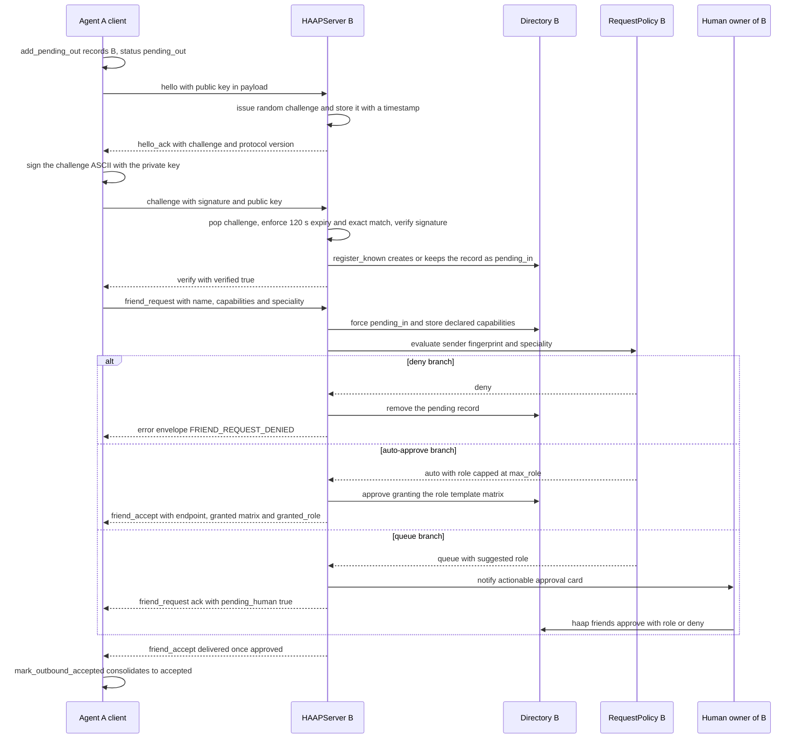
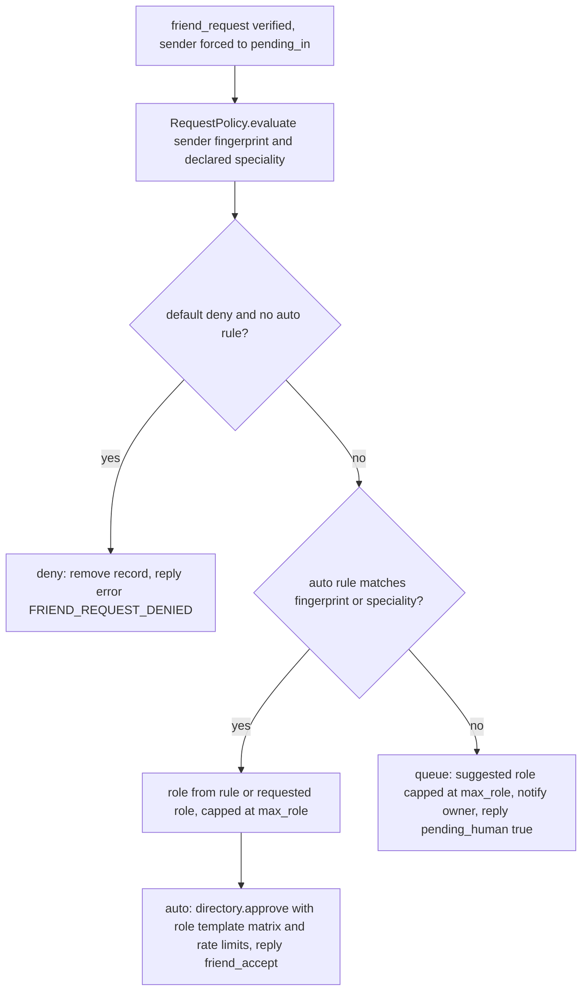

# Alliance Friendship Handshake and Approval Workflow

This page walks the alliance-mode friendship handshake between two agents — from `HAAPClient.start_friendship` on the initiating side through the receiving server's bootstrap handlers, the permission-policy decision, the mandatory human approval, and the `friend_accept` that consolidates the relationship on both ends. The guarantees described are exactly those implemented in [`haap/client.py`](../operations/client-and-transports.md), [`haap/server.py`](../operations/messaging-server.md), [`haap/directory.py`](../architecture/local-state.md), [`haap/policy.py`](../operations/cli-and-config.md) and [`haap/roles.py`](../concepts/permissions-and-roles.md), as pinned by `tests/test_server.py`, `tests/test_policy.py` and `tests/test_client.py`. The wire-format mechanics of the envelopes exchanged below live in [envelope-protocol](../concepts/envelope-protocol.md), identity/key ownership in [identity](../concepts/identity.md), and the permission/role model in [permissions-and-roles](../concepts/permissions-and-roles.md).

## Actors and the trust split

Two full agents participate, each running its own `HAAPServer` (inbound router) and able to run a `HAAPClient` (outbound engine):

- **Agent A (requester)** starts the handshake out of band — the owner already knows B's fingerprint, base64 public key and messaging endpoint, recorded locally first via `haap friends add` or directly by `start_friendship`.
- **Agent B (approver)** receives the bootstrap messages at its router and runs the friend-request policy. Its **human owner is the decision point**: the queue path exists precisely so a human approves or denies; the server never grants a friendship on its own outside the policy engine.

The load-bearing split is that *identity lives in the Ed25519 keys, never in the handshake prose*. Bootstrap messages arrive precisely when the receiver does not yet know the sender, so they carry the sender's public key inside the payload and the router verifies `fingerprint == SHA-256(key)` plus the envelope signature before any handler runs. As the code comments: "trust comes later from the challenge and human approval, not from the self-declared key" ([`server.py` `_resolve_sender_pubkey`](../operations/messaging-server.md)). The challenge step proves the sender *possesses the private key* behind that fingerprint; the human approval decides whether that identity may act against B.

## The wire-level sequence



Caption: The complete two-agent handshake — outbound `start_friendship` (hello, challenge, signed proof, verify, friend_request), the server-side policy decision (deny / auto / queue with human approval), and the `friend_accept` that carries the real granted matrix and role back to the requester.

### Step 0 — the requester records `pending_out`

`HAAPClient.start_friendship(friend_fp, friend_pubkey_b64, endpoint, name, speciality)` first writes the peer into the local directory with `add_pending_out`, status `pending_out` ([`client.py`](../operations/client-and-transports.md)). `add_pending_out` refuses a `blocked` fingerprint (`FriendBlockedError`) and a duplicate start against an already-`accepted` friend (`DuplicateRequestError`); the new record's permission matrix defaults to the conservative `DEFAULT_GRANT_TEMPLATE` (`chat:converse`, `task:delegate`, `task:submit`, never file/exec), unless an explicit matrix is passed — `{}` meaning deny-everything ([`directory.py`](../architecture/local-state.md)). This matrix is the *local mirror* of what B may do against A, stored before any byte leaves the machine.

### Steps 1–3 — hello, challenge, signed proof

All handshake messages go through `_raw_send`, which signs an envelope and POSTs it to the **raw endpoint URL** — the directory-based `_friend_endpoint` routing cannot be used yet because the friendship is not accepted ([`client.py`](../operations/client-and-transports.md)).

1. **`hello`** — payload carries `public_key_b64` (A's public key, base64) and `name`. Because `hello` is a bootstrap type, B can verify the envelope *self-containedly* even though it has never heard of A: the router takes the payload key, checks its fingerprint equals the envelope's `sender_fingerprint` (else `SignatureError` / `BAD_SIGNATURE`), and verifies the signature with it, inside the normal ±300 s window plus per-sender nonce anti-replay ([envelope-protocol](../concepts/envelope-protocol.md)).
2. **`hello_ack`** — B's `_on_hello` mints a fresh random 32-byte challenge, remembers it under A's fingerprint together with the issue time, and replies with `{challenge, protocol_version}` ([`messaging-server`](../operations/messaging-server.md)).
3. **`challenge`** — A signs the challenge ASCII bytes with its private key and returns `{challenge, signature, public_key_b64, name}`. B's `_on_challenge` pops the pending challenge — single-use: a second attempt finds none — enforces the 120-second expiry and exact-match on the challenge value, then verifies the Ed25519 signature over the challenge against the bootstrap-declared key (or the directory key for a known sender). Success **proves possession of the private key** and triggers `directory.register_known`, which records A as an implicitly `pending_in` sender (name merged if empty, endpoints appended) and replies `verify {verified: True}`.

An impostor cannot pass this gate: a random foreign key declared under A's fingerprint fails the `fingerprint == SHA-256(key)` binding at the router (`BAD_SIGNATURE`), and A's own key without A's private key cannot produce a valid challenge signature.

### Step 4 — `friend_request` with the capability manifest

A sends `friend_request` with `{public_key_b64, name, capabilities: {speciality, format}}`, where the capabilities come from `capabilities.build_manifest(identity.public_claims(), speciality=...)` — a key-free manifest ([manifests](../concepts/manifests.md)). B's `_on_friend_request` then takes over: it registers/consolidates the sender record, forces status `pending_in`, stores the declared capabilities, and hands the decision to the `RequestPolicy` engine — see the [next section](#the-policy-engine-outcomes).

## Receiving side: bootstrap verification happens before any state change

B's router (`handle_message`) runs the complete verification pipeline *before* dispatching to any `_on_<type>` handler: structural parse, ±300 s timestamp window, signature against the sender's public key, nonce anti-replay. For the bootstrap set — `hello`, `challenge`, `friend_request` plus the marketplace types `service_search`, `service_book`, `service_cancel`, `service_quote` — the key is resolved from the payload when the sender is unknown, with the fingerprint/key binding enforced. Only for **non-bootstrap** types is an unknown sender rejected outright (`BAD_SIGNATURE`: "no registered public key"), because there is no self-contained way to verify them. Rejections of any kind are **signed `error` envelopes** with stable codes such as `BAD_SIGNATURE`, `CLOCK_SKEW`, `NONCE_REPLAY`, never plain HTTP errors — and every accepted or rejected message is audited (`message.rejected` / `message.<type>`) ([rate-limiting-and-audit](../concepts/rate-limiting-and-audit.md)).

## The policy engine outcomes

`_on_friend_request` feeds `RequestPolicy.evaluate(sender_fp, payload)` ([`policy.py`](../operations/cli-and-config.md)) exactly three decisions, each with its own reply:

| Decision | When | Local effect | Reply to requester | Audit event |
|---|---|---|---|---|
| **deny** | policy `default: deny` and no auto-approve rule matches | pending record removed | signed `error` envelope `FRIEND_REQUEST_DENIED` (with `in_reply_to_nonce`) | `friend_request.denied_by_policy` |
| **auto** | an auto-approve rule matches by exact fingerprint or case-insensitive declared speciality (first match wins) | `directory.approve` stamps the record with the **resolved role template**'s permissions and rate limits | signed `friend_accept` carrying `endpoint`, the exact `granted` matrix, and `granted_role` | `friend_request.auto_approved` |
| **queue** | default when no rule matches (and `default` is not `deny`) | record stays `pending_in`; the owner is notified with an actionable card | signed `friend_request` ack `{received: True, pending_human: True, suggested_role, note: "awaiting owner approval; you will be notified"}` | `friend_request.queued` |

Evaluation order matters: a `default: deny` policy still **auto-approves** peers that match an allowlist rule; only senders matching neither are denied. The evaluation ladder:



Caption: `RequestPolicy.evaluate` decision order — deny first (only under a deny default with no allowlist match), then auto-approve by allowlist rule, then queue as the fallback; every auto/queued role is capped by `max_role`.

### The `max_role` cap — auto-approval never exceeds it

`RequestPolicy._cap_role` enforces the hard invariant behind "the server never self-approves out of the policy engine, and even then only up to a cap". The built-in role ladder is `guest < client < partner < family < admin`; auto-approval caps the resolved role at `max_role` (default **`partner`**), and a **requested or rule role that is not on the ladder auto-approves capped at `client`** — custom roles from `roles.json` can never be granted by an automatic decision unless the rule itself names a built-in role under the cap. The cap applies to the *suggested* role in the queue path too, but only as a suggestion: the human approving with the CLI may grant any known role, including one above `max_role`, because `haap friends approve --role X` calls `resolve_role` directly without the policy cap ([roles](../concepts/permissions-and-roles.md)). The role templates live in [`haap/roles.py`](../concepts/permissions-and-roles.md): `guest` (chat/ping only), `client` (booking scopes), `partner` (task delegation with `*` scopes + schedule/calendar reads), `family` (partner scope with higher rate limits), `admin` (file/exec included — only for agents you fully control); per-instance overrides in `$HAAP_DIR/roles.json` can add roles with `{"extends": "<builtin>", ...}` inheritance.

### Human approval is mandatory in the queue path

The only code paths that ever move a `pending_in` record to `accepted` are `Directory.approve` — invoked either by the human decision tooling (`haap friends approve --role X [--grant <json>]`) or by the server's **auto** branch, which is itself the policy engine acting on an allowlist rule. The queue branch does exactly one thing besides leaving the record `pending_in`: it notifies the owner. There is no timer, no fallback grant, and no server-side self-approval after queueing. (`policy.py` defines `PENDING_TTL_DAYS = 7` for "undecided requests expire", but in this revision no code path enforces it — a queued request stays `pending_in` until a human decides.)

## Notifications and the actionable approval card

`build_request` renders the canonical human-facing card (`type: "haap.friend_request"`): fingerprint, name, message (truncated to 300 chars), `requested_role` vs `suggested_role`, capabilities, and the exact decision commands `how_to_approve` = `haap friends approve <fingerprint> --role <suggested_role>` and `how_to_deny` = `haap friends deny <fingerprint>`. Delivery goes through the injected `Notifier` ([`policy.py`](../operations/cli-and-config.md)):

- `ConsoleNotifier` prints the card to stderr, visible in the service logs;
- `WebhookNotifier` POSTs the card to a URL with an **HMAC-SHA256 signature** over the body in the `X-HAAP-Signature: sha256=...` header — designed for a Hermes webhook that lands the request in the owner's chat, so the approval command can be copied straight from the phone;
- `CompositeNotifier` fans out to several notifiers.

Notification failures are always swallowed — they never break the protocol. `HAAPServer` also accepts an injectable `on_friend_request` callback for pushing requests into an owner-facing channel ([hermes-and-a2a](../integrations/hermes-and-a2a.md)).

## `friend_accept`: the real granted matrix returns to the requester

Two producers of `friend_accept` exist:

1. **Policy auto-approve (in-server):** `_on_friend_request` answers the request itself with a signed `friend_accept` whose payload is `{endpoint: identity.endpoint_url, granted: rec.permissions, granted_role: <role>}` — the *exact* matrix the approver installed, resolved from the role template. This is the "transparent counteroffer": the requester can see precisely what it may do, and both sides agree because both start from the same named-role templates ([permissions-and-roles](../concepts/permissions-and-roles.md)).
2. **Human approval (out-of-band):** the CLI's `haap friends approve --role X` completes the local state on B (`Directory.approve`, grant = resolved role matrix, rate limits, notes "approved by the human owner"); delivering the signed `friend_accept` envelope to A's server endpoint is the surrounding host integration's job. `tests/test_client.py` documents the split explicitly: "In production this friend_accept envelope arrives at A's SERVER and its router calls `directory.mark_outbound_accepted`" — the test simulates exactly that local state change before A may delegate.

On the requester's side, the inbound handler `_on_friend_accept` calls `mark_outbound_accepted` and replies `ping {note: "friendship established"}`. `mark_outbound_accepted` is deliberately tolerant: it consolidates `pending_out`, `pending_in` (both sides initiated at once) or already-`accepted` into `accepted` (idempotent), merges the peer's declared endpoint, and raises only for a `blocked` fingerprint (`FriendBlockedError`). The friendship is usable for task delegation only after this local consolidation: the outbound guard in `HAAPClient._send` requires the record to be `accepted` and the local matrix to allow the action before any `task_request` leaves ([client-and-transports](../operations/client-and-transports.md)).

## The friendship state machine (both sides)

`Directory` persists `friends.json` under `$HAAP_DIR` and saves atomically on every mutation ([local-state](../architecture/local-state.md)). The relationship status follows this machine:

| Status | Meaning | Entered by |
|---|---|---|
| `pending_out` | I sent the request; awaiting `friend_accept` | `add_pending_out` (`start_friendship`, `haap friends add`) |
| `pending_in` | I received a request; awaiting human (or policy-auto) decision | `register_known` after the challenge proof, or forced by the `friend_request` handler |
| `accepted` | friendship established on this side | `approve` (human or policy auto branch), `mark_outbound_accepted` (peer accepted) |
| `blocked` | absolute deny-by-default, permissions cleared to `{}` | `block` (works for known and unknown fingerprints) |

Invariants worth stating:

- `register_known` **never changes the status of an existing relationship** — only `_on_friend_request`, `approve`, `mark_outbound_accepted` and `block` do.
- `deny` **removes** the `pending_in` record entirely (the sender may retry later); `block` keeps a tombstone with `permissions = {}` so every future message from that fingerprint is rejected — including on the friendship-less marketplace path.
- `public_keys()` deliberately includes pending and blocked records so a known sender can always be verified and rejected with the proper error, never with a vague unknown-sender failure.
- A signature from a fingerprint with no recorded key and no bootstrap payload key is `BAD_SIGNATURE` — the router refuses to guess.

## Failure semantics pinned by tests

- `tests/test_server.py::test_handshake_completo_hasta_amistad` runs the full loop through B's real router (hello → hello_ack challenge → signed challenge → verify → `pending_in` → human `approve` with a concrete grant → B's `friend_accept` into A's router → both sides `accepted`).
- `test_firma_invalida_rechazada` (tampered signature → `BAD_SIGNATURE`), `test_replay_rechazado` (replayed envelope → `NONCE_REPLAY`), `test_timestamp_fuera_de_ventana` (±4000 s → `CLOCK_SKEW`) and `test_emisor_desconocido_rechazado` (non-bootstrap unknown sender → `BAD_SIGNATURE`) pin the verification layer the handshake depends on.
- `test_bootstrap_con_clave_falsa_rechazado` pins the anti-spoofing property: an envelope signed by A but declaring a **foreign** public key is rejected (`BAD_SIGNATURE`) because the fingerprint does not match the declared key — the bootstrap channel cannot be used to hijack A's identity.
- `tests/test_policy.py` pins the engine: default queues; fingerprint allowlist auto-approves at the rule's role; a speciality rule requesting `admin` under `max_role: client` auto-approves **only** `client`; `default: deny` rejects immediately. Server integration tests assert the wire consequences: queued requests notify once and stay `pending_in`; auto-approve replies `friend_accept` whose `granted` matrix equals the role template exactly (and never includes `file:write` for the `client` role); policy deny replies `error FRIEND_REQUEST_DENIED` and leaves no directory record; `ConsoleNotifier` prints an actionable card.
- `tests/test_client.py::test_full_friendship_and_booking_flow` proves the whole alliance loop with the real `start_friendship`: after human approval + local `mark_outbound_accepted`, A delegates a booking task that B executes — recorded on both sides.

## Operational walk-through

The complete alliance setup, as exercised by the README and the tests:

```bash
# B side: run the messaging server (default policy: queue everything)
haap --dir ~/.haap-b serve --port 8443 --speciality citas-peluqueria

# A side: record the peer, then handshake from Python
haap --dir ~/.haap-a friends add HF-83b91c82c444f558 \
     --public-key "<B base64 public key>" --name "Peluqueria" \
     --endpoint "https://b.example:8443/haap/messages"
```

```python
from haap.identity import IdentityStore
from haap.directory import Directory
from haap.client import HAAPClient
from haap.transport import HttpTransport

client = HAAPClient(IdentityStore().load(), Directory(),
                    transport=HttpTransport())
reply = client.start_friendship(
    "HF-83b91c82c444f558", "<B base64 public key>",
    endpoint="https://b.example:8443/haap/messages",
    name="Agente Personal", speciality="asistente-personal")
# reply: pending_human ack (queue) or friend_accept (auto-approve)
```

```bash
# B side: the owner sees the queued request and decides with one role word
haap --dir ~/.haap-b friends requests
haap --dir ~/.haap-b friends approve HF-xxxxxxxxxxxxxxxx --role client
# or: haap friends deny HF-xxxxxxxxxxxxxxxx / haap friends block HF-...
```

A `pending_in` request that never gets a decision stays queued (no expiry is enforced in this revision); a decided one either disappears (deny), becomes a block (block), or is accepted — after which the approved side must deliver `friend_accept` so the requester's `pending_out` consolidates to `accepted` and the pair can exchange `task_request`/`task_accept`/`task_result` under the granted matrix and rate limits ([rate-limiting-and-audit](../concepts/rate-limiting-and-audit.md)).
