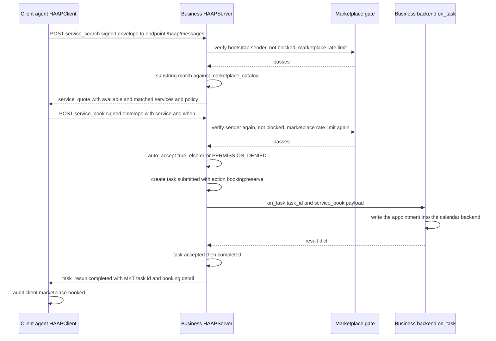

# Marketplace Booking Workflow (Open Services)

This page walks the **marketplace trust mode**: the way a business agent publishes open booking services that any *identity-verified stranger* can discover and book with **no prior friendship and no human approval**. The guarantees described are exactly those implemented in [`haap/server.py`](../operations/messaging-server.md) (`HAAPServer` marketplace handlers), [`haap/client.py`](../operations/client-and-transports.md) (`HAAPClient.service_search` / `service_book`), [`haap/envelope.py`](../concepts/envelope-protocol.md) (the `service_*` message catalog) and [`haap/tasks.py`](../architecture/local-state.md) (the reused task lifecycle), as pinned by `tests/test_marketplace.py` and exercised end to end by `demo_marketplace.py` — the canonical working example. Contrast this page with [friendship-handshake](friendship-handshake.md) (alliance mode) and [task-delegation](task-delegation.md) (delegated work between friends): marketplace mode is the deliberate exception to both.

## Actors and the trust split

Two full agents participate, each with its own Ed25519 identity:

- **The business agent** (e.g. *Peluqueria Euraka*) runs a `HAAPServer` configured with `marketplace_catalog` — a `service -> {price, duration, ...}` dict — and `marketplace_policy` (e.g. `{"auto_accept": True, "open_hours": "10:00-19:00"}`). Its `on_task` callback is the business backend (in `demo_marketplace.py`, a write to a local iCalendar file standing in for the real CalDAV calendar).
- **The client agent** (e.g. *Agente Personal*) knows the business's **fingerprint and messaging endpoint out of band** (from the federated registry / well-known discovery described in [directory-registration](directory-registration.md), or simply from a configured record). It sends signed bootstrap envelopes directly to `business_endpoint + "/haap/messages"`.

The load-bearing split is that **openness applies only to a tiny, declared surface**. The four `service_*` message types — `service_search`, `service_quote`, `service_book`, `service_cancel` — are the *only* things a stranger can do against a marketplace business, and even those are gated by identity verification, block state, dedicated rate limits, and the business's own `auto_accept` policy. Everything else on the server stays deny-by-default: `task_request` still requires an accepted friendship plus a granted `task:submit` permission ([friendship-handshake](friendship-handshake.md)), friend endpoints and directory state are untouched, and an unknown message type is answered with a signed `error` envelope ("unhandled type"). Opening a catalog never opens the task pipeline, the permission matrix, or the friend directory to strangers — the marketplace handlers are separate code paths that only *reuse* `on_task` after their own gate passes.

Marketplace senders remain **identity-verified and rate-limited even though they are strangers**: the router verifies every envelope (fingerprint ↔ key binding, Ed25519 signature, ±300 s clock window, nonce anti-replay) before any marketplace handler runs, and a blocked fingerprint is rejected instantly with `PERMISSION_DENIED` — `haap friends block HF-...` is the kill switch ([local-state](../architecture/local-state.md)).

## How a business publishes open services

Marketplace publication is **constructor configuration on `HAAPServer`**, not a file, a role, or a CLI flag ([messaging-server](../operations/messaging-server.md)):

```python
server_biz = HAAPServer(
    id_biz, Directory(...), audit=AuditLog(memory=True),
    speciality="citas-peluqueria",
    marketplace_catalog={
        "corte": {"price_eur": 15, "duration_min": 30},
        "corte+barba": {"price_eur": 22, "duration_min": 45},
    },
    marketplace_policy={"auto_accept": True, "open_hours": "10:00-19:00"})
server_biz.on_task = write_to_calendar   # the business backend (CalDAV stand-in)
```

The semantics that matter:

- `marketplace_catalog` is what `service_search` answers from. It is a plain dict — the reference implementation reports **catalog presence**, not live calendar availability; real slot/date checking is the backend's job at booking time (an extension point for an embedding).
- `marketplace_policy` is **not a policy engine**. Only one key is enforced anywhere: `auto_accept`. When it is missing or `False`, `service_book` is refused with a `PERMISSION_DENIED` error whose detail names `auto_accept`. Every other key (`open_hours`, prices, …) is *echoed back* to clients inside quotes for the client/owner to reason about, and is never enforced server-side.
- The handlers exist even when neither argument is passed: an unconfigured `HAAPServer` (e.g. under plain `haap serve`, which has no marketplace wiring — see [cli-and-config](../operations/cli-and-config.md)) still answers `service_search` with an empty catalog and `available: false`, and can never book because `auto_accept` defaults to `False`. Only an embedding Python process can enable marketplace mode.
- `on_task` may be assigned after construction (the demo does exactly that). It is the same injectable executor used by the alliance `task_request` path ([hermes-and-a2a](../integrations/hermes-and-a2a.md)), which is what lets a booking reach the real business backend through one integration point.

## The wire-level sequence



Caption: Marketplace discovery and booking — `service_search`/`service_quote` for availability, then `service_book` through the shared sender gate and the `auto_accept` check into the reused `on_task` backend, answered with a completed `task_result` (grounded in `HAAPServer` handlers and `demo_marketplace.py`).

## Step 1 — discovery: `service_search` → `service_quote`

`HAAPClient.service_search(business_fp, business_endpoint, services="", date="")` signs a `service_search` envelope for `business_fp` whose payload carries `{services, date, public_key_b64}` and POSTs it to `business_endpoint.rstrip("/") + "/haap/messages"` ([client-and-transports](../operations/client-and-transports.md)). The `public_key_b64` field is what makes bootstrap possible: the business may never have heard of this sender, so the router resolves the key from the payload, checks `fingerprint_of_public_key(key) == sender_fingerprint`, verifies the envelope signature with it, applies the ±300 s window and nonce anti-replay, and only then dispatches — the exact same self-contained bootstrap verification used by `hello` ([envelope-protocol](../concepts/envelope-protocol.md)).

The business's `_on_service_search` then runs the shared marketplace sender check (below) and answers with a **`service_quote`** envelope containing:

- `query` — the echoed `{services, date}` request (the date is *not* used to compute availability in the reference implementation);
- `available` — `bool(matched)`;
- `services` — the matched catalog subset `{service: info}`, matched by **bidirectional substring** on lowercased names: a `"corte"` query matches both `"corte"` and `"corte+barba"`, and an empty query matches everything;
- `policy` — the business's `marketplace_policy` dict echoed verbatim.

A search never fails the *client*: an empty or unmatched catalog still yields a `service_quote` with `available: false`. The request is audited as `marketplace.search` on the business side ([rate-limiting-and-audit](../concepts/rate-limiting-and-audit.md)).

## The shared sender checks (every marketplace message)

All three inbound marketplace types run `_check_marketplace_sender` before any business logic ([`server.py` `_check_marketplace_sender`](../operations/messaging-server.md)):

1. **Not blocked.** If the local directory has a `blocked` record for the sender fingerprint, the request is refused with `PERMISSION_DENIED` *before* any token is consumed. Because the router can verify strangers self-containedly, this works even for a fingerprint the business has never seen as a friend: `Directory.block()` creates a `blocked` tombstone (emptying the matrix if a record existed), and from then on every marketplace message from that identity is verified and then rejected. Blocking is instant, fingerprint-scoped, and independent of endpoint — the kill switch also for marketplace abuse (`haap friends block HF-...`).
2. **Dedicated marketplace rate limit.** The sender's tokens are drawn from a stricter inline catalog than friend traffic: a `marketplace` bucket with capacity **10** and refill **0.05/s**, plus a per-sender global bucket with capacity **20** and refill **0.1/s**. Both are consumed on every message (`RateLimiter.check`, which raises `RATE_LIMITED` with a `retry_after` hint when either bucket is empty). This throttles open-business traffic harder than alliance traffic by construction, and the buckets are keyed by fingerprint, so a stranger cannot escape them by hopping endpoints.
3. (Router-level, earlier) **Full bootstrap verification** as described above — a marketplace sender is never anonymous.

`tests/test_marketplace.py::test_marketplace_rate_limit` pins the numbers: a burst of 12 `service_search` messages against the capacity-10 bucket passes early and is eventually limited, and `test_blocked_sender_cannot_use_marketplace` pins that a `directory.block()`ed sender gets `error_code: PERMISSION_DENIED`.

## Step 2 — booking: `service_book` into the task pipeline

`HAAPClient.service_book(business_fp, business_endpoint, service, when)` signs a `service_book` envelope with `{service, when, public_key_b64}` and POSTs it to the same endpoint. The business's `_on_service_book` gate is strictly ordered ([`server.py` `_on_service_book`](../operations/messaging-server.md)):

1. `_check_marketplace_sender` — verified, not blocked, marketplace buckets pass (above);
2. **`auto_accept` gate** — `marketplace_policy.get("auto_accept", False)`; if false, a `PermissionDeniedError` ("this business does not accept automated bookings (auto_accept disabled)") becomes a signed `error` envelope with `PERMISSION_DENIED` and the text `auto_accept` in its detail (`test_service_book_rejected_without_auto_accept`);
3. the booking record is built: `{service, when, client_fingerprint: <sender fp>, status: "reserved"}`;
4. **if `on_task` exists**, the booking reuses the task pipeline: a task is created with `role="server"`, `friend_fingerprint=<sender>`, `action="booking:reserve"`, `resource=<service>` and prompt `"marketplace booking <service> <when>"`, then `on_task(task.task_id, <the raw service_book payload>)` is invoked. The callback's returned dict is merged into the booking record; the local task legally walks `submitted → accepted → completed` ([`tasks.py` lifecycle](../architecture/local-state.md)); if the callback raises, the task is marked `failed` and the client receives a signed `error` envelope with `TASK_ERROR` — the exception never leaks raw;
5. the handler audits `marketplace.book` and answers with a **completed `task_result`** envelope whose `task_id` is `"MKT-" + <epoch seconds>` and whose `detail` is the merged booking (`{service, when, client_fingerprint, status: "reserved", ...backend fields...}`).

Note two asymmetries. First, the *reply to a booking is a `task_result` envelope, not a `service_quote`* — a booking is executed work, so it travels under the task message family even though it entered through the marketplace family. Second, the executor receives the **raw request payload**, which contains `service`/`when`/`public_key_b64` but not the sender fingerprint (that lives in the envelope header and in the booking record's `client_fingerprint`), so a backend that wants the client's identity must read it from the booking record or the envelope, not the callback argument.

If `on_task` is **absent** (unconfigured server), step 4 is skipped: the booking is still recorded as `status: "reserved"` and a completed `task_result` is returned — the reference implementation treats the reservation record itself as the outcome, with no backend side effect.

## Cancellation and protocol edges

- **`service_cancel`** exists at the protocol level: `_on_service_cancel` runs the same sender checks, audits `marketplace.cancel` (booking id truncated to 40 chars) and replies a completed `task_result` with `detail: {cancelled: True}`. It does **not** create a task and does **not** call `on_task`, so cancel does not reach the business backend in this revision — the natural extension point for real cancellation semantics. `HAAPClient` has no `service_cancel` helper yet (only `service_search` and `service_book`), so cancellation currently requires hand-signing the envelope or extending the client.
- **`service_quote` inbound to a business** is unexpected: it is in `BOOTSTRAP_TYPES` so it can be *verified* if it arrives, but `_on_service_quote` answers a signed `error` envelope ("service_quote not expected here"). Quotes are one-way: business → client.
- Every reply in the marketplace flow — success or `error` — is a **signed envelope** from the business identity (never a plain HTTP error body), and every accepted or rejected message is audited (`message.<type>` at the router plus the handler-level `marketplace.search` / `marketplace.book` / `marketplace.cancel` events). Error codes are the stable wire codes `PERMISSION_DENIED`, `RATE_LIMITED` (transient, with `retry_after`), `BAD_SIGNATURE`, `CLOCK_SKEW`, `NONCE_REPLAY`, `TASK_ERROR` ([envelope-protocol](../concepts/envelope-protocol.md)).

## Client-side mechanics and where the guarantees live

The two client helpers deliberately **bypass the friendship machinery** ([`client.py`](../operations/client-and-transports.md)): they do not call `_send`, so there is no local-directory lookup, no outbound permission-matrix guard and no client-side rate-limit check before a marketplace envelope leaves the machine (unlike `delegate_task`, which enforces all three). The trust that makes this safe is concentrated server-side: self-contained verification, block state, the dedicated buckets, and the business's own `auto_accept` choice. Neither helper records the exchange in the local `TaskRegistry` or `Directory` — they are stateless outbound calls returning the reply payload (`service_book` returns the raw `task_result` payload `{task_id, state, detail}`, with the booking fields nested under `detail`).

Client-side audit is asymmetric: `service_book` writes `client.marketplace.booked` on success (detail: service and `when`) and `client.marketplace.book.error` on error; `service_search` writes nothing client-side. Error replies are normalized into raised exceptions via `error_from_code`.

## The canonical example: `demo_marketplace.py`

`demo_marketplace.py` is the runnable, self-contained demonstration of everything above (run `python3 demo_marketplace.py`): a business agent *Peluqueria Euraka* and a personal agent *Agente Personal*, both with real Ed25519 identities stored under `demo_data/`, talking over **real loopback HTTP** (`HttpTransport` against ephemeral ports, business URL printed as the base that the client appends `/haap/messages` to). The business publishes the `corte` / `corte+barba` catalog with `auto_accept: True`, its `on_task` appends an iCalendar `VEVENT` to `demo_data/citas_peluqueria.ics`; the personal agent runs `service_search` (printing the availability and the echoed policy), books `corte` at `2026-09-10T17:00` with `service_book`, prints the confirmed result, and the demo closes by printing the calendar file and the business's audit trail (`marketplace.search`, `marketplace.book`, …). It is the proof that two agents with zero prior relationship, zero shared secrets, and zero human intervention can complete a booking over the wire.

## Marketplace vs alliance: two routes to the same backend

It is worth being precise about the boundary, because the same `on_task` serves both worlds:

| | Alliance mode (friendship) | Marketplace mode (open services) |
|---|---|---|
| Entry message | `task_request` | `service_search` / `service_book` / `service_cancel` |
| Prior relationship | accepted friendship required | none |
| Authorization | granted `task:submit` matrix + scopes (e.g. `booking:*`, the `client` role) | business `marketplace_policy.auto_accept` only |
| Rate limiting | per-friend action buckets (`DEFAULT_RATE_LIMITS` / role limits) | dedicated marketplace buckets (10 / 0.05 s + global 20 / 0.1 s per sender) |
| Backend | `on_task(task_id, payload)` | `on_task(task_id, payload)` — same executor |
| Human in the loop | owner approval (or policy auto rule) | none by design |

Because marketplace mode never consults friend grants or roles, the `service_*` message types are deliberately **not advertised** in the public capability manifest (`/.well-known/haap.json`): `MESSAGE_TYPES_PUBLIC` omits them, and open-services requests are gated by marketplace policy rather than advertised as offered capabilities ([manifests](../concepts/manifests.md)). Marketplace "discovery" is therefore discovery *of the business* (registry/well-known → fingerprint + endpoint), not discovery of services from a capability listing; the services themselves are learned by asking with `service_search`.

## Failure modes at a glance

| Condition | Decided by | Wire result |
|---|---|---|
| Tampered / unknown / fingerprint-key mismatch | router bootstrap verification | signed `error`, `BAD_SIGNATURE` |
| Outside ±300 s window / replayed nonce | router | `CLOCK_SKEW` / `NONCE_REPLAY` |
| Sender blocked (even never-a-friend) | `_check_marketplace_sender` (before rate limit) | `PERMISSION_DENIED` |
| Marketplace or global bucket empty | `RateLimiter.check` | `RATE_LIMITED` (transient, retry after) |
| `auto_accept` off | `_on_service_book` | `PERMISSION_DENIED` (detail names `auto_accept`) |
| `on_task` raises | `_on_service_book` exception path | signed `error`, `TASK_ERROR` (task marked `failed`) |
| Empty catalog / no match | `_on_service_search` | still `service_quote`, `available: false` |
| Transport failure / unreachable endpoint | `HttpTransport` | `TransportError` raised locally on the client |

## Tests that pin this workflow

`tests/test_marketplace.py` (five tests, driving `server.handle_message` directly with self-signed bootstrap envelopes — see [testing overview](../testing/overview.md)) is the focused guard: catalog search returning a `service_quote` with availability and matched services; `service_book` under `auto_accept` invoking the injected `on_task` and replying a completed `task_result` whose detail asserts `status: "reserved"`; rejection without `auto_accept`; the marketplace rate-limit burst; and the blocked sender receiving `PERMISSION_DENIED`. `demo_marketplace.py` adds the only real-HTTP coverage of the client helpers.

Related pages: [friendship-handshake](friendship-handshake.md) (the alliance trust mode this page contrasts with) · [directory-registration](directory-registration.md) (how a client finds the business fingerprint/endpoint) · [task-delegation](task-delegation.md) (the task pipeline bookings reuse) · [messaging-server](../operations/messaging-server.md) (server reference: constructor args, handlers, HTTP surface) · [client-and-transports](../operations/client-and-transports.md) (outbound `service_search`/`service_book`) · [envelope-protocol](../concepts/envelope-protocol.md) (wire format, bootstrap verification, error codes) · [rate-limiting-and-audit](../concepts/rate-limiting-and-audit.md) (buckets and audit events) · [permissions-and-roles](../concepts/permissions-and-roles.md) (why marketplace sits outside the matrix) · [security-model](../architecture/security-model.md) (threat model) · [manifests](../concepts/manifests.md) (why `service_*` is not advertised) · [local-state](../architecture/local-state.md) (directory, tasks, block) · [hermes-and-a2a](../integrations/hermes-and-a2a.md) (the `on_task` executor boundary) · [testing overview](../testing/overview.md).
