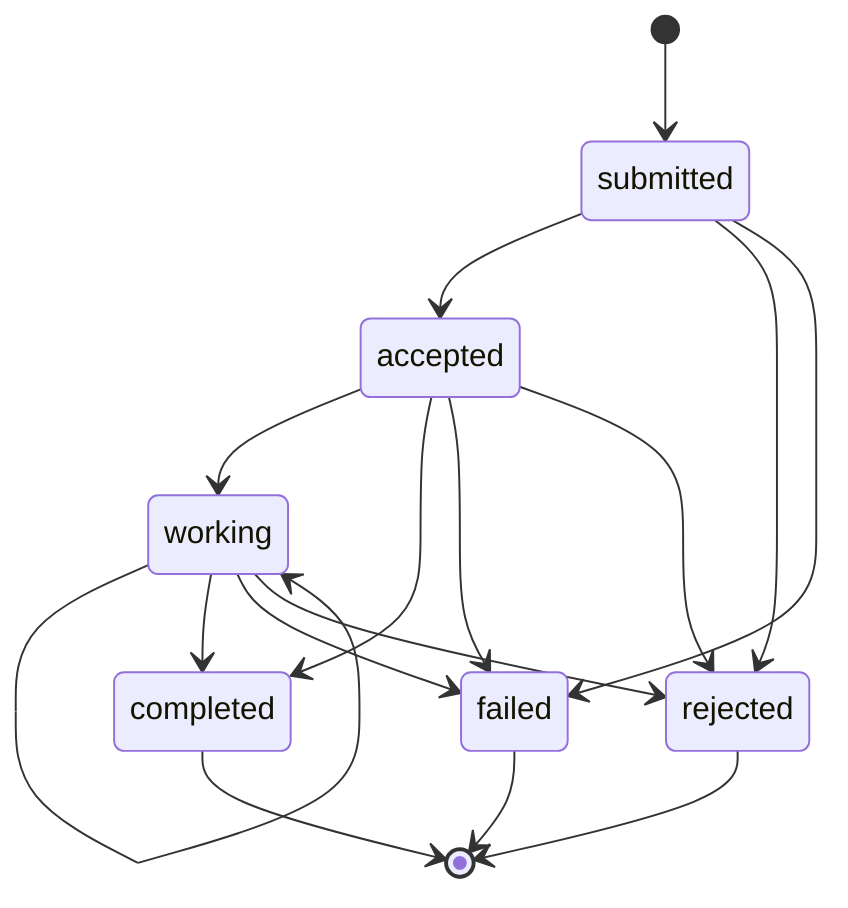

# Task Delegation Workflow and A2A Task Lifecycle

This page walks the alliance-mode delegation workflow: how one accepted friend delegates executable work to another, how the receiving agent authorizes it, executes it through its injectable executor, and records the outcome under an A2A-aligned lifecycle (`submitted -> accepted -> working -> completed`, with `failed`/`rejected` branches), and how the delegating side mirrors that lifecycle locally. The guarantees described are exactly those implemented in [`haap/client.py`](../operations/client-and-transports.md) (`HAAPClient._send` guard and `delegate_task`), [`haap/server.py`](../operations/messaging-server.md) (`_on_task_request`, `_on_task_result`, the `on_task` boundary), [`haap/tasks.py`](../architecture/local-state.md) (the registry and its transition table), [`haap/errors.py`](../concepts/envelope-protocol.md) (the transport-level error codes) and [`haap/permissions.py`](../concepts/permissions-and-roles.md) (the mirrored matrices), as pinned by `tests/test_client.py` and `tests/test_server.py`.

Delegation is the core of the **alliance trust mode**: the friendship machinery of [friendship-handshake](friendship-handshake.md) establishes *who* may ask, the permission matrix decides *what* may be asked, and this workflow is *the asking and doing*. Contrast it with [marketplace-booking](marketplace-booking.md), which deliberately bypasses this page's gates for a tiny open-services surface, and with [hermes-and-a2a](../integrations/hermes-and-a2a.md), which shows how the same executor boundary plugs into a real agent host.

## Actors and the trust split

Two full agents participate, each running its own `HAAPServer` (inbound router) and able to run a `HAAPClient` (outbound engine):

- **Agent A (delegator)** wants work done. It holds its own local record of B in its `Directory` (`friends.json`), records the delegated task in its local `TaskRegistry` with `role="delegate"`, and drives the exchange with `HAAPClient.delegate_task`.
- **Agent B (executor)** has approved A into its directory with a permission matrix (typically via a named role — `client` scopes `booking:*`/`service:*`, `partner` with `*` scopes, see [permissions-and-roles](../concepts/permissions-and-roles.md)). It records the received task with `role="server"`, executes it through its injectable `on_task` callback, and answers over the wire.

The load-bearing split is that **a delegation crosses two independent local permission matrices**. The sender's server never consults the receiver's directory and the receiver never sees the sender's record: A may delegate only if *A's own record of B* (its outbound local guard) allows the action, and B executes only if *B's record of A* (the grant installed at approval) allows the same action and resource. Both sides start from the same conservative template (`DEFAULT_GRANT_TEMPLATE`: `chat:converse`, `task:delegate`, `task:submit`) or the same named role, so the two halves agree without any central policy server; `tests/test_client.py::test_local_guard_blocks_disallowed_action` pins the asymmetry: B grants `task:submit` with `"*"` scopes, but A's *own* record for B is empty, so A's client refuses to send.

The wire action defaults to **`task:submit`** on both sides (the delegator may pass a different `action`/`resource` pair, which then travels verbatim in the `task_request` payload), and the grant that matters is the one the **receiver** installed for the sender — the role templates grant both `task:delegate` (inbound vocabulary) and `task:submit` (outbound vocabulary) with the same scopes precisely so either naming convention holds against the same matrix shape.

## Authorization is a transport-level precondition, never a task state

The single most important boundary in this workflow: **`FRIEND_NOT_FOUND`, `PERMISSION_DENIED` and `RATE_LIMITED` are not task states.** They are gate failures that happen *before* any `TaskRecord` exists, so they never appear in the A2A lifecycle and never produce a registry entry on the receiving side:

| Failure | Decided where | What the sender sees |
|---|---|---|
| Not an accepted friend (unknown or `pending_*`/`blocked` status) | server `_on_task_request`, `directory.require(sender, statuses=("accepted",))` | signed `error` envelope, code `FRIEND_NOT_FOUND` (HTTP 200 at the transport) |
| Action missing / `allow: false` / resource outside granted scopes | server `_on_task_request`, `has_permission(action)` + `PermissionMatrix.check(rec.permissions, action, resource)` | signed `error` envelope, code `PERMISSION_DENIED` |
| Friend's `(action)` or global token bucket empty | server `_on_task_request`, `rate_limiter.check(sender, action, rec.rate_limits)` | signed `error` envelope, code `RATE_LIMITED` (transient, carries `retry_after`) |
| A's own record of B lacks the grant | **client** local guard inside `_send`, before anything leaves the machine | local `PermissionDeniedError` raised (nothing sent) |
| A's own outbound `task:submit` bucket empty | **client** `rate_limiter.check(self.identity.fingerprint, "task:submit")` | local `RateLimitedError` raised (nothing sent) |
| No record / not accepted / no endpoint for B on A's side | **client** `_friend_endpoint` | local `FriendNotFoundError` / `DiscoveryError` raised |

The client-side guard and throttle run **before the envelope is signed and sent** (`_send` applies them only to `task_request`), so a disallowed delegation costs nothing on the wire; the server-side gates run **before the task is created and before the executor is invoked**, so a denied or throttled request costs no model/executor work (the denial-of-wallet defense, threat T8 in [security-model](../architecture/security-model.md)). Error replies are signed `error` envelopes built by `_error_reply` with the stable class code, a 200-character detail, and `in_reply_to_nonce` echoing the rejected envelope's nonce — never plain HTTP errors — and `HAAPClient` translates them back into local exceptions via `error_from_code` ([envelope-protocol](../concepts/envelope-protocol.md)).

The contrast with the task-state `rejected` is explicit in `haap/tasks.py`: *permissions are transport-level errors; rejection = executor/agent decision*. `rejected` is a lifecycle outcome an executor could choose *after* a task exists (the transition table admits `submitted/accepted/working -> rejected`), not the wire code a gate produces. In this revision no shipped code path writes `rejected` — a delegating client can still mirror a `rejected` state reported by a remote `task_result`, which is why the mirror transition table and the poll loop recognize it.

## The task lifecycle state machine

`haap/tasks.py` models the A2A / Linux Foundation lifecycle: `submitted -> accepted -> working -> completed`, with `rejected` (receiving agent declines after acceptance) and `failed` (executor failure) as additional outcomes. `TaskRecord.transition(new_state, detail)` validates every move against the legal table below and raises `TaskStateError` (`TASK_STATE_INVALID`) on any other move, so the persisted `state` field is always authoritative:



Caption: The A2A task lifecycle enforced by `TaskRegistry`/`TaskRecord.transition` — `submitted` is the creation state, `accepted` follows when the executor takes the task, `working` allows progress updates (including self-transitions), and `completed`/`failed`/`rejected` are terminal; any other move raises `TaskStateError`.

The terminality rule matters operationally: once `completed`, `failed` or `rejected` is recorded, no further update is legal — a duplicate `task_result` push for the same task id raises `TaskStateError` on the receiving side rather than silently rewriting history. `working -> working` exists so repeated progress reports do not need a distinct transition. In A2A terms the *mirror* the delegator keeps follows the same table, which is what lets both sides converge on one state vocabulary even though each side's registry is an independent local file ([local-state](../architecture/local-state.md)).

## Step 1 — the outbound send: `delegate_task`

`HAAPClient.delegate_task(friend_fp, prompt, *, action="task:submit", resource="", timeout_s=120.0, poll_interval=2.0, poll_max=30)` builds the payload `{action, resource, prompt}` and sends it through `_send("task_request", friend_fp, payload, timeout_s=timeout_s)` ([client-and-transports](../operations/client-and-transports.md)), which means every gate in the table above applies before the signed envelope is POSTed to `endpoints[0]` of the accepted friend record. The 120-second default timeout covers only this single `task_request` round trip; the *local poll budget* for the asynchronous path (`poll_max` tries at `poll_interval` seconds) is a separate, client-only number.

The delegator records its side of the exchange only **after** the first reply arrives, and the recording path depends on which executor model the friend runs. Note also that nothing is written to A's *server-side* registry during delegation: `delegate_task` writes only into the `TaskRegistry` instance the `HAAPClient` was given (in-memory by default — see [local-state](../architecture/local-state.md)), which becomes load-bearing in the asynchronous path below.

## Step 2 — the receiving gate and the two execution paths

`HAAPServer._on_task_request` runs the strict ordered gate (relationship → permission → rate limit, all transport-level as above), then creates the received task: `TaskRegistry.create(role="server", friend_fingerprint=sender, prompt=..., action=action, resource=resource)` in state `submitted`, then consults the injectable executor `self.on_task(task.task_id, env["payload"])`. The executor receives the **assigned local task id and the raw `task_request` payload** — not the envelope and not the sender fingerprint (that lives in the envelope header and in the recorded task's `friend_fingerprint`). Its return value picks the path ([`server.py` `_on_task_request`](../operations/messaging-server.md)):

```mermaid
sequenceDiagram
    participant A as Delegator HAAPClient
    participant B as Executor HAAPServer
    participant R as TaskRegistry of B
    participant E as on_task executor

    A->>A: local guard and outbound rate limit pass
    A->>B: task_request signed envelope with action, resource and prompt
    B->>B: accepted friend, then permission, then inbound rate limit
    B->>R: create task in state submitted
    B->>E: on_task task_id and payload
    alt synchronous: callback returns a dict
        E-->>B: result dict
        B->>R: accepted then completed with detail
        B-->>A: task_result completed with result detail
        A->>A: mirror submitted then accepted then completed
    else asynchronous: callback absent or returns None
        B->>R: accepted then working
        B-->>A: task_accept with assigned task id
        A->>A: mirror submitted then accepted then working, then poll
        Note over A,B: executor pushes task_result later; delegator side records it
    else executor raises
        B->>R: failed with truncated error detail
        B-->>A: task_result failed with error detail
        A->>A: mirror submitted then failed
    end
```

Caption: The receiving gate and the three `on_task` outcomes — a returned dict walks `submitted → accepted → completed` with a direct `task_result` reply; `None` (or an absent executor) walks `submitted → accepted → working` and answers `task_accept` with the result pushed later; a raised exception marks the task `failed` and is reported as a `task_result`, keeping the lifecycle intact.

### Synchronous path (legal transitions `submitted -> accepted -> completed`)

When `on_task` **returns a dict**, the server marks the task `accepted`, then `completed` with the returned dict merged as `detail`, and replies with a signed `task_result` envelope whose payload is `{task_id, state: "completed", detail: <result>}` — the direct, synchronous HTTP reply to the `task_request`. On the client, the `task_result` branch of `delegate_task` creates the mirror (`role="delegate"`, same `task_id`) and replays the exact legal transitions: `submitted -> accepted`, then `accepted -> completed` with the remote `detail`; a non-`completed` terminal state reported by the remote (`failed`/`rejected`) is applied as a direct `submitted -> <state>` transition. It then audits `client.task.completed` and returns the **friend's reply payload** `{task_id, state, detail}`. A synchronous executor that raises is handled before this branch (below). This is the path `tests/test_client.py::test_full_friendship_and_booking_flow` and `tests/test_server.py::test_task_request_aceptada_con_permiso` exercise end to end: the friend's `on_task` returns a booking confirmation dict and the delegator asserts `result["state"] == "completed"` plus the detail fields, with exactly one task recorded on each side.

### Asynchronous path (legal transitions `submitted -> accepted -> working`)

When `on_task` is **absent or returns `None`**, the server walks the task `submitted -> accepted -> working` and replies with a signed **`task_accept`** envelope carrying the assigned `task_id` — meaning the executor intends to do the work out-of-band and push the final outcome later as a separate signed `task_result` envelope. On the client, the `task_accept` branch mirrors the task `submitted -> accepted -> working` using the friend's `task_id`, then polls up to `poll_max` (30) times, sleeping `poll_interval` (2 s) between attempts. Each poll sends a `ping` envelope to the friend through `_send` — an accepted-friendship keepalive that also exercises the friend's router — and then re-reads **its own** task registry. If the mirror has reached `completed`, `failed` or `rejected`, the poll loop returns the mirrored record (`rec.to_dict()`); if the budget is exhausted while the mirror is still `working`, it returns `{task_id, state: "working", detail: {note: "still working; result will be pushed"}}` instead of raising.

The documented limitation is the mirror's information source. An inbound `task_result` push lands in `HAAPServer._on_task_result`, which applies the reported state/detail to **the server's** `TaskRegistry` and acknowledges with `{}` (HTTP 202 fire-and-forget). With the stock defaults — a separate in-memory registry per `HAAPClient` and per `HAAPServer` — the delegator's polled mirror therefore never observes the pushed result, and `delegate_task` returns the "still working" note. Asynchronous completion in this revision works only in an embedding that shares one `TaskRegistry` between the local server and client (the inbound push updates the very records the poller reads), or that otherwise updates the mirror out of band — which is exactly what the code comment means by "async result collection requires the friend to push task_result (documented)". The friend's push for a task id its receiving registry has never recorded is answered with a signed `error` envelope (`TASK_NOT_FOUND`, from `TaskRegistry.require` inside `_on_task_result`), and an illegal reported transition is answered with `TASK_STATE_INVALID`.

A server run by a plain `haap serve` has **no executor wired at all**, so a delegated task is created, walked to `working`, answered with `task_accept`, and left `working` forever — real execution requires an embedding that supplies `on_task` ([messaging-server](../operations/messaging-server.md)).

### Executor failure (legal transition `-> failed`)

When `on_task` **raises**, the server marks the task `failed` with `detail: {"error": <exception truncated to 200 chars>}` and replies with a signed `task_result` whose state is `failed` — deliberately **not** an `error` envelope, because an error reply would lose the task id and break the state machine. The exception never leaks raw to the sender; its message is truncated and transported inside the task's detail. The delegator mirrors `submitted -> failed` with that detail and returns the payload as usual (in the sync branch the audit event name is still `client.task.completed`, an event-name artifact worth knowing when reading audit logs: the mirroring branch does not vary the event name by outcome).

## The `on_task` executor contract

`on_task` is the single injectable boundary between the HAAP protocol and the agent's real capabilities ([hermes-and-a2a](../integrations/hermes-and-a2a.md)):

- **Signature and wiring.** `cb(task_id: str, payload: dict) -> dict | None`. It is a `HAAPServer` constructor argument defaulting to `None` and may be assigned after construction (`demo_marketplace.py` does `server_biz.on_task = write_to_calendar`). Exactly one executor serves both alliance `task_request`s and marketplace `service_book`s — the business backend is one integration point for both trust modes.
- **Input.** The receiving server's assigned `task_id` and the raw request payload (`action`, `resource`, `prompt` — and for marketplace bookings `service`/`when`/`public_key_b64`). Identity of the requester is *not* passed to the callback; it lives in the envelope header and in the task record's `friend_fingerprint`.
- **Output contract.** Return a JSON-ish dict → synchronous completion (`completed` with the dict as `detail`); return `None` or be absent → asynchronous acceptance (`working`, `task_accept` reply, result pushed later); raise → `failed` with a truncated error detail in a `task_result`. The server converts the returned dict through `result if isinstance(result, dict) else {}`, so a non-dict truthy return still completes with an empty detail.
- **Never called on denied work.** Because the gate runs first, `on_task` is invoked only for an accepted friend, a granted action/resource, and an in-budget request — a denied or throttled request cannot consume executor cost.

## The registry: two sides of one lifecycle, one file per agent

`TaskRegistry` is **local per agent**: it stores the tasks this agent delegated *and* the tasks this agent received and executed, distinguished by `role` ([local-state](../architecture/local-state.md)):

| Record | Role value written by | Meaning | Created in state |
|---|---|---|---|
| Tasks this agent delegated | `delegate` (`HAAPClient.delegate_task`) | local mirror of what a friend executed for us | `submitted`, then replayed on the reply |
| Tasks this agent received | `server` (`HAAPServer._on_task_request`, marketplace booking path) | the executor side of the lifecycle | `submitted` |

Each `TaskRecord` stores `task_id` (`"T"` + 16 hex chars of uuid4), `role`, the peer `friend_fingerprint`, `prompt`, the `action`/`resource` pair used for scope checks, the lifecycle `state`, a free-form `detail` dict (transition `detail` updates are merged in), and a `progress_log` whose last 20 entries are serialized. `TaskRegistry` persists the list to `<HAAP_DIR>/tasks.json` atomically (`.tmp` + `os.replace`) under a reentrant lock when constructed with a directory; both `HAAPServer` and `HAAPClient` default to `TaskRegistry(memory=True)`, so under stock wiring nothing ever writes `tasks.json` — embedders that want durable history construct `TaskRegistry(<dir>)` and inject it into both sides. One naming caveat is real: the module docstring and the CLI help (`haap task list --role delegate|submit`) describe the roles as `delegate`/`submit`, but the shipped creators write `delegate` and `server` respectively, so a `haap task list --role submit` filter matches nothing produced by this revision's code.

Registry invariants worth stating:

- `update(task_id, new_state, detail)` requires the task to exist (`TaskNotFoundError` / `TASK_NOT_FOUND` otherwise) and the move to be legal (`TaskStateError` / `TASK_STATE_INVALID` otherwise); it saves immediately in file mode.
- `completed`, `failed` and `rejected` are terminal — no transition leaves them.
- A single agent's registry holds both halves of its task activity: delegations out (role `delegate`) and executions in (role `server`), so `haap task list` shows the full local picture regardless of direction.

## Wire outcomes and HTTP mapping

All task replies — success and failure alike — are **signed envelopes from the executor's identity**; the HTTP layer is only a status mapper ([messaging-server](../operations/messaging-server.md)): a handler returning a reply dict (including every signed `error` envelope) is HTTP 200; a handler returning `{}` — an inbound `task_result` acknowledgement — is HTTP 202. Consequences for this workflow: `FRIEND_NOT_FOUND`/`PERMISSION_DENIED`/`RATE_LIMITED` denials ride HTTP 200 as signed `error` envelopes (so `HttpTransport` never retries them), while the synchronous `task_result` reply also rides 200 and an async push acknowledgement rides 202. Router-level audit records `message.task_request` (result `ok` or `error` with the exception class) and `message.task_result` for pushes; client-side audit records `client.task_request.error` for wire denials and `client.task.completed` when the mirror completes a replied task ([rate-limiting-and-audit](../concepts/rate-limiting-and-audit.md)).

## Failure semantics at a glance

| Condition | Decided by | Result |
|---|---|---|
| Unknown or non-accepted sender | server `directory.require(... accepted ...)` | signed `error` `FRIEND_NOT_FOUND`; no task created |
| Action/resource not granted to the sender | server permission gate | signed `error` `PERMISSION_DENIED`; no task created, `on_task` never called |
| Sender's inbound bucket empty | server `rate_limiter.check(sender, action, rec.rate_limits)` | signed `error` `RATE_LIMITED` (transient, `retry_after`); no task created |
| A's own record lacks the grant | client local guard in `_send` | local `PermissionDeniedError`, nothing sent |
| A's outbound `task:submit` bucket empty | client `rate_limiter.check(...)` | local `RateLimitedError`, nothing sent |
| `on_task` raises | server exception path | task marked `failed`; reply `task_result` with `state: "failed"` and truncated `detail.error` |
| `on_task` returns a dict | sync path | `submitted -> accepted -> completed`; reply `task_result completed` with the dict as detail |
| `on_task` absent / returns `None` | async path | `submitted -> accepted -> working`; reply `task_accept`; result pushed later |
| Push for an unknown task id | server `_on_task_result` → `TaskRegistry.require` | signed `error` `TASK_NOT_FOUND` (HTTP 200) |
| Illegal reported transition | server `_on_task_result` → `TaskRecord.transition` | signed `error` `TASK_STATE_INVALID` (HTTP 200) |
| Unexpected reply type to `task_request` | client `delegate_task` | local `HAAPError("unexpected reply to task_request: ...")` |
| Async result never observed within the poll budget | client poll loop | returns `{task_id, state: "working", note}` — no exception |

## Operational walk-through

The canonical embedding wires a file-backed `TaskRegistry` into both the server (so received tasks persist) and the client (so the mirror persists), assigns `on_task`, and delegates after the friendship is accepted on both sides:

```python
from haap.identity import IdentityStore
from haap.directory import Directory
from haap.tasks import TaskRegistry
from haap.server import HAAPServer
from haap.client import HAAPClient
from haap.transport import HttpTransport

registry = TaskRegistry("/var/lib/haap-agent")   # durable tasks.json

server = HAAPServer(IdentityStore().load(), Directory(),
                    tasks=registry)              # executor side
def my_executor(task_id, payload):
    # run the real work; return a dict (sync) or None + push later (async)
    return {"summary": "done"}
server.on_task = my_executor

client = HAAPClient(IdentityStore().load(), Directory(),
                    transport=HttpTransport(),
                    tasks=registry)              # same registry -> async pushes observed
result = client.delegate_task(
    "HF-xxxxxxxxxxxxxxxx", "Summarize the Q3 report",
    action="task:submit")
print(result)   # {task_id, state, detail} on sync completion
```

Delegation itself cannot be driven from the stock CLI — `haap task send` deliberately raises with "task send requires a running friend server; use the Python API (server.py + transport.py) — CLI delegation lands with client.py" — and `haap task list [--role ...]` only inspects the local file-backed registry ([cli-and-config](../operations/cli-and-config.md)). Over the wire the requirement is always that the executor's server is reachable at the friend's recorded `endpoints[0]` (refreshable via `refresh_endpoint` against the friend's `/.well-known/haap.json`), and that HTTPS terminates the transport in production.

## Tests that pin this workflow

- `tests/test_client.py::test_full_friendship_and_booking_flow` — two full agents wired by `MemoryTransport` into the friend's real `handle_message`: outbound handshake, human approval granting `task:submit` with `booking:*` scopes, local `mark_outbound_accepted`, delegation of a booking task, the executor callback running once, the synchronous `completed` `task_result` with detail, and exactly one task recorded in each side's registry.
- `tests/test_client.py::test_local_guard_blocks_disallowed_action` — the outbound mirror: B grants `task:submit` with `"*"` scopes, but A's record for B has an explicit empty matrix, and `delegate_task` raises `PermissionDeniedError` before anything is sent.
- `tests/test_server.py::test_task_request_aceptada_con_permiso` — the inbound sync path through the router: an approved friendship with a scoped grant, `on_task` invoked, reply is a `task_result` with `state: "completed"` and the executor's detail.
- `tests/test_server.py::test_task_sin_amistad_rechazada`, `test_task_permiso_denegado`, `test_task_rate_limit` — the three transport-level denials as signed `error` envelopes with `FRIEND_NOT_FOUND`, `PERMISSION_DENIED` and `RATE_LIMITED` respectively (the rate-limit test proves the second request in a burst is refused while the first completes).
- The security rejections every delegation depends on (`BAD_SIGNATURE`, `NONCE_REPLAY`, `CLOCK_SKEW`, bootstrap key/fingerprint binding) are pinned in the same `tests/test_server.py` file; see [testing overview](../testing/overview.md) for the harness conventions (direct `handle_message` vs `MemoryTransport` vs live loopback sockets).

Related pages: [friendship-handshake](friendship-handshake.md) (the accepted-friendship precondition and its state machine) · [marketplace-booking](marketplace-booking.md) (the friendship-less mode that reuses `on_task` and the task pipeline) · [permissions-and-roles](../concepts/permissions-and-roles.md) (the mirrored matrices and role templates the gates evaluate) · [rate-limiting-and-audit](../concepts/rate-limiting-and-audit.md) (buckets and audit events) · [envelope-protocol](../concepts/envelope-protocol.md) (wire format, signed `error` envelopes, codes) · [messaging-server](../operations/messaging-server.md) (server reference: gates, handlers, HTTP mapping) · [client-and-transports](../operations/client-and-transports.md) (outbound guard, transports, `delegate_task` API) · [local-state](../architecture/local-state.md) (the `tasks.json` registry and its persistence rules) · [hermes-and-a2a](../integrations/hermes-and-a2a.md) (the `on_task` executor boundary into a real agent host) · [testing overview](../testing/overview.md).
